# RocketMQ 5.x 新特性源码深度分析

> 基于 Apache RocketMQ 5.5.0 (develop 分支) 源码
> 覆盖四大核心新特性：**任意时间定时消息（时间轮）**、**分级存储（TieredStore 冷热分离）**、**Pop 消费模式**、**消息级别负载均衡（MessageRequestMode / 端云互联）**
> 所有流程图、架构图、时序图均使用 mermaid 呈现

---

## 目录

1. [总览：5.x 架构演进](#一总览5x-架构演进)
2. [任意时间定时消息（Timer Wheel）](#二任意时间定时消息timer-wheel)
3. [分级存储（TieredStore 冷热分离）](#三分级存储tieredstore-冷热分离)
4. [Pop 消费模式](#四pop-消费模式)
5. [消息级别负载均衡（MessageRequestMode）](#五消息级别负载均衡messagerequestmode)
6. [LMQ / LiteTopic 轻量队列](#六lmq--litetopic-轻量队列)
7. [Controller 模式（自动主从切换 / 弹性副本）](#七controller-模式自动主从切换--弹性副本)
8. [RocksDB 存储引擎全家桶](#八rocksdb-存储引擎全家桶)
9. [Proxy 层与 gRPC 新客户端架构](#九proxy-层与-grpc-新客户端架构)
10. [ACL 2.0 认证鉴权管道](#十acl-20-认证鉴权管道)
11. [九大特性的协同关系](#十一九大特性的协同关系)

---

# 一、总览：5.x 架构演进

## 1.1 4.x vs 5.x 关键差异

| 维度 | 4.x | 5.x |
|------|-----|-----|
| 客户端协议 | 私有 Remoting 协议 | gRPC（Proxy 层）+ 兼容 Remoting |
| 延迟消息 | 18 个固定延迟级别（SCHEDULE_TOPIC + ScheduleMessageService） | 任意时间定时（TIMER_TOPIC + TimerWheel + TimerLog） |
| 消费模式 | Push（长轮询）/ Pull（队列独占） | 新增 Pop（队列共享、消息级负载均衡、服务端重试） |
| 负载均衡粒度 | 队列级（客户端 Rebalance 分队列） | 队列级 + 消息级（Pop 模式下客户端可共享全队列） |
| 存储 | 本地 CommitLog 单层 | 本地 + 分级存储（TieredStore，冷数据上传对象存储） |
| 高可用 | DLedger / 主从复制 | 新增 Controller（自动切主）、弹性副本 |
| 无状态消费 | 不支持 | SimpleConsumer（gRPC，Pop 语义） |

## 1.2 5.x 整体架构图

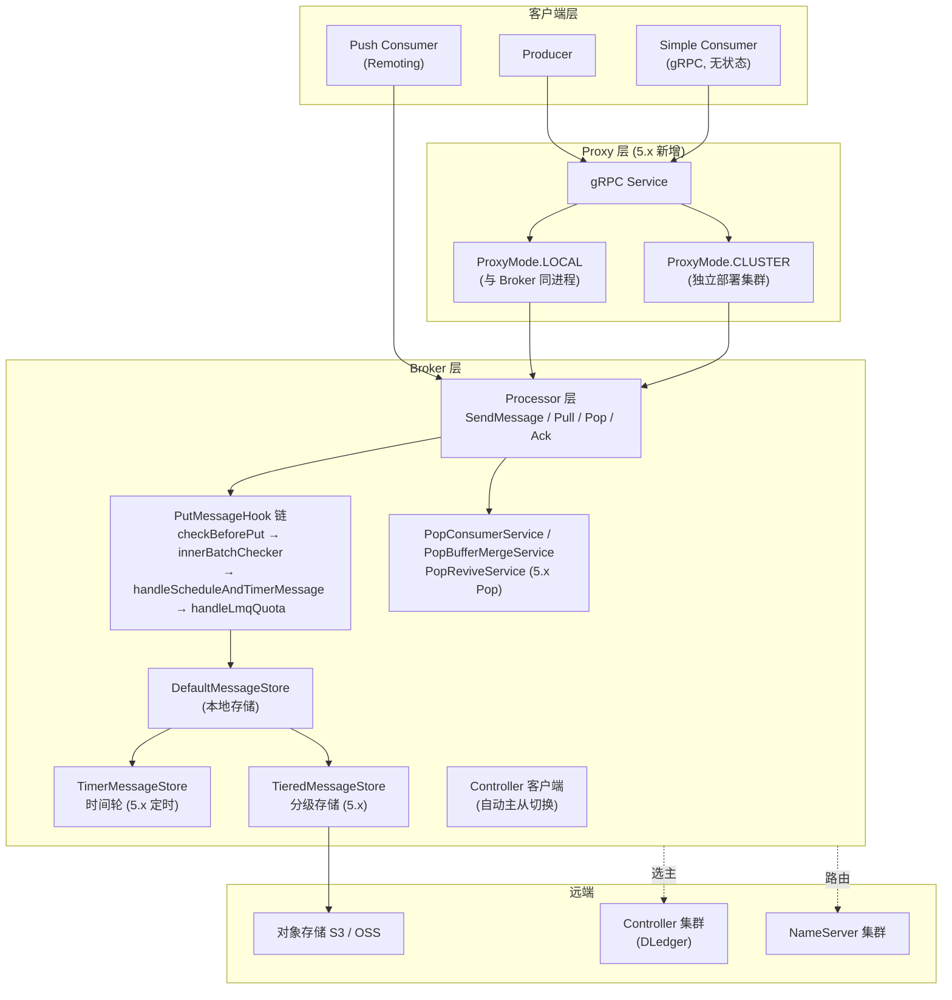
```mermaid
flowchart TB
    subgraph Client["客户端层"]
        PC["Push Consumer<br/>(Remoting)"]
        SC["Simple Consumer<br/>(gRPC, 无状态)"]
        PD["Producer"]
    end

    subgraph Proxy["Proxy 层 (5.x 新增)"]
        GP["gRPC Service"]
        LOCAL["ProxyMode.LOCAL<br/>(与 Broker 同进程)"]
        CLUSTER["ProxyMode.CLUSTER<br/>(独立部署集群)"]
    end

    subgraph Broker["Broker 层"]
        PROC["Processor 层<br/>SendMessage / Pull / Pop / Ack"]
        HOOK["PutMessageHook 链<br/>checkBeforePut → innerBatchChecker<br/>→ handleScheduleAndTimerMessage → handleLmqQuota"]
        STORE["DefaultMessageStore<br/>(本地存储)"]
        TIMER["TimerMessageStore<br/>时间轮 (5.x 定时)"]
        POPSVC["PopConsumerService / PopBufferMergeService<br/>PopReviveService (5.x Pop)"]
        TIERED["TieredMessageStore<br/>分级存储 (5.x)"]
        CTRL["Controller 客户端<br/>(自动主从切换)"]
    end

    subgraph Remote["远端"]
        OSS["对象存储 S3 / OSS"]
        CTL["Controller 集群<br/>(DLedger)"]
        NS["NameServer 集群"]
    end

    PD --> GP
    PC --> PROC
    SC --> GP
    GP --> LOCAL
    GP --> CLUSTER
    LOCAL --> PROC
    CLUSTER --> PROC
    PROC --> HOOK
    HOOK --> STORE
    STORE --> TIMER
    STORE --> TIERED
    TIERED --> OSS
    PROC --> POPSVC
    Broker -.路由.-> NS
    Broker -.选主.-> CTL
```

## 1.3 写入路径上的路由：PutMessageHook

5.x 的定时消息路由与 Pop 支持都建立在 **PutMessageHook** 机制上。Broker 启动时注册 4 个 Hook（`BrokerController.java:1030-1088`）：

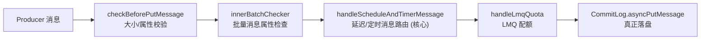
```mermaid
flowchart LR
    MSG["Producer 消息"] --> H1["checkBeforePutMessage<br/>大小/属性校验"]
    H1 --> H2["innerBatchChecker<br/>批量消息属性检查"]
    H2 --> H3["handleScheduleAndTimerMessage<br/>延迟/定时消息路由 (核心)"]
    H3 --> H4["handleLmqQuota<br/>LMQ 配额"]
    H4 --> CL["CommitLog.asyncPutMessage<br/>真正落盘"]
```

路由优先级（`HookUtils.checkIfTimerMessage:183`）：

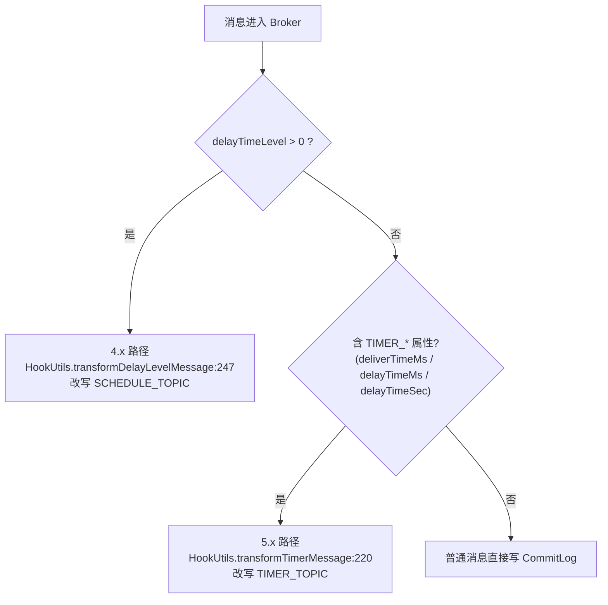
```mermaid
flowchart TD
    IN["消息进入 Broker"] --> Q1{"delayTimeLevel > 0 ?"}
    Q1 -->|是| V4["4.x 路径<br/>HookUtils.transformDelayLevelMessage:247<br/>改写 SCHEDULE_TOPIC"]
    Q1 -->|否| Q2{"含 TIMER_* 属性?<br/>(deliverTimeMs / delayTimeMs / delayTimeSec)"}
    Q2 -->|是| V5["5.x 路径<br/>HookUtils.transformTimerMessage:220<br/>改写 TIMER_TOPIC"]
    Q2 -->|否| NORMAL["普通消息直接写 CommitLog"]
```

---

# 二、任意时间定时消息（Timer Wheel）

## 2.1 设计动机与总体方案

4.x 延迟消息只有 18 个固定级别（`MessageStoreConfig.java:253`：`1s 5s 10s 30s 1m 2m 3m 4m 5m 6m 7m 8m 9m 10m 20m 30m 1h 2h`），每个级别对应一个 SCHEDULE_TOPIC 的队列，`ScheduleMessageService` 用定时任务逐级扫描（`parseDelayLevel:300`，`messageTimeUp:334`）。这套方案的缺陷：

- 无法支持任意时间投递（最多 2 小时）
- 每个级别一个队列，级别数与队列数绑定

5.x 引入 **时间轮 + 追加日志** 的经典组合（参考 Kafka Purgatory 的设计思想）：

- **TimerWheel**：内存中的时间轮，每个 slot 代表一个 `precisionMs`（默认 1s）的时间刻度
- **TimerLog**：磁盘顺序追加日志，记录定时消息的元数据（指向真实消息在 CommitLog 中的位置）
- 真实消息本体存放在 CommitLog 中，定时系统只搬运「元数据指针」

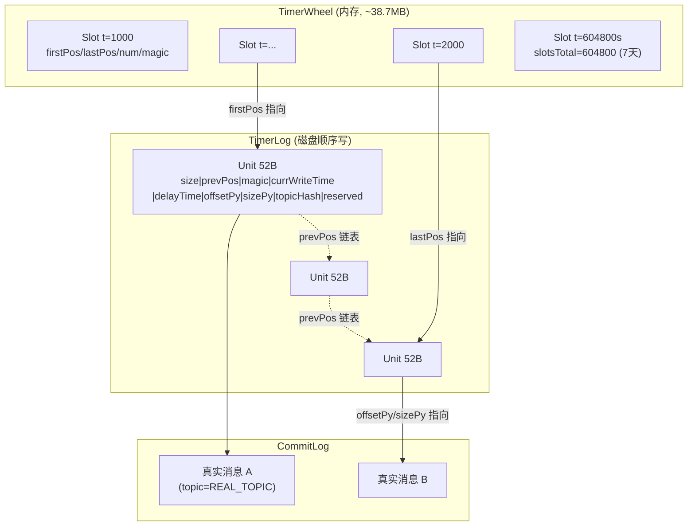
```mermaid
flowchart TB
    subgraph Wheel["TimerWheel (内存, ~38.7MB)"]
        S0["Slot t=1000<br/>firstPos/lastPos/num/magic"]
        S1["Slot t=2000"]
        S2["Slot t=..."]
        SN["Slot t=604800s<br/>slotsTotal=604800 (7天)"]
    end

    subgraph TLog["TimerLog (磁盘顺序写)"]
        U1["Unit 52B<br/>size|prevPos|magic|currWriteTime<br/>|delayTime|offsetPy|sizePy|topicHash|reserved"]
        U2["Unit 52B"]
        U3["Unit 52B"]
        U1 -.prevPos 链表.-> U2
        U2 -.prevPos 链表.-> U3
    end

    subgraph CL["CommitLog"]
        M1["真实消息 A<br/>(topic=REAL_TOPIC)"]
        M2["真实消息 B"]
    end

    S1 -->|"lastPos 指向"| U3
    U3 -->|"offsetPy/sizePy 指向"| M2
    S2 -->|"firstPos 指向"| U1
    U1 --> M1
```

**关键数据结构**：

1. **Slot（32 字节）**，`store/timer/Slot.java`：

| 字段 | 大小 | 含义 |
|------|------|------|
| timeMs | 8B | 该槽代表的时刻（毫秒） |
| firstPos | 8B | 该槽第一条记录在 TimerLog 中的偏移 |
| lastPos | 8B | 该槽最后一条记录在 TimerLog 中的偏移 |
| num | 4B | 槽内消息数量 |
| magic | 4B | 标记位（DEFAULT / ROLL / DELETE） |

时间轮总槽位数 `slotsTotal = 604800`（7 天，`TIMER_WHEEL_TTL_DAY=7`），每槽 32B，总内存约 38.7MB，全量常驻内存。

2. **TimerLog Unit（52 字节）**，`store/timer/TimerLog.java:33`：

| 字段 | 大小 | 含义 |
|------|------|------|
| size | 4B | 记录大小（=52） |
| prevPos | 8B | **同槽前一条记录的偏移（形成反向链表）** |
| magic | 4B | 标记（ROLL=超窗回滚 / DELETE=删除） |
| currWriteTime | 8B | 写入 TimerLog 的时间戳 |
| delayTime | 4B | 相对 currWriteTime 的延迟（秒） |
| offsetPy | 8B | 真实消息在 CommitLog 的物理偏移 |
| sizePy | 4B | 真实消息大小 |
| hashcode of real topic | 4B | 真实主题哈希（用于 metrics） |
| reserved | 8B | 保留 |

> 注意：TimerLog UNIT_SIZE 实际为 **52 字节**（4+8+4+8+4+8+4+4+8），社区部分资料写 44 字节是漏算了 reserved 字段。

## 2.2 核心组件与线程模型

`store/timer/TimerMessageStore.java:79`（类定义），主题名 `TIMER_TOPIC = "rmq_sys_wheel_timer"`（:86）。内部 6 个 ServiceThread 形成流水线：

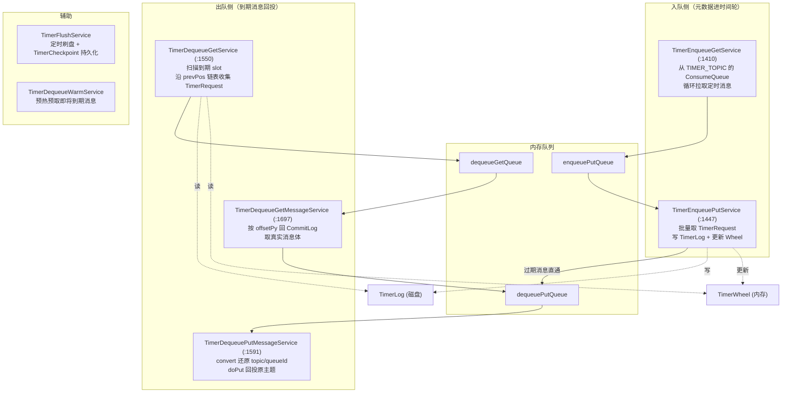
```mermaid
flowchart TB
    subgraph EnqueueSide["入队侧（元数据进时间轮）"]
        EGS["TimerEnqueueGetService (:1410)<br/>从 TIMER_TOPIC 的 ConsumeQueue<br/>循环拉取定时消息"]
        EPS["TimerEnqueuePutService (:1447)<br/>批量取 TimerRequest<br/>写 TimerLog + 更新 Wheel"]
    end

    subgraph Queue["内存队列"]
        EPQ["enqueuePutQueue"]
        DGQ["dequeueGetQueue"]
        DPQ["dequeuePutQueue"]
    end

    subgraph DequeueSide["出队侧（到期消息回投）"]
        DGS["TimerDequeueGetService (:1550)<br/>扫描到期 slot<br/>沿 prevPos 链表收集 TimerRequest"]
        DMS["TimerDequeueGetMessageService (:1697)<br/>按 offsetPy 回 CommitLog<br/>取真实消息体"]
        DPS["TimerDequeuePutMessageService (:1591)<br/>convert 还原 topic/queueId<br/>doPut 回投原主题"]
    end

    subgraph Aux["辅助"]
        FLUSH["TimerFlushService<br/>定时刷盘 + TimerCheckpoint 持久化"]
        WARM["TimerDequeueWarmService<br/>预热预取即将到期消息"]
    end

    EGS --> EPQ --> EPS
    EPS -->|"过期消息直通"| DPQ
    DGS --> DGQ --> DMS --> DPQ --> DPS
    EPS -.写.-> TL["TimerLog (磁盘)"]
    EPS -.更新.-> WH["TimerWheel (内存)"]
    DGS -.读.-> TL
    DGS -.读.-> WH
```

## 2.3 完整时序：一条定时消息的一生

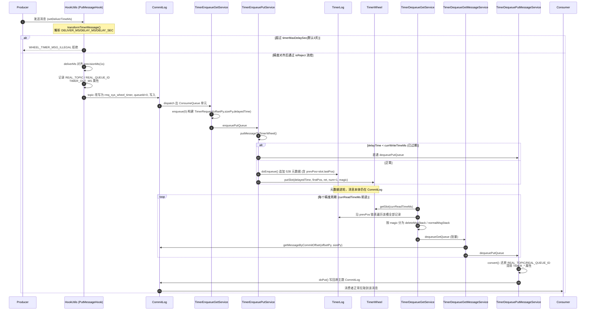
```mermaid
sequenceDiagram
    autonumber
    participant P as Producer
    participant HP as HookUtils (PutMessageHook)
    participant CL as CommitLog
    participant EG as TimerEnqueueGetService
    participant EP as TimerEnqueuePutService
    participant TL as TimerLog
    participant TW as TimerWheel
    participant DG as TimerDequeueGetService
    participant DM as TimerDequeueGetMessageService
    participant DP as TimerDequeuePutMessageService
    participant C as Consumer

    P->>HP: 发送消息 (setDeliverTimeMs)
    Note over HP: transformTimerMessage()<br/>解析 DELIVER_MS/DELAY_MS/DELAY_SEC
    alt 超过 timerMaxDelaySec(默认3天)
        HP-->>P: WHEEL_TIMER_MSG_ILLEGAL 拒绝
    else 精度对齐后通过 isReject 流控
        HP->>HP: deliverMs 对齐 precisionMs(1s)
        HP->>HP: 记录 REAL_TOPIC / REAL_QUEUE_ID<br/>TIMER_OUT_MS 属性
        HP->>CL: topic 改写为 rmq_sys_wheel_timer, queueId=0, 写入
        CL->>EG: dispatch 出 ConsumeQueue 单元
        EG->>EG: enqueue(0) 构建 TimerRequest(offsetPy,sizePy,delayedTime)
        EG->>EP: enqueuePutQueue
        EP->>EP: putMessageToTimerWheel()
        alt delayTime < currWriteTimeMs (已过期)
            EP->>DP: 直通 dequeuePutQueue
        else 正常
            EP->>TL: doEnqueue() 追加 52B 元数据 (含 prevPos=slot.lastPos)
            EP->>TW: putSlot(delayedTime, firstPos, ret, num+1, magic)
        end
        Note over TL,TW: 元数据进轮，消息本体仍在 CommitLog
        loop 每个精度周期 (currReadTimeMs 前进)
            DG->>TW: getSlot(currReadTimeMs)
            DG->>TL: 沿 prevPos 链表遍历该槽全部记录
            DG->>DG: 按 magic 分为 deleteMsgStack / normalMsgStack
            DG->>DM: dequeueGetQueue (批量)
            DM->>CL: getMessageByCommitOffset(offsetPy, sizePy)
            DM->>DP: dequeuePutQueue
        end
        DP->>DP: convert(): 还原 REAL_TOPIC/REAL_QUEUE_ID<br/>清除 TIMER_* 属性
        DP->>CL: doPut() 写回原主题 CommitLog
        CL->>C: 消费者正常拉取到该消息
    end
```

## 2.4 关键源码剖析

### 2.4.1 入队：doEnqueue（`TimerMessageStore.java:841`）

```java
public boolean doEnqueue(long offsetPy, int sizePy, long delayedTime,
                         MessageExt messageExt, boolean isFromTimeline) {
    long tmpWriteTimeMs = currWriteTimeMs;
    // ① 超窗回滚：延迟时间超出时间轮滚动窗口(timerRollWindowSlots, 默认2天)
    boolean needRoll = delayedTime - tmpWriteTimeMs
        >= (long) timerRollWindowSlots * precisionMs;
    int magic = MAGIC_DEFAULT;
    if (needRoll) {
        magic = magic | MAGIC_ROLL;
        // 回滚到窗口内(1/2或满窗处)，到期后再"续约"一次
        delayedTime = ...; // tmpWriteTimeMs + (slots/2 或 slots) * precisionMs
    }
    // ② 删除标记消息（取消定时）
    boolean isDelete = messageExt.getProperty(TIMER_DELETE_UNIQUE_KEY) != null;
    if (isDelete) {
        magic = magic | MAGIC_DELETE;
        if (!isFromTimeline) recallToTimeline(delayedTime, offsetPy, sizePy, messageExt);
    }
    String realTopic = messageExt.getProperty(MessageConst.PROPERTY_REAL_TOPIC);
    Slot slot = timerWheel.getSlot(delayedTime);
    // ③ 顺序写 TimerLog：52 字节，prevPos = slot.lastPos（头插反向链表）
    tmpBuffer.clear();
    tmpBuffer.putInt(TimerLog.UNIT_SIZE);
    tmpBuffer.putLong(slot.lastPos);
    tmpBuffer.putInt(magic);
    tmpBuffer.putLong(tmpWriteTimeMs);
    tmpBuffer.putInt((int) (delayedTime - tmpWriteTimeMs));
    tmpBuffer.putLong(offsetPy);
    tmpBuffer.putInt(sizePy);
    tmpBuffer.putInt(hashTopicForMetrics(realTopic));
    tmpBuffer.putLong(0);
    long ret = timerLog.append(tmpBuffer.array(), 0, TimerLog.UNIT_SIZE);
    if (-1 != ret) {
        // ④ 更新槽：firstPos 不变（首条时置为 ret），lastPos 永远指向最新一条
        timerWheel.putSlot(delayedTime,
            slot.firstPos == -1 ? ret : slot.firstPos, ret,
            isDelete ? slot.num - 1 : slot.num + 1, slot.magic);
        addMetric(messageExt, isDelete ? -1 : 1);
    }
    return -1 != ret;
}
```

**核心技巧**：
- **prevPos 反向链表**：同一个 slot 内的多条 TimerLog 记录通过 prevPos 串成链表。写入时只更新 `slot.lastPos`（O(1)），读取时从 lastPos 沿 prevPos 回溯整链。**写入快、读取整槽遍历一次**。
- **回滚续约（MAGIC_ROLL）**：时间轮只有 7 天容量，超过 `timerRollWindowSlots` 的消息先登记在窗口边缘的槽里，该槽被 dequeue 时发现 `needRoll(magic)`，会把消息**再次 enqueue**（相当于续约），直到真正的投递时间进入窗口。这就是 5.x 支持超长延迟（最大 `timerMaxDelaySec`，默认 3 天）的方式。

### 2.4.2 出队：dequeue（`TimerMessageStore.java:1018`）

```java
public int dequeue() throws Exception {
    Slot slot = timerWheel.getSlot(currReadTimeMs);
    long currOffsetPy = slot.lastPos;
    Set<String> deleteUniqKeys = new ConcurrentSkipListSet<>();
    LinkedList<TimerRequest> normalMsgStack = new LinkedList<>();
    LinkedList<TimerRequest> deleteMsgStack = new LinkedList<>();
    // ① 沿 prevPos 链表遍历整个槽
    while (currOffsetPy != -1) {
        SelectMappedBufferResult timeSbr = timerLog.getWholeBuffer(currOffsetPy);
        // ② 解析 52B 记录
        int size = buf.getInt();          long prevPos = buf.getLong();
        int magic = buf.getInt();         long enqueueTime = buf.getLong();
        long delayedTime = buf.getInt() + enqueueTime;
        long offsetPy = buf.getLong();    int sizePy = buf.getInt();
        TimerRequest tr = new TimerRequest(offsetPy, sizePy, delayedTime, enqueueTime, magic);
        tr.setDeleteList(deleteUniqKeys);
        // ③ 删除消息优先，普通消息 addFirst 保证时间正序
        if (needDelete(magic) && !needRoll(magic)) deleteMsgStack.add(tr);
        else normalMsgStack.addFirst(tr);
        currOffsetPy = prevPos;
    }
    // ④ 拆批入队：删除批在前（先收集要删的 uniqKey），普通批在后
    for (List<TimerRequest> deleteList : splitIntoLists(deleteMsgStack))
        dequeueGetQueue.put(deleteList);
    for (List<TimerRequest> normalList : splitIntoLists(normalMsgStack))
        dequeueGetQueue.put(normalList);
    moveReadTime(); // currReadTimeMs += precisionMs，槽随即作废复用
    return 0;
}
```

`TimerDequeueGetMessageService` 在取消息体时会过滤掉 `deleteUniqKeys` 中的消息（实现**取消定时**语义）；`needRoll(magic)` 的消息则被重新 enqueue（续约）。

### 2.4.3 恢复与检查点（`TimerMessageStore.java:302 recover()`）

崩溃恢复的核心矛盾：TimerLog 已刷盘但 `currReadTimeMs` / `currQueueOffset` 落后，会导致消息被重复或遗漏处理。

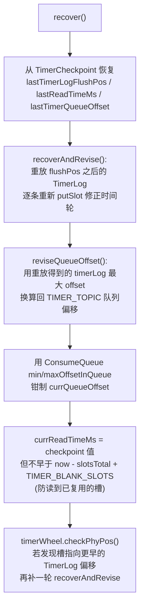
```mermaid
flowchart TD
    R["recover()"] --> R1["从 TimerCheckpoint 恢复<br/>lastTimerLogFlushPos / lastReadTimeMs / lastTimerQueueOffset"]
    R1 --> R2["recoverAndRevise():<br/>重放 flushPos 之后的 TimerLog<br/>逐条重新 putSlot 修正时间轮"]
    R2 --> R3["reviseQueueOffset():<br/>用重放得到的 timerLog 最大 offset<br/>换算回 TIMER_TOPIC 队列偏移"]
    R3 --> R4["用 ConsumeQueue min/maxOffsetInQueue<br/>钳制 currQueueOffset"]
    R4 --> R5["currReadTimeMs = checkpoint 值<br/>但不早于 now - slotsTotal + TIMER_BLANK_SLOTS<br/>(防读到已复用的槽)"]
    R5 --> R6["timerWheel.checkPhyPos()<br/>若发现槽指向更早的 TimerLog 偏移<br/>再补一轮 recoverAndRevise"]
```

`TimerCheckpoint` 是一个 MappedByteBuffer 持久化文件（约 56B）：`lastReadTimeMs | lastTimerLogFlushPos | lastTimerQueueOffset | masterTimerQueueOffset | dataVersion(24B)`。由 `TimerFlushService` 周期（`timerFlushIntervalMs`，默认 1s）落盘。

## 2.5 关键配置一览

| 配置 | 默认值 | 说明 |
|------|--------|------|
| `timerPrecisionMs` | 1000 | 时间轮精度（毫秒），到期时间向下对齐 |
| `timerRollWindowSlots` | 2 天槽数 | 滚动窗口，超出触发 MAGIC_ROLL 续约 |
| `timerMaxDelaySec` | 3 天 | 最大允许延迟，超出直接拒绝（区别于 7 天的轮容量） |
| `TIMER_WHEEL_TTL_DAY` | 7（常量） | 时间轮保留期，决定 slotsTotal=604800 |
| `timerCongestNumEachSlot` | 10000 | 单槽消息数上限（流控依据之一） |
| `timerFlushIntervalMs` | 1000 | TimerLog/Checkpoint 刷盘间隔 |
| `timerWheelSnapshotIntervalMs` | 30000 | 时间轮快照间隔 |
| `timerEnableRetryUntilSuccess` | false | 投递失败是否无限重试（默认 3 次后放弃） |
| `timerSkipUnknownError` | false | 未知异常是否跳过该消息 |

## 2.6 与 4.x 延迟消息对比总结

| 维度 | 4.x ScheduleMessageService | 5.x TimerMessageStore |
|------|---------------------------|----------------------|
| 支持时间 | 18 个固定级别（≤2h） | 任意时间（≤timerMaxDelaySec，默认 3 天） |
| 存储主题 | SCHEDULE_TOPIC（每级别一队列） | rmq_sys_wheel_timer（单队列 queueId=0） |
| 扫描方式 | 每级别一个定时任务，逐条判 tagCode | 时间轮 O(1) 定位槽 + TimerLog 链表批量遍历 |
| 元数据 | tagsCode 编码投递时间（`CommitLog.java:569-584` dispatch 时写入） | 独立 TimerLog 52B/条 |
| 取消定时 | 不支持 | 支持（TIMER_DELETE_UNIQUE_KEY + MAGIC_DELETE） |
| 客户端 API | `setDelayTimeLevel(int)` | `setDeliverTimeMs / setDelayTimeMs / setDelayTimeSec` |
| 兼容性 | 5.x 仍保留（delayTimeLevel>0 优先走旧路径） | 与旧路径通过 checkIfTimerMessage 区分 |

---

# 三、分级存储（TieredStore 冷热分离）

## 3.1 设计动机与总体架构

本地存储的痛点：磁盘容量有限，保留全部历史消息成本高；消息保留时间与磁盘容量强耦合。

TieredStore 的思路：**近期热数据留在本地磁盘（保障写入性能），历史冷数据异步搬运到廉价的对象存储（S3/OSS），读取时统一透明回源**。

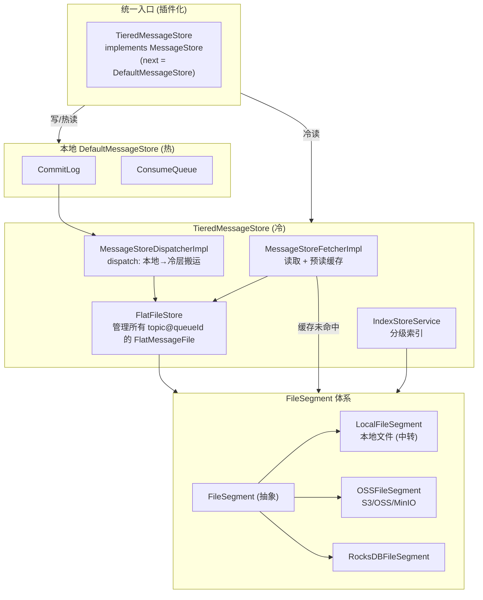
```mermaid
flowchart TB
    subgraph LocalStore["本地 DefaultMessageStore (热)"]
        CL["CommitLog"]
        CQ["ConsumeQueue"]
    end

    subgraph Tiered["TieredMessageStore (冷)"]
        DISP["MessageStoreDispatcherImpl<br/>dispatch: 本地→冷层搬运"]
        FFS["FlatFileStore<br/>管理所有 topic@queueId 的 FlatMessageFile"]
        FETCH["MessageStoreFetcherImpl<br/>读取 + 预读缓存"]
        IDX["IndexStoreService<br/>分级索引"]
    end

    subgraph Segments["FileSegment 体系"]
        FS1["FileSegment (抽象)"]
        FS1 --> LFS["LocalFileSegment<br/>本地文件 (中转)"]
        FS1 --> OSSS["OSSFileSegment<br/>S3/OSS/MinIO"]
        FS1 --> RDS["RocksDBFileSegment"]
    end

    CL --> DISP
    DISP --> FFS
    FFS --> Segments
    FETCH --> FFS
    FETCH -->|"缓存未命中"| Segments
    IDX --> Segments

    subgraph Entry["统一入口 (插件化)"]
        TMS["TieredMessageStore<br/>implements MessageStore<br/>(next = DefaultMessageStore)"]
    end
    Entry -->|"写/热读"| LocalStore
    Entry -->|"冷读"| Tiered
```

核心类职责表（均在 `tieredstore/` 模块）：

| 类 | 职责 |
|----|------|
| `TieredMessageStore` | 插件主入口，包装本地 store（next 指向 DefaultMessageStore），`getMessageAsync:228` 决定热/冷路由 |
| `MessageStoreDispatcherImpl` | 分发器（`doScheduleDispatch:133`），把本地消息搬入冷层并构建索引 |
| `MessageStoreFetcherImpl` | 冷层读取 + Caffeine 预读缓存（`getMessageFromTieredStoreAsync:313`） |
| `FlatFileStore` | 全部 `topic@queueId → FlatMessageFile` 的注册表 |
| `FlatMessageFile` | 单队列冷层文件：`FlatCommitLogFile` + `FlatConsumeQueueFile` |
| `FlatAppendFile` | 通用追加文件：内部由一串 FileSegment 组成的逻辑连续文件 |
| `FileSegment` | 最小存储单元（baseOffset + 大小上限），三种 Provider：本地文件 / OSS / RocksDB |
| `IndexStoreService` | 冷层索引（`putKey:203` / `queryAsync:232`），支持按 key+时间范围查询 |

## 3.2 文件组织：FlatFile 与 FileSegment

分级存储没有沿用本地的「固定大小 MappedFile + 预分配」模型，而是**逻辑上连续、物理上分段**：

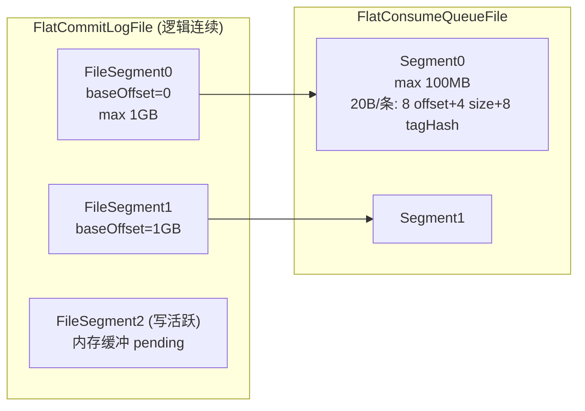
```mermaid
flowchart LR
    subgraph FlatCommitLog["FlatCommitLogFile (逻辑连续)"]
        A["FileSegment0<br/>baseOffset=0<br/>max 1GB"]
        B["FileSegment1<br/>baseOffset=1GB"]
        C["FileSegment2 (写活跃)<br/>内存缓冲 pending"]
    end
    subgraph FlatCQ["FlatConsumeQueueFile"]
        D["Segment0<br/>max 100MB<br/>20B/条: 8 offset+4 size+8 tagHash"]
        E["Segment1"]
    end
    A --> D
    B --> E
```

- **CommitLog 段**：默认最大 1GB（`tieredStoreCommitLogMaxSize`），内容格式与本地 CommitLog 完全一致（直接拷贝字节）。
- **ConsumeQueue 段**：默认最大 100MB，单元 20B（`8B commitLog偏移 + 4B 消息大小 + 8B tag hash`），与本地 CQ 一致（`ConsumeQueue.java:64` CQ_STORE_UNIT_SIZE=20）。
- **偏移体系**：冷层 commitLog 偏移与本地偏移**无关**（重新编址），但 ConsumeQueue 的队列偏移（queue offset）与本地保持一致编号，从而消费者 offset 可以无缝跨层。`FlatMessageFile.getConsumeQueueMinOffset():216` 取 `max(cq最小偏移, commitLog首条消息偏移)` 作为有效起点。

## 3.3 分发流程：热→冷搬运

`MessageStoreDispatcherImpl.run():384` 主循环每 20s 扫描全部 FlatMessageFile（新消息到达也会触发即时 dispatch）。

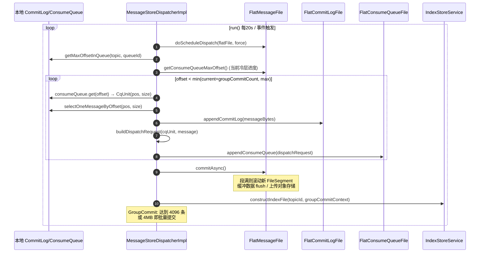
```mermaid
sequenceDiagram
    autonumber
    participant LCL as 本地 CommitLog/ConsumeQueue
    participant D as MessageStoreDispatcherImpl
    participant F as FlatMessageFile
    participant FCL as FlatCommitLogFile
    participant FCQ as FlatConsumeQueueFile
    participant IDX as IndexStoreService

    loop run() 每20s / 事件触发
        D->>F: doScheduleDispatch(flatFile, force)
        D->>LCL: getMaxOffsetInQueue(topic, queueId)
        D->>F: getConsumeQueueMaxOffset() (当前冷层进度)
        loop offset < min(current+groupCommitCount, max)
            D->>LCL: consumeQueue.get(offset) → CqUnit(pos, size)
            D->>LCL: selectOneMessageByOffset(pos, size)
            D->>FCL: appendCommitLog(messageBytes)
            D->>D: buildDispatchRequest(cqUnit, message)
            D->>FCQ: appendConsumeQueue(dispatchRequest)
        end
        D->>F: commitAsync()
        Note over F: 段满则滚动新 FileSegment<br/>缓冲数据 flush / 上传对象存储
        D->>IDX: constructIndexFile(topicId, groupCommitContext)
        Note over D: GroupCommit: 达到 4096 条<br/>或 4MB 即批量提交
    end
```

要点：
1. **搬运的是消息本体**（从本地 CommitLog 读出再写入冷层 CommitLog 段），ConsumeQueue 与索引在冷层重建。
2. **组提交（Group Commit）**：`tieredStoreGroupCommitCount=4096` / `tieredStoreGroupCommitSize=4MB`，攒批降低对对象存储的请求次数。
3. 分发位点记录在 FlatMessageFile 自身元数据中，broker 重启后从 `getConsumeQueueMaxOffset()` 续传。

## 3.4 读取路径：透明回源 + 预读缓存

`TieredMessageStore.getMessageAsync():228` 的路由判断（`fetchFromCurrentStore:178`）：

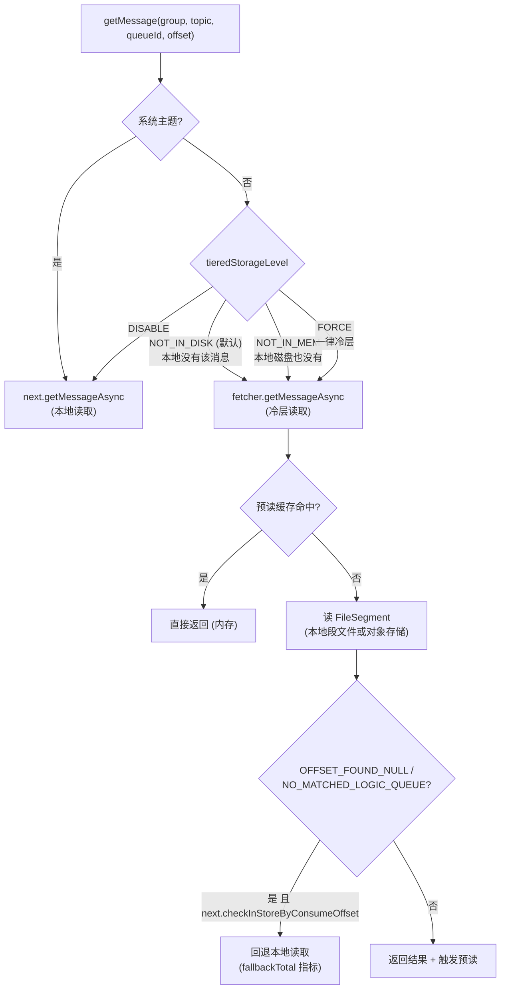
```mermaid
flowchart TD
    REQ["getMessage(group, topic, queueId, offset)"] --> SYS{"系统主题?"}
    SYS -->|是| LOCAL["next.getMessageAsync<br/>(本地读取)"]
    SYS -->|否| LV{"tieredStorageLevel"}
    LV -->|"DISABLE"| LOCAL
    LV -->|"NOT_IN_DISK (默认)<br/>本地没有该消息"| TIERED["fetcher.getMessageAsync<br/>(冷层读取)"]
    LV -->|"NOT_IN_MEM<br/>本地磁盘也没有"| TIERED
    LV -->|"FORCE<br/>一律冷层"| TIERED
    TIERED --> CACHE{"预读缓存命中?"}
    CACHE -->|是| HIT["直接返回 (内存)"]
    CACHE -->|否| MISS["读 FileSegment<br/>(本地段文件或对象存储)"]
    MISS --> FALLBACK{"OFFSET_FOUND_NULL /<br/>NO_MATCHED_LOGIC_QUEUE?"}
    FALLBACK -->|"是 且 next.checkInStoreByConsumeOffset"| FB["回退本地读取<br/>(fallbackTotal 指标)"]
    FALLBACK -->|否| RES["返回结果 + 触发预读"]
```

**预读缓存（ReadAheadCache）**：`MessageStoreFetcherImpl.initCache()` 基于 Caffeine：
- 容量上限 = 堆内存 × `readAheadCacheSizeThresholdRate`（默认 0.3）
- 支持**双 TTL**（创建后过期 + 最后访问后过期），冷层读取一次会顺带把后续若干条消息读入缓存，适配顺序消费模式
- `getMessageFromCacheAsync:284` 先查缓存；未命中走 `getMessageFromTieredStoreAsync:313`

## 3.5 索引与删除

**索引（IndexStoreService）**：分发完成后异步构建（`constructIndexFile:343`），哈希槽默认 500 万，条目含 topicId/queueId/offset/size/时间戳；`queryAsync:232` 从 `timeStoreTable`（按时间组织的 NavigableMap）按时间窗倒序检索，支持 `forceUpload:284` 强制上传未上传索引。

**过期删除**：`FlatFileStore.scheduleDeleteExpireFile()` 定期（`tieredStoreDeleteFileInterval=1h`）执行；每个 FlatMessageFile 持有独立 `fileReservedHours`（默认 `tieredStoreFileReservedTime=72h`），`destroyExpiredFile(now - reservedMs)` 将到期 FileSegment 同时从元数据和对象存储删除。注意：**冷层保留时长与本地 store 的文件保留时长是两套独立配置**，因此可以做到「本地只留 1 天、冷层留 3 年」。

## 3.6 关键配置

| 配置 | 默认值 | 说明 |
|------|--------|------|
| `tieredStorageLevel` | NOT_IN_DISK | DISABLE / NOT_IN_DISK / NOT_IN_MEM / FORCE 四档 |
| `tieredStoreCommitLogMaxSize` | 1GB | 冷层 CommitLog 段大小 |
| `tieredStoreConsumeQueueMaxSize` | 100MB | 冷层 ConsumeQueue 段大小 |
| `tieredStoreFileReservedTime` | 72h | 冷层文件保留时间 |
| `tieredStoreDeleteFileInterval` | 1h | 过期删除任务间隔 |
| `tieredStoreGroupCommit` | true | 是否组提交 |
| `tieredStoreGroupCommitCount / Size` | 4096 / 4MB | 组提交阈值 |
| `readAheadCacheEnable` | true | 预读缓存开关 |
| `readAheadCacheSizeThresholdRate` | 0.3 | 缓存占堆比例 |
| `objectStoreEndpoint/Bucket/AK/SK` | - | 对象存储连接配置 |

## 3.7 与本地存储的本质区别

| 维度 | 本地 DefaultMessageStore | TieredMessageStore |
|------|--------------------------|--------------------|
| 写入路径 | 生产者直写 CommitLog（顺序写+PageCache） | 不接写入，仅异步搬运 |
| 文件模型 | 固定大小 MappedFile 预分配 | FileSegment 逻辑拼接，容量按需增长 |
| 读路径 | mmap 零拷贝 | 预读缓存 → 段文件/对象存储（网络 IO） |
| 容量 | 磁盘上限 | 对象存储近乎无限 |
| 副本 | 主从/Controller 复制 | 对象存储自身多副本（冷层不再复制） |

---

# 四、Pop 消费模式

## 4.1 设计动机

4.x Push 模式的两大痛点：
1. **队列独占**：一个队列同一时刻只能被组内一个消费者消费（客户端 Rebalance 分队列）。消费者数量 > 队列数量时多余消费者空转；扩缩容需要触发 Rebalance（`RebalanceService` 20s 周期 + 事件触发），有消费停顿。
2. **重试复杂**：消费失败的重试逻辑（`CONSUMER_START_TIME`、`RETRY_TOPIC` 挂起、offset 管理）全在客户端，客户端实现重、行为不一致。

Pop 模式的核心思想：**把「队列分配」和「失败重试」从客户端上移到 Broker**。消费者不再绑定队列，而是向 Broker 发 POP 请求，Broker 从（可共享的）队列里「弹出」若干条消息并置为**不可见（invisible）**，消费者 ACK 后才真正完成；超时未 ACK 由 Broker 的 revive 机制自动重投。

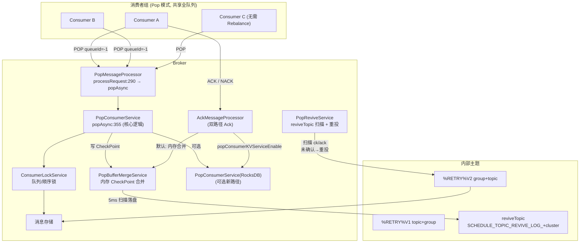
```mermaid
flowchart TB
    subgraph Client["消费者组 (Pop 模式, 共享全队列)"]
        C1["Consumer A"]
        C2["Consumer B"]
        C3["Consumer C (无需 Rebalance)"]
    end

    subgraph Broker
        POP["PopMessageProcessor<br/>processRequest:290 → popAsync"]
        PCS["PopConsumerService<br/>popAsync:355 (核心逻辑)"]
        LOCK["ConsumerLockService<br/>队列/顺序锁"]
        STORE["消息存储"]
        BUF["PopBufferMergeService<br/>内存 CheckPoint 合并"]
        ACKP["AckMessageProcessor<br/>(双路径 Ack)"]
        REV["PopReviveService<br/>reviveTopic 扫描 + 重投"]
        ROCKS["PopConsumerService(RocksDB)<br/>(可选新路径)"]
    end

    subgraph Topics["内部主题"]
        RT1["%RETRY%V1 topic+group"]
        RT2["%RETRY%V2 group+topic"]
        RVT["reviveTopic<br/>SCHEDULE_TOPIC_REVIVE_LOG_+cluster"]
    end

    C1 -->|"POP queueId=-1"| POP
    C2 -->|"POP queueId=-1"| POP
    C3 -->|"POP"| POP
    POP --> PCS --> LOCK --> STORE
    PCS -->|"写 CheckPoint"| BUF
    PCS -->|"可选"| ROCKS
    C1 -->|"ACK / NACK"| ACKP
    ACKP -->|"默认: 内存合并"| BUF
    ACKP -->|"popConsumerKVServiceEnable"| ROCKS
    BUF -->|"5ms 扫描落盘"| RVT
    REV -->|"扫描 ck/ack<br/>未确认→重投"| RT2
    RT2 --> STORE
```

## 4.2 popAsync 全流程（`PopConsumerService.popAsync:355-471`）

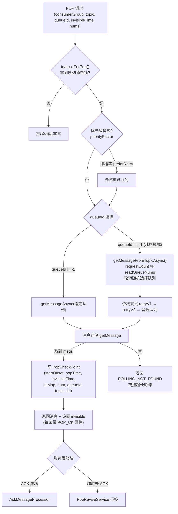
```mermaid
flowchart TD
    START["POP 请求 (consumerGroup, topic, queueId, invisibleTime, nums)"] --> LOCK{"tryLockForPop()<br/>拿到队列消费锁?"}
    LOCK -->|否| RETRY1["挂起/稍后重试"]
    LOCK -->|是| MODE{"优先级模式?<br/>priorityFactor"}
    MODE -->|"按概率 preferRetry"| PR["先试重试队列"]
    MODE -->|否| QSEL
    PR --> QSEL{"queueId 选择"}
    QSEL -->|"queueId != -1"| FIX["getMessageAsync(指定队列)"]
    QSEL -->|"queueId == -1 (乱序模式)"| RND["getMessageFromTopicAsync()<br/>requestCount % readQueueNums<br/>轮转随机选择队列"]
    RND --> TRYRETRY["依次尝试 retryV1 → retryV2 → 普通队列"]
    FIX --> GET
    TRYRETRY --> GET["消息存储 getMessage"]
    GET -->|"取到 msgs"| CK["写 PopCheckPoint<br/>(startOffset, popTime, invisibleTime,<br/>bitMap, num, queueId, topic, cid)"]
    CK --> RESP["返回消息 + 设置 invisible<br/>(每条带 POP_CK 属性)"]
    GET -->|空| EMPTY["返回 POLLING_NOT_FOUND<br/>或挂起长轮询"]
    RESP --> ACKPATH{"消费者处理"}
    ACKPATH -->|"ACK 成功"| ACK["AckMessageProcessor"]
    ACKPATH -->|"超时未 ACK"| REVIVE["PopReviveService 重投"]
```

关键细节：
- **queueId=-1**：客户端不指定队列，Broker 在该 topic 的全部读队列 + 重试队列中轮转选择，天然实现「所有消费者共享所有队列」——这就是**消息级负载均衡**的 Broker 侧基础。
- **invisibleTime**：Pop 时携带，消息在 `popTime + invisibleTime` 前对后续 Pop 不可见（通过 CheckPoint 过滤，而非修改存储）。
- **CheckPoint 的 POP_CK 属性**会随消息下发给消费者，消费者 ACK 时带回，Broker 据此定位内存中的 CheckPoint 并置位。

## 4.3 PopCheckPoint 与 PopBufferMergeService（内存合并）

`store/pop/PopCheckPoint.java` 字段：`startOffset(8) + popTime(8) + invisibleTime(8) + bitMap(4) + num(1) + queueId(4) + topic + cid + reviveOffset(8) + queueOffsetDiff + brokerName + rePutTimes + suspend`。其中 **bitMap** 是本次 Pop 弹出的 `num` 条消息的确认位图。

`broker/processor/PopBufferMergeService.java`（5ms 一轮 `scan()`）：

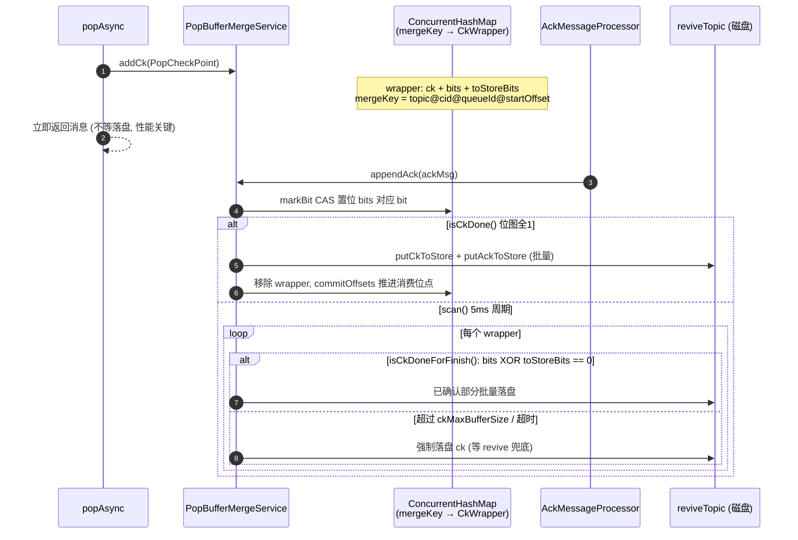
```mermaid
sequenceDiagram
    autonumber
    participant POP as popAsync
    participant BUF as PopBufferMergeService
    participant K as ConcurrentHashMap<br/>(mergeKey → CkWrapper)
    participant ACK as AckMessageProcessor
    participant RT as reviveTopic (磁盘)

    POP->>BUF: addCk(PopCheckPoint)
    Note over K: wrapper: ck + bits + toStoreBits<br/>mergeKey = topic@cid@queueId@startOffset
    POP-->>POP: 立即返回消息 (不等落盘, 性能关键)

    ACK->>BUF: appendAck(ackMsg)
    BUF->>K: markBit CAS 置位 bits 对应 bit
    alt isCkDone() 位图全1
        BUF->>RT: putCkToStore + putAckToStore (批量)
        BUF->>K: 移除 wrapper, commitOffsets 推进消费位点
    else scan() 5ms 周期
        loop 每个 wrapper
            alt isCkDoneForFinish(): bits XOR toStoreBits == 0
                BUF->>RT: 已确认部分批量落盘
            else 超过 ckMaxBufferSize / 超时
                BUF->>RT: 强制落盘 ck (等 revive 兜底)
            end
        end
    end
```

**双位图语义**（这是该组件最精妙之处）：
- `bits`：消费者已 ACK 的消息位（内存实时）
- `toStoreBits`：已写入 reviveTopic 磁盘的 ACK 位
- `isCkDone()`：bits 全 1 → 整个 CheckPoint 完成，可直接删
- `isCkDoneForFinish()`：`bits ^ toStoreBits == 0` → 所有已发生的 ACK 均已落盘，写一条「带 finish 标记的 ck」即可终止该 ck 的重投

这样，**正常路径下 ACK 只动内存位图，磁盘 IO 被合并成批**，只有异常路径（超时、缓冲满）才逐条落盘，由 revive 兜底。

## 4.4 AckMessageProcessor 双路径（:571 行类）

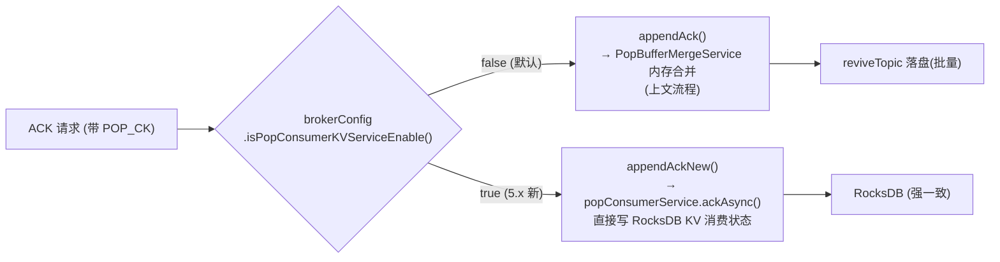
```mermaid
flowchart LR
    ACKREQ["ACK 请求 (带 POP_CK)"] --> SW{"brokerConfig<br/>.isPopConsumerKVServiceEnable()"}
    SW -->|"false (默认)"| OLD["appendAck()<br/>→ PopBufferMergeService 内存合并<br/>(上文流程)"]
    SW -->|"true (5.x 新)"| NEW["appendAckNew()<br/>→ popConsumerService.ackAsync()<br/>直接写 RocksDB KV 消费状态"]
    OLD --> RT["reviveTopic 落盘(批量)"]
    NEW --> RK["RocksDB (强一致)"]
```

旧路径性能好但正确性依赖「内存丢失 → revive 兜底」；新路径（RocksDB 模式）用 KV 存储管理 Pop 状态，ack 直接落 RocksDB，路径更简单一致，是后续演进方向。

## 4.5 PopReviveService：兜底重投

`PopBufferMergeService` 内存中的 CheckPoint 若因宕机丢失，消息将永远「不可见」。`PopReviveService` 通过 **reviveTopic**（`SCHEDULE_TOPIC_REVIVE_LOG_ + cluster`）兜底：

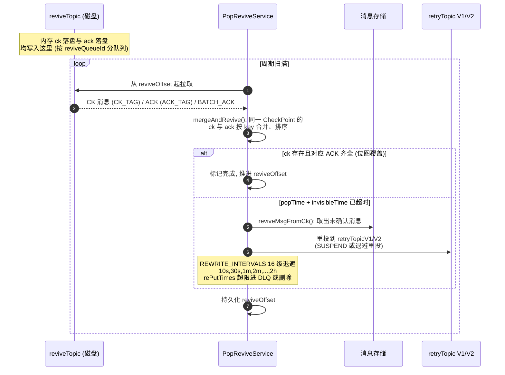
```mermaid
sequenceDiagram
    autonumber
    participant RT as reviveTopic (磁盘)
    participant REV as PopReviveService
    participant ST as 消息存储
    participant RET as retryTopic V1/V2

    Note over RT: 内存 ck 落盘与 ack 落盘<br/>均写入这里 (按 reviveQueueId 分队列)
    loop 周期扫描
        REV->>RT: 从 reviveOffset 起拉取
        RT-->>REV: CK 消息 (CK_TAG) / ACK (ACK_TAG) / BATCH_ACK
        REV->>REV: mergeAndRevive(): 同一 CheckPoint 的<br/>ck 与 ack 按 key 合并、排序
        alt ck 存在且对应 ACK 齐全 (位图覆盖)
            REV->>REV: 标记完成, 推进 reviveOffset
        else popTime + invisibleTime 已超时
            REV->>ST: reviveMsgFromCk(): 取出未确认消息
            REV->>RET: 重投到 retryTopicV1/V2<br/>(SUSPEND 或退避重投)
            Note over REV: REWRITE_INTERVALS 16 级退避<br/>10s,30s,1m,2m,...,2h<br/>rePutTimes 超限进 DLQ 或删除
        end
        REV->>REV: 持久化 reviveOffset
    end
```

要点：
- `inflightReviveRequestMap` 防止同一条消息重复重投
- 重试主题自动创建；V1 (`%RETRY%topic@group`) 兼容旧命名，V2 (`%RETRY%group@topic`) 为 5.x 新命名，`KeyBuilder.buildPopRetryTopicV1/V2`
- 退避序列 `REWRITE_INTERVALS`：16 级从 10s 到 2h，与 4.x 的 `messageDelayLevel` 类似但服务端自主控制
- **客户端在 Pop 模式下消费失败只需不 ACK（或 NACK 指定重试）**，重试编排完全由服务端完成——这是「无状态消费」的关键

## 4.6 客户端侧

`client/impl/consumer/DefaultMQPushConsumerImpl.popMessage():501`：
- 客户端为每个（被分配到的）MessageQueue 构造 `PopRequest`（`MessageRequestMode.POP`），调用 `mqClientAPI.popMessageAsync` 异步 Pop
- 成功后消息进入本地 `ProcessQueue`，回调 `PopCallback`；ACK 在消费成功后发送（`ACK` 带 POP_CK），失败可发 NACK
- 流控/退避：`popThresholdForQueue`（在途未确认消息数阈值）、`pullTimeDelayMillsWhenException`、暂停/缓存流控延迟

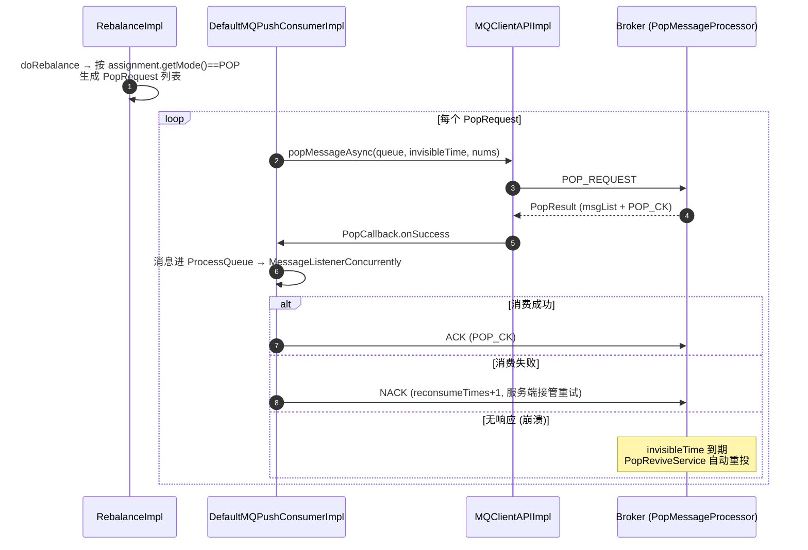
```mermaid
sequenceDiagram
    autonumber
    participant RB as RebalanceImpl
    participant CI as DefaultMQPushConsumerImpl
    participant API as MQClientAPIImpl
    participant B as Broker (PopMessageProcessor)

    RB->>RB: doRebalance → 按 assignment.getMode()==POP<br/>生成 PopRequest 列表
    loop 每个 PopRequest
        CI->>API: popMessageAsync(queue, invisibleTime, nums)
        API->>B: POP_REQUEST
        B-->>API: PopResult (msgList + POP_CK)
        API->>CI: PopCallback.onSuccess
        CI->>CI: 消息进 ProcessQueue → MessageListenerConcurrently
        alt 消费成功
            CI->>B: ACK (POP_CK)
        else 消费失败
            CI->>B: NACK (reconsumeTimes+1, 服务端接管重试)
        else 无响应 (崩溃)
            Note over B: invisibleTime 到期<br/>PopReviveService 自动重投
        end
    end
```

## 4.7 Pop vs Push vs Pull 对比

| 维度 | Push (4.x/5.x) | Pull (LitePull) | Pop (5.x) |
|------|---------------|-----------------|-----------|
| 队列分配 | 客户端 Rebalance 独占 | 客户端分配 | Broker 侧共享（queueId=-1） |
| 消费位点 | 客户端管理，定期提交 | 客户端管理 | Broker 端（CheckPoint/offset） |
| 失败重试 | 客户端 retryTopic 编排 | 自行处理 | 服务端 revive 自动重投 |
| 扩缩容 | 需 Rebalance，有停顿 | 需重新分配 | 近似即时（无队列绑定） |
| 消费者数 > 队列数 | 空转 | 空转 | 均匀分担（消息级） |
| 顺序性 | 队列内有序 | 队列内有序 | 默认无序（顺序 Pop 需队列锁+顺序模式） |
| 网络开销 | 长轮询挂起 | 主动拉 | 长轮询 + ACK 一次额外 RPC |

---

# 五、消息级别负载均衡（MessageRequestMode）

## 5.1 概念：两种请求模式

`common/message/MessageRequestMode.java` 枚举：

- **PULL**：传统模式，MessageQueue 由组内某一消费者独占，粒度 = 队列级
- **POP**：消息级模式，所有消费者可对同一队列发起 Pop，Broker 弹出式分发

Broker 端通过 `broker/loadbalance/MessageRequestModeManager` 维护配置：

```java
// topic → (consumerGroup → SetMessageRequestModeRequestBody)
ConcurrentHashMap<String, ConcurrentHashMap<String, SetMessageRequestModeRequestBody>>
    messageRequestModeMap;
```

可通过管理 API（`setMessageRequestMode`）动态切换某 topic+group 的模式与 `shareMode`（队列共享数）。

## 5.2 客户端如何感知模式

5.x 客户端的 Rebalance 增加了「Assignment」概念：Broker/Proxy 下发的不再只是 MessageQueue 列表，而是**带模式的分配结果**。`client/impl/consumer/RebalanceImpl.java:519`：

```java
if (MessageRequestMode.POP == assignment.getMode()) {
    mq2PopAssignment.put(messageQueue, assignment);
} else {
    mq2PushAssignment.put(messageQueue, assignment);
}
```

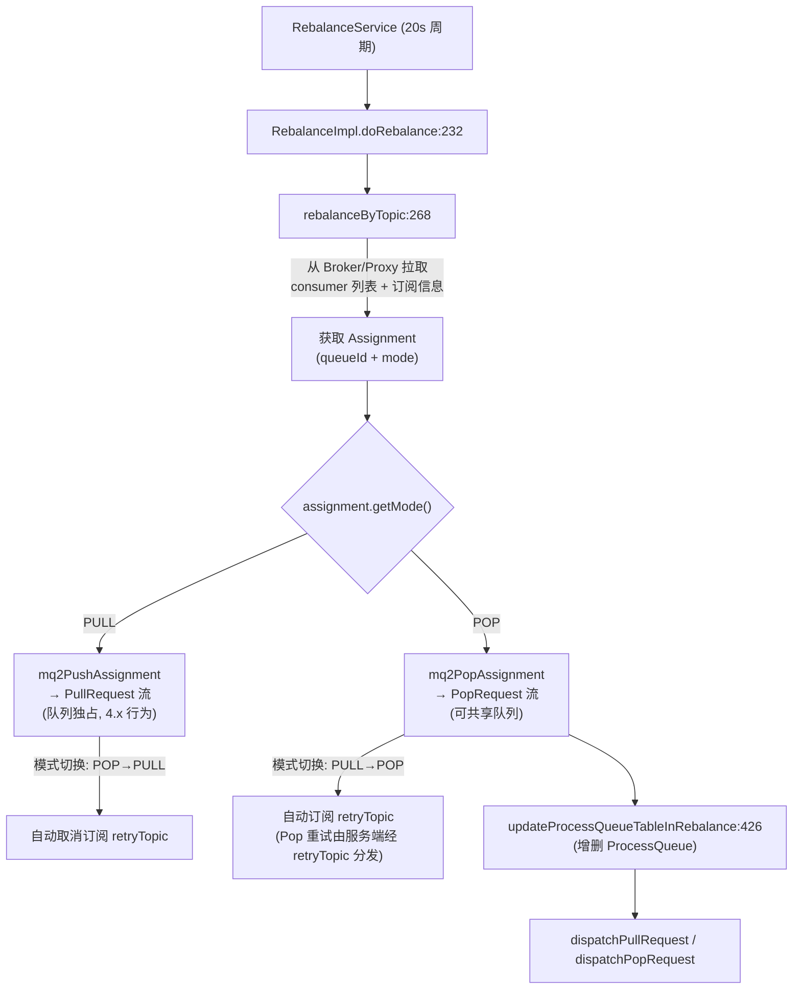
```mermaid
flowchart TD
    RS["RebalanceService (20s 周期)"] --> DRB["RebalanceImpl.doRebalance:232"]
    DRB --> RBT["rebalanceByTopic:268"]
    RBT -->|"从 Broker/Proxy 拉取<br/>consumer 列表 + 订阅信息"| ASSIGN["获取 Assignment<br/>(queueId + mode)"]
    ASSIGN --> SPLIT{"assignment.getMode()"}
    SPLIT -->|PULL| PUSHPATH["mq2PushAssignment<br/>→ PullRequest 流<br/>(队列独占, 4.x 行为)"]
    SPLIT -->|POP| POPPATH["mq2PopAssignment<br/>→ PopRequest 流<br/>(可共享队列)"]
    PUSHPATH -->|"模式切换: POP→PULL"| UNSUB["自动取消订阅 retryTopic"]
    POPPATH -->|"模式切换: PULL→POP"| SUB["自动订阅 retryTopic<br/>(Pop 重试由服务端经 retryTopic 分发)"]
    POPPATH --> UPT["updateProcessQueueTableInRebalance:426<br/>(增删 ProcessQueue)"]
    UPT --> DISP["dispatchPullRequest / dispatchPopRequest"]
```

**重试主题订阅的动态切换**是 5.x 客户端为适配 Pop 做的关键改动：PULL 模式下消费者自己订阅 retryTopic 并分配队列；POP 模式下 retryTopic 由 Broker 在 popAsync 内部优先消费，客户端无需（也不应）自行订阅。

## 5.3 Pop 模式下「不需要传统 Rebalance」的原理

严格说 Pop 模式**并非没有 Rebalance**，而是 Rebalance 的语义被弱化为「知道要消费哪些队列」，而非「独占哪些队列」：

1. **共享语义**：Pop 的 CheckPoint 机制保证一条消息同时只属于一个消费者（弹出即不可见），队列本身无需排他 → 消费者数量变化不需要重新瓜分队列。
2. **位点服务端化**：消费进度由 Broker 端 commitOffsets/PopConsumerService 管理，客户端上下线不产生位点迁移。
3. **随机队列选择**：`queueId=-1` 时 Broker 在全部读队列轮转，天然把流量摊到所有队列与所有 broker。
4. **失败接管**：消费者宕机无需「队列转移 + offset 重置」，其未 ACK 消息由 `invisibleTime + PopReviveService` 自动重新进入消费池。

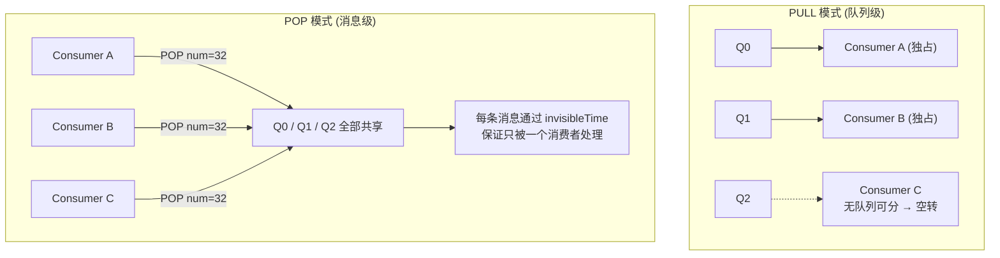
```mermaid
flowchart TB
    subgraph PULLMode["PULL 模式 (队列级)"]
        direction LR
        Q1a["Q0"] --> CA["Consumer A (独占)"]
        Q1b["Q1"] --> CB["Consumer B (独占)"]
        Q1c["Q2"] -.-> CC["Consumer C<br/>无队列可分 → 空转"]
    end

    subgraph POPMode["POP 模式 (消息级)"]
        direction LR
        Q2a["Q0 / Q1 / Q2 全部共享"]
        CA2["Consumer A"] -->|"POP num=32"| Q2a
        CB2["Consumer B"] -->|"POP num=32"| Q2a
        CC2["Consumer C"] -->|"POP num=32"| Q2a
        Q2a --> MSG["每条消息通过 invisibleTime<br/>保证只被一个消费者处理"]
    end
```

## 5.4 与 Proxy / SimpleConsumer 的关系（端云互联）

5.x 的 gRPC 新客户端（SimpleConsumer）天然基于 Pop 语义：

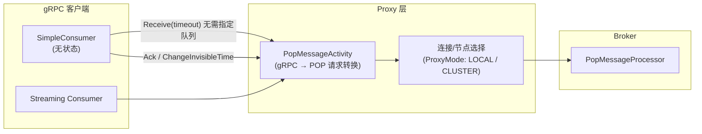
```mermaid
flowchart LR
    subgraph Grpc["gRPC 客户端"]
        SC["SimpleConsumer<br/>(无状态)"]
        TC["Streaming Consumer"]
    end
    subgraph Proxy["Proxy 层"]
        ACT["PopMessageActivity<br/>(gRPC → POP 请求转换)"]
        LB["连接/节点选择<br/>(ProxyMode: LOCAL / CLUSTER)"]
    end
    subgraph Broker["Broker"]
        POPP["PopMessageProcessor"]
    end
    SC -->|"Receive(timeout) 无需指定队列"| ACT
    TC --> ACT
    ACT --> LB --> POPP
    SC -->|"Ack / ChangeInvisibleTime"| ACT
```

- **SimpleConsumer**：显式调用 `receive`（对应 POP）与 `ack`，客户端完全不维护 Rebalance、ProcessQueue、位点——**消息级负载均衡的最彻底形态**
- **ProxyMode.LOCAL**：Proxy 与 Broker 同进程（默认推荐），gRPC 请求直接进程内转发到 `PopMessageProcessor`
- **ProxyMode.CLUSTER**：Proxy 独立部署集群，维护到各 Broker 的连接池，按队列负载与健康度选择节点
- `ChangeInvisibleTime`（延长不可见时间）是 gRPC 独有的扩展语义，服务端通过更新 CheckPoint 的 invisibleTime 实现

## 5.5 三种消费形态的负载均衡对比

| 形态 | 协议 | 均衡粒度 | 均衡执行方 | 客户端状态 |
|------|------|----------|-----------|-----------|
| Push Consumer | Remoting | 队列级 | 客户端 Rebalance | 重（ProcessQueue/位点/重试） |
| Pop Consumer (Push 客户端 + POP 模式) | Remoting | 消息级 | Broker + 弱化 Rebalance | 中（本地仍管 ProcessQueue） |
| Simple Consumer | gRPC | 消息级 | Broker（POP） | 轻（近乎无状态） |

---

# 六、LMQ / LiteTopic 轻量队列

## 6.1 介绍：什么是 LMQ（Lite Message Queue）

LMQ 是 RocketMQ 5.x 为**海量轻量级逻辑队列（百万级 Topic 场景）**设计的特性，业界常称 "liteTopic" 或轻量队列。它解决的核心矛盾：

- 传统模式下，每个 Topic 的每个队列都要在磁盘上创建独立的 ConsumeQueue 文件、在 NameServer/Broker 注册 Topic 路由与 TopicConfig，**队列数量与文件句柄、路由表规模、元数据开销线性正相关**，百万级 Topic 会让 Broker 元数据与冷文件成为灾难。
- IoT / 多租户 / Serverless 场景（如每个设备、每个租户一个"Topic"）恰恰需要海量逻辑队列，但**每个队列的流量极小**。

LMQ 的解法：**一条物理消息只存一份（写在父 Topic 的 CommitLog 中），但通过"多播分发"把消息的索引（ConsumeQueue 单元）额外写入多个以 `%LMQ%` 为前缀命名的虚拟队列**。虚拟队列只有 queueId=0 一个队列，无需注册 Topic 路由、无需 TopicConfig，存储开销仅是一条 CQ 索引（20 字节）。

关键常量（`common/MixAll.java:112-114, 550-552, 577-582`）：

```java
public static final String LMQ_PREFIX = "%LMQ%";        // LMQ 命名前缀
public static final int LMQ_QUEUE_ID = 0;                // LMQ 虚拟队列固定 queueId=0
public static final String LMQ_DISPATCH_SEPARATOR = ","; // 多队列分隔符

public static boolean isLmq(String lmqMetaData) {        // 判定是否 LMQ
    return lmqMetaData != null && lmqMetaData.startsWith(LMQ_PREFIX);
}
// 重试/死信/系统/SCHEDULE 主题不允许承载 LMQ
public static boolean topicAllowsLMQ(String topic) { ... }
```

涉及两个消息内部属性（`MessageConst`）：

| 属性 | 作用 |
|------|------|
| `INNER_MULTI_DISPATCH` | 逗号分隔的虚拟队列名列表，如 `%LMQ%123,%LMQ%456`（发送方设置） |
| `INNER_MULTI_QUEUE_OFFSET` | Broker 写 CommitLog 前预取并写入消息体的各虚拟队列当前 offset（逗号分隔、与上者一一对应），**保证主从/重放时 offset 确定** |

## 6.2 特性总结

1. **一份存储、多路分发**：消息本体在父 Topic 的 CommitLog 中仅存一份；N 个 LMQ 各自的 ConsumeQueue 中各有一条指向它的 20B 索引。
2. **零元数据创建**：LMQ 无需在 NameServer 注册路由、无需 Broker TopicConfig，第一次被分发时 `findConsumeQueue(queueName, 0)` 惰性创建，天然支持百万级"Topic"。
3. **配额保护**：`handleLmqQuota` Hook 限制 LMQ 总数（默认 20000，可调），防止索引文件失控。
4. **Push / Pop 双消费形态**：LMQ 既可被传统 Push 消费者（本地补偿路由）消费，也可切换为 Pop 模式由服务端 Rebalance 消费（5.x 推荐形态）。
5. **事件驱动推送**：`broker/lite` 子包（LiteEventDispatcher + LiteSubscriptionRegistry + RocksDBLiteLifecycleManager）为 LMQ 提供了基于事件队列的"服务端推"能力，避免海量 LMQ 的长轮询扫描开销。
6. **存储引擎可插拔**：5.5.0 起 LMQ 的 ConsumeQueue 可走 RocksDB 引擎（`CombineConsumeQueueStore` 双写/切换），海量小队列不再产生海量小文件。
7. **透明兼容**：LMQ 与普通 Topic 共用同一套 Pull/Pop/查询处理器；`cleanUnusedTopic` 会跳过 LMQ（`DefaultMessageStore.java:1612`），防止其被当作"未使用 Topic"误删。

## 6.3 使用示例

### 6.3.1 生产（`example/lmq/LMQProducer.java`）

```java
DefaultMQProducer producer = new DefaultMQProducer("ProducerGroupName");
producer.setNamesrvAddr("127.0.0.1:9876");
producer.start();

Message msg = new Message("TopicLMQParent", "TagA", "Hello RocketMQ".getBytes());
// 核心：一条消息同时分发到两个 LMQ 虚拟队列
msg.putUserProperty(
    MessageConst.PROPERTY_INNER_MULTI_DISPATCH /* INNER_MULTI_DISPATCH */,
    String.join(MixAll.LMQ_DISPATCH_SEPARATOR,
        "%LMQ%123", "%LMQ%456"));
producer.send(msg);
```

说明：
- 发送的 topic 是**父 Topic**（`TopicLMQParent`，需预先创建，其队列数决定物理写入位置）；
- `INNER_MULTI_DISPATCH` 属性列出目标 LMQ 名，命名必须以 `%LMQ%` 开头；
- 一条消息可同时进多个 LMQ（多播语义）。

### 6.3.2 Push 消费（`example/lmq/LMQPushConsumer.java`）

```java
DefaultMQPushConsumer consumer = new DefaultMQPushConsumer("CID_LMQ_1");
consumer.subscribe("%LMQ%123", "*");   // 直接把 LMQ 当 Topic 订阅
consumer.registerMessageListener(...);
consumer.start();

// ---- 关键：LMQ 没有路由，需要用父 Topic 的路由手工补偿 ----
consumer.getDefaultMQPushConsumerImpl().getmQClientFactory()
    .updateTopicRouteInfoFromNameServer("TopicLMQParent");          // 用父Topic填 broker 地址表
TopicRouteData route = ...; // 手工构造仅含 broker-a 的路由
consumer.getDefaultMQPushConsumerImpl().getmQClientFactory()
    .getTopicRouteTable().put("%LMQ%123", route);                   // 补偿路由
consumer.getDefaultMQPushConsumerImpl().updateTopicSubscribeInfo(
    "%LMQ%123",
    new HashSet<>(Arrays.asList(
        new MessageQueue("%LMQ%123", "broker-a", (int) MixAll.LMQ_QUEUE_ID)))); // 只有 queueId=0
consumer.getDefaultMQPushConsumerImpl().getmQClientFactory().doRebalance();     // 立即触发拉取
```

> Push 形态的痛点显而易见：客户端要自己"伪造"路由与订阅信息。这正是 5.x 更推荐 **Pop + 服务端 Rebalance** 形态的原因。

### 6.3.3 Pop 消费（`example/lmq/LMQPushPopConsumer.java`）

```java
private static void switchPop() throws Exception {
    DefaultMQAdminExt mqAdminExt = new DefaultMQAdminExt();
    mqAdminExt.setNamesrvAddr("127.0.0.1:9876");
    mqAdminExt.start();
    // 把 LMQ+消费组 切换为 POP 模式（shareMode=8），交给服务端 Rebalance
    mqAdminExt.setMessageRequestMode(brokerAddr, "%LMQ%456", "CID_LMQ_POP_1",
        MessageRequestMode.POP, 8, 3_000);
}

DefaultMQPushConsumer consumer = new DefaultMQPushConsumer("CID_LMQ_POP_1");
consumer.subscribe("%LMQ%456", "*");
consumer.setClientRebalance(false);   // 关闭客户端 Rebalance，走服务端分配
consumer.start();
// 仍需用父 Topic 补偿 broker 地址表与 LMQ 路由（同上）
```

Pop 形态下队列分配、位点管理全部上移服务端，是 LMQ 消费的推荐姿势（与第五章消息级负载均衡直接衔接）。

## 6.4 实现原理

### 6.4.1 总体数据流

```mermaid
flowchart TB
    subgraph Send["发送链路"]
        P["Producer<br/>msg(topic=父Topic)<br/>+ INNER_MULTI_DISPATCH=%LMQ%123,%LMQ%456"] --> HP["HookUtils.handleLmqQuota:155<br/>LMQ 数量配额检查"]
        HP --> CL["CommitLog.asyncPutMessage"]
        CL --> PRE["LmqDispatch.prepareLmqDispatch<br/>(CommitLog.java:2000)<br/>预取各 LMQ 当前 offset<br/>写入 INNER_MULTI_QUEUE_OFFSET 属性"]
        PRE --> CLW["消息(含属性)写 CommitLog"]
    end

    subgraph Reput["Reput 分发链路 (异步)"]
        RP["ReputMessageService.doReput"] --> DR["生成 DispatchRequest<br/>(含 propertiesMap)"]
        DR --> PARENT["父Topic ConsumeQueue<br/>putMessagePositionInfoWrapper:725<br/>(写物理队列索引)"]
        PARENT --> MD{"MultiDispatchUtils<br/>.checkMultiDispatchQueue:46<br/>enableMultiDispatch &&<br/>含两个 INNER 属性?"}
        MD -->|是| LMQD["ConsumeQueue.multiDispatchLmqQueue:775<br/>逐个虚拟队列:"]
        LMQD --> C1["findConsumeQueue(%LMQ%123, 0)<br/>惰性创建 + 写 20B 索引<br/>(queueOffset 取预取值)"]
        LMQD --> C2["findConsumeQueue(%LMQ%456, 0)<br/>同上"]
        LMQD --> UPD["LmqDispatch.updateLmqOffsets<br/>(CommitLog.java:2107)<br/>各 LMQ 队列 offset +1"]
        LMQD --> NTF["notifyMessageArrive4MultiQueue<br/>(DefaultMessageStore.java:2791)<br/>逐 LMQ 通知长轮询/Lite事件"]
    end

    subgraph Consume["消费链路"]
        L1["Push: PullMessageProcessor<br/>按 %LMQ%123@0 拉索引<br/>回 CommitLog 取消息"]
        L2["Pop: PopMessageProcessor<br/>服务端 Rebalance 分配 LMQ"]
        L3["Lite: LiteEventDispatcher<br/>事件队列推送"]
    end

    C1 --> L1
    C1 --> L2
    NTF --> L3
```

### 6.4.2 写入路径：offset 预取与配额

**（1）配额检查**（`broker/util/HookUtils.java:155`，注册为 PutMessageHook 链最后一个 Hook）：

```java
public static PutMessageResult handleLmqQuota(BrokerController brokerController,
                                               final MessageExtBrokerInner msg) {
    if (!enableLmqQuota || !enableLmq || !enableMultiDispatch
        || !msg.needDispatchLMQ()) {
        return null; // 未开启或普通消息，放行
    }
    ConsumeQueueStoreInterface cqStore = brokerController.getMessageStore().getQueueStore();
    String[] queueNames = msg.getProperty(PROPERTY_INNER_MULTI_DISPATCH)
        .split(MixAll.LMQ_DISPATCH_SEPARATOR);
    for (String queueName : queueNames) {
        if (!MixAll.isLmq(queueName)) continue;
        // LMQ 总数达到上限 且 该 LMQ 是新队列 -> 拒绝
        if (cqStore.getLmqNum() >= maxLmqConsumeQueueNum /* 默认 20000 */
            && !cqStore.isLmqExist(queueName)) {
            return new PutMessageResult(PutMessageStatus.LMQ_CONSUME_QUEUE_NUM_EXCEEDED, null);
        }
    }
    return null;
}
```

注意配额只拦"新建"，已存在的 LMQ 不受影响 -- 保证存量流量不受限。

**（2）offset 预取**（`store/LmqDispatch.java`，由 `CommitLog.java:2000` 在消息进 CommitLog 前调用）：

```java
// prepareLmqDispatch -> populateLmqOffsets (LmqDispatch.java:47)
private static String[] populateLmqOffsets(MessageStore messageStore, MessageExtBrokerInner msg) {
    String[] queueNames = parseLmqQueueNames(msg);   // 按逗号拆 INNER_MULTI_DISPATCH
    StringBuilder queueOffsets = new StringBuilder();
    for (int i = 0; i < queueNames.length; i++) {
        if (i > 0) queueOffsets.append(MixAll.LMQ_DISPATCH_SEPARATOR);
        if (enableLmq && MixAll.isLmq(queueNames[i])) {
            // 取该 LMQ 当前队列 offset（文件 CQ 从索引条数推算，RocksDB 从 KV 读取）
            queueOffsets.append(messageStore.getQueueStore()
                .getLmqQueueOffset(queueNames[i], MixAll.LMQ_QUEUE_ID));
        }
    }
    MessageAccessor.putProperty(msg, PROPERTY_INNER_MULTI_QUEUE_OFFSET, queueOffsets.toString());
    return queueNames;
}
```

**为什么必须预取并随消息落盘？** 因为 ConsumeQueue 索引是 Reput 线程**异步**构建的，而 LMQ 队列 offset 存在于 ConsumeQueueStore 的运行时状态中；若分发时才取 offset，主从切换/崩溃恢复重放（reput 重跑）时可能取到不同值导致 CQ 中 offset 断裂或重复。把 offset 作为消息属性固化进 CommitLog 后，**重放是幂等的**。写成功后 `CommitLog.java:2107` 调 `updateLmqOffsets` 把各 LMQ 计数 +1。

### 6.4.3 分发路径：一次存储，多路索引

`ReputMessageService` 从 CommitLog 重放消息生成 DispatchRequest 后（`DefaultMessageStore.java:2075`）：

```java
// ConsumeQueue.java:725 putMessagePositionInfoWrapper
boolean result = this.putMessagePositionInfo(request.getCommitLogOffset(),
    request.getMsgSize(), tagsCode, request.getConsumeQueueOffset());  // ① 父Topic索引
if (result) {
    if (MultiDispatchUtils.checkMultiDispatchQueue(..., request)) {     // ② 校验
        multiDispatchLmqQueue(request, maxRetries);                     // ③ LMQ 多路分发
    }
    return;
}

// ConsumeQueue.java:775 multiDispatchLmqQueue
for (int i = 0; i < queues.length; i++) {
    long queueOffset = Long.parseLong(queueOffsets[i]);  // 取消息属性中预取的 offset
    int queueId = request.getQueueId();
    if (enableLmq && MixAll.isLmq(queueName)) {
        queueId = 0;                                     // LMQ 固定 queueId=0
    }
    doDispatchLmqQueue(request, maxRetries, queueName, queueOffset, queueId);
}

// ConsumeQueue.java:799 doDispatchLmqQueue
ConsumeQueueInterface cq = this.messageStore.findConsumeQueue(queueName, queueId); // 惰性创建
((ConsumeQueue) cq).putMessagePositionInfo(
    request.getCommitLogOffset(), request.getMsgSize(), request.getTagsCode(),
    queueOffset);                                        // 与父Topic CQ 同样的 20B 单元
```

索引单元与普通 CQ 完全一致（8B commitLogOffset + 4B size + 8B tagsCode），**指向同一份 CommitLog 消息** -- 这就是"一份存储、多路分发"的落地。

分发完成后 `notifyMessageArrive4MultiQueue`（`DefaultMessageStore.java:2791`）逐 LMQ 通知消息到达（长轮询唤醒 / Lite 事件），注意对 LMQ 强制 `queueId = LMQ_QUEUE_ID`。

### 6.4.4 存储布局与清理保护

```mermaid
flowchart LR
    subgraph Disk["store 目录"]
        CLG["commitlog/<br/>00000000000000000000 (消息本体, 一份)"]
        CQP["consumequeue/TopicLMQParent/0/000...<br/>(父Topic队列索引)"]
        CQL1["consumequeue/%LMQ%123/0/000...<br/>(虚拟队列索引, 惰性创建)"]
        CQL2["consumequeue/%LMQ%456/0/000...<br/>(虚拟队列索引)"]
    end
    CQP -.->|"指向"| CLG
    CQL1 -.->|"指向同一条"| CLG
    CQL2 -.->|"指向同一条"| CLG
```

清理策略上的特殊处理（`DefaultMessageStore.java:1605 cleanUnusedTopic / :1570 deleteTopics`）：
- `cleanUnusedTopic` 中 `MixAll.isLmq(topicName)` 的队列**跳过**"未使用即删除"逻辑 -- LMQ 不在 TopicConfig 表中，若不跳过会被全量误删；
- `deleteTopics` 删除 LMQ 时不触发 `onTopicDeleted` 统计清理（LMQ 无统计）。

### 6.4.5 broker/lite 子包：LMQ 的事件驱动推送

海量 LMQ 场景下，若每个 LMQ 都靠长轮询挂起/唤醒，PullRequestHoldService 与消费端轮询压力巨大。`broker/lite` 子包提供了**服务端事件推送**方案：

```mermaid
flowchart TB
    subgraph Lite["broker/lite 子包"]
        REG["LiteSubscriptionRegistry(Impl)<br/>clientId+group -> 订阅的 LMQ 集合<br/>(RocksDB 持久化)"]
        DISP["LiteEventDispatcher (ServiceThread)<br/>dispatch(group, lmqName, queueId,<br/>offset, msgStoreTime):92<br/>事件入 per-group 队列"]
        LCM["RocksDBLiteLifecycleManager<br/>(AbstractLiteLifecycleManager)<br/>订阅生命周期 + 墓碑清理"]
        SHARD["LiteSharding(Impl)<br/>LMQ 分片路由"]
    end

    subgraph Client["消费端 (轻客户端)"]
        SUB["subscribe(%LMQ%xxx)<br/>(注册到 Registry)"]
        POLL["事件队列 poll()/next()<br/>收到'有新消息'事件后定向拉取"]
    end

    MSG["新消息 dispatch 到 LMQ"] --> DISP
    DISP -->|"GroupEventSet<br/>BlockingQueue + 去重 map"| POLL
    SUB --> REG
    REG --> DISP
    DISP --> BL["blacklist (Caffeine, 10s 过期)<br/>消费过慢/异常客户端临时拉黑"]
    DISP --> SCAN["scan() 周期任务<br/>清理不活跃客户端事件集<br/>(10s 无处理 -> 释放)"]
```

关键设计（`LiteEventDispatcher.java`）：
- **每个 (group) 一个事件集**（内部类含 `BlockingQueue<String> events` + 去重 map + 容量自适应 `getMaxCapacity()`），注释明确"一个消费组内通常每个 LMQ 只有一个订阅者"，事件按 LMQ 名去重，**消费端只需知道"哪个 LMQ 有新消息"再定向拉取**，避免盲目轮询；
- **全量补发**：客户端重连时 `doFullDispatchForClient(clientId, group):202` 遍历其订阅的全部 LMQ 补发事件；`doFullDispatchForWildcardGroup:272` 处理通配订阅（遍历 CQ 表，代价较高，故按需触发）；
- **黑名单与防雪崩**：异常客户端进 blacklist（10s 过期），scan() 清理 10s 无消费进展的事件集，防止慢客户端把内存事件队列撑爆；
- 订阅关系与生命周期由 `RocksDBLiteLifecycleManager` 落 RocksDB，配合 `ExclusiveEvictionTombstones`（排他清理墓碑）处理订阅的注册/注销/孤儿清理。

### 6.4.6 RocksDB ConsumeQueue 存储引擎（5.5.0）

海量 LMQ 意味着海量 `consumequeue/%LMQ%xxx/0/` 小目录与小文件。5.5.0 引入 `CombineConsumeQueueStore` 双引擎架构：

```mermaid
flowchart LR
    DR["DispatchRequest"] --> CCS["CombineConsumeQueueStore<br/>putMessagePositionInfoWrapper:363"]
    CCS -->|"combineCQUseRocksdbForLmq<br/>&& rocksdbCQDoubleWriteEnable"| RDB["RocksDBConsumeQueueStore<br/>(LMQ 索引写 RocksDB, :232)"]
    CCS -->|"否则"| FILE["ConsumeQueueStore (文件 CQ)"]
    MD["MultiDispatchUtils.checkMultiDispatchQueue:50<br/>若走 RocksDB-LMQ 路径<br/>则跳过文件 CQ 的 LMQ 分发<br/>(避免双写两份)"]
```

- `rocksdbCQDoubleWriteEnable`：文件 CQ 与 RocksDB CQ 双写（迁移期）
- `combineCQUseRocksdbForLmq`：LMQ 队列的索引只写 RocksDB 引擎（`RocksDBConsumeQueueStore.putMessagePositionInfoWrapper:232`），普通 Topic 仍走文件 CQ
- LMQ 队列 offset 的读写（`getLmqQueueOffset / increaseLmqOffset`）随之从"数文件条目"变为 RocksDB KV 操作

这样百万级 LMQ 不再产生百万个小文件，索引全部收敛进 RocksDB 的 LSM 树，配合配额 `maxLmqConsumeQueueNum` 形成完整的海量轻队列方案。

### 6.4.7 完整时序图

```mermaid
sequenceDiagram
    autonumber
    participant P as Producer
    participant HK as HookUtils(handleLmqQuota)
    participant C as CommitLog
    participant LD as LmqDispatch
    participant RP as ReputMessageService
    participant PCQ as 父Topic ConsumeQueue
    participant LCQ as LMQ ConsumeQueue(%LMQ%123)
    participant NTF as notifyMessageArrive4MultiQueue
    participant CS as 消费者(Push/Pop/Lite)

    P->>HK: send(父Topic, INNER_MULTI_DISPATCH=%LMQ%123,%LMQ%456)
    HK->>HK: getLmqNum() >= 20000 且新建?<br/>是->LMQ_CONSUME_QUEUE_NUM_EXCEEDED
    HK->>LD: prepareLmqDispatch (CommitLog:2000)
    LD->>LCQ: getLmqQueueOffset(%LMQ%123, 0)
    LD->>C: 消息附加 INNER_MULTI_QUEUE_OFFSET=5,3 写入
    C-->>P: PUT_OK
    Note over C: 消息本体仅此一份

    loop doReput (异步)
        RP->>RP: 生成 DispatchRequest(含属性)
        RP->>PCQ: putMessagePositionInfoWrapper:725 (父Topic索引)
        RP->>RP: checkMultiDispatchQueue:46 通过
        RP->>LCQ: multiDispatchLmqQueue:775<br/>findConsumeQueue 惰性创建, 写 20B 索引(offset=5)
        RP->>RP: updateLmqOffsets:2107 -> LMQ offset +1
        RP->>NTF: arriving(%LMQ%123, 0, offset+1)
        NTF->>CS: 长轮询唤醒 / Lite 事件推送
    end

    CS->>LCQ: Pull/Pop offset=5 读索引
    LCQ-->>CS: (commitLogOffset, size)
    CS->>C: 按 offset 读消息本体
```

## 6.5 配置一览（`store/config/MessageStoreConfig.java`）

| 配置 | 默认值 | 行号 | 说明 |
|------|--------|------|------|
| `enableLmq` | false | :299 | LMQ 总开关（offset 读写与队列判定均依赖） |
| `enableMultiDispatch` | false | :300 | 多路分发开关（reput 分发到虚拟队列） |
| `maxLmqConsumeQueueNum` | 20000 | :301 | LMQ 队列总数配额（handleLmqQuota） |
| `enableLmqQuota` | false | :302 | 配额检查开关 |
| `rocksdbCQDoubleWriteEnable` | false | :486 | 文件 CQ + RocksDB CQ 双写 |
| `combineCQUseRocksdbForLmq` | false | :502 | LMQ 索引改用 RocksDB 引擎 |

## 6.6 与普通 Topic 的对比

| 维度 | 普通 Topic | LMQ（LiteTopic） |
|------|-----------|------------------|
| 路由/元数据 | NameServer 路由 + Broker TopicConfig | 无（消费端需补偿路由或走服务端 Rebalance） |
| 队列数 | 可配置多队列 | 固定 queueId=0 单队列 |
| 消息存储 | CommitLog 独立单元 | 复用父 Topic 的 CommitLog 单元 |
| ConsumeQueue | 每队列一组文件 | 每个命名一个虚拟目录（或 RocksDB），仅索引 |
| 创建方式 | createTopic | 首次分发惰性创建 + 配额限制 |
| 顺序性 | 队列内有序 | 单 LMQ 内有序（共用父 Topic 物理顺序） |
| 典型规模 | 百~千级 | 万~百万级 |
| 适用场景 | 高吞吐业务主题 | IoT 设备分流、多租户、Serverless 事件、轻量广播 |

## 6.7 与其他 5.x 特性的关系

- **LMQ × Pop/消息级负载均衡**：LMQ 天然单队列，传统 Push 的队列独占模型下并发度受限；切换 POP 模式（`setMessageRequestMode`）后所有消费者共享该虚拟队列，`setClientRebalance(false)` 走服务端分配 -- 这是 `LMQPushPopConsumer` 示例展示的推荐组合。
- **LMQ × 定时消息**：定时消息到期回投原主题时同样会携带原始属性走 Reput 分发，理论上可与 LMQ 叠加（需注意 `topicAllowsLMQ` 对系统主题的排除）。
- **LMQ × 分级存储**：LMQ 的冷数据同样可被 TieredStore 搬运，虚拟队列索引随 ConsumeQueue 一并进入冷层。

---

# 七、Controller 模式（自动主从切换 / 弹性副本）

## 7.1 设计动机与总体架构

4.x 高可用方案的痛点：

| 方案 | 问题 |
|------|------|
| 传统主从（SYNC_MASTER） | 主挂后**不会自动切换**，需人工运维；ASYNC 会丢数据 |
| DLedger CommitLog（4.x） | Raft 复制耦合进存储层，CommitLog 格式被改写（带 index/term），磁盘开销大、无法平滑升级回原生格式 |

Controller 模式的思路：**把"选主决策"从数据面剥离到独立的控制面**。数据面仍是原生 CommitLog + 传统 HA 复制（`DefaultHAConnection`），控制面是一个基于 DLedger(Raft) 的独立小集群，只维护"谁是主、谁是同步副本集"这类元数据。主挂了由 Controller 秒级选出新主，**存储格式零侵入**。

```mermaid
flowchart TB
    subgraph CTL["Controller 集群 (3/5 节点, DLedger Raft)"]
        CL["Controller Leader"]
        CF1["Controller Follower"]
        CF2["Controller Follower"]
        RIM["ReplicasInfoManager<br/>brokerLiveTable / syncStateSetInfoTable<br/>controllerMetaData (内存状态机)"]
        ES["EventScheduler<br/>单线程顺序消费事件队列"]
        CL --> RIM
        CL --> ES
    end

    subgraph BrokerGroup["Broker 组 (一个 brokerName, 数据面)"]
        M["Master<br/>(LEADING)"]
        S1["Slave/Follower<br/>(FOLLOWING)"]
        S2["Slave/Follower<br/>(FOLLOWING)"]
        HA["DefaultHAService<br/>原生 HA 复制<br/>(Write/ReadSocketService)"]
        M --> HA --> S1
        M --> HA --> S2
    end

    subgraph RM["每个 Broker 内嵌"]
        RM1["ReplicasManager<br/>注册/心跳/角色切换"]
    end

    M --> RM1
    S1 --> RM1
    S2 --> RM1
    RM1 -->|"registerBroker / sendHeartbeat<br/>(brokerId, maxOffset, epoch)"| CL
    CL -->|"ElectMaster / 角色变更通知"| RM1
    CF1 -.Raft 复制.- CL
    CF2 -.Raft 复制.- CL
```

三层职责划分：
- **Controller（控制面）**：持有全局路由权威，决定主从与 SyncStateSet，自身由 Raft 保证高可用
- **ReplicasManager（Broker 内嵌代理）**：`broker/controller/ReplicasManager.java`，负责注册、心跳、执行角色切换
- **DefaultHAService（数据面）**：与传统主从完全相同的物理复制通道，Controller 模式只是换了"谁来指挥"

## 7.2 Controller 集群实现（`controller/` 模块）

### 7.2.1 接口与实现

`org.apache.rocketmq.controller.Controller` 接口定义控制面 API：`startup/shutdown`、`startScheduling/stopScheduling`、`registerBroker`、`electMaster`、`alterSyncStateSet`、`getReplicaInfo`、`getSyncStateData`、`getControllerMetadata`。生产实现为 **DLedgerController**：

- `startup()` 初始化 DLedgerServer 并注册状态机（`DLedgerControllerStateMachine`）
- `RoleChangeHandler` 监听 Raft 角色：成为 **Leader** 后才 `startScheduling()` 启动事件调度与不活跃 Broker 扫描；退位即停止
- 所有变更（选主/改 SyncStateSet）都以事件形式**追加进 Raft 日志**再由状态机 apply 到 `ReplicasInfoManager` 的内存表 -- 单线程 `EventScheduler`（阻塞队列）保证顺序性，Raft 保证多数派持久化

### 7.2.2 核心元数据：epoch 与 SyncStateSet

Controller 模式引入两个防脑裂的关键计数器：

| 概念 | 含义 |
|------|------|
| **epoch（term）** | 每一次主从切换全局单调递增。Broker 启动时向 Controller 确认 epoch，若本地的 epoch/leaderId 与 Controller 不一致则进入 **Fenced**（隔离）。旧主网络恢复后因 epoch 落后无法再接受写入 -- **解决脑裂** |
| **SyncStateSet（同步副本集）** | 当前被认为"与主保持同步"的副本集合。只有 SyncStateSet 内的副本有资格被选为新主（除非 `enableElectUncleanMaster`），且写入确认数可按它计算 |

`ReplicasInfoManager` 维护：
- `brokerLiveTable`：在线副本表（心跳维持，含各副本 maxOffset 等上报信息）
- `syncStateSetInfoTable`：每组的同步副本集
- `controllerMetaData`：leader epoch 等元数据

### 7.2.3 选举与失效检测

```mermaid
sequenceDiagram
    autonumber
    participant B1 as Broker-a(旧主)
    participant B2 as Broker-b(Follower)
    participant CTL as Controller Leader
    participant RIM as ReplicasInfoManager

    Note over B1: 宕机, 心跳中断
    loop scanInactiveBrokers (周期)
        CTL->>RIM: scanInactiveMasterAndTriggerReelect()
        RIM->>RIM: 旧主超过超时时间未心跳
        RIM->>RIM: DefaultElectPolicy: 从 SyncStateSet<br/>中选出同步进度最优副本
        RIM->>CTL: 生成 ElectMasterEvent
        CTL->>CTL: 追加 Raft 日志 -> 状态机 apply<br/>masterEpoch+1, 更新 leaderId
    end
    CTL->>B2: 角色变更通知(变主)
    B2->>B2: ReplicasManager.changeToMaster:237<br/>haService.changeToMaster(epoch)
    B2->>CTL: registerBrokerWhenRoleChange:321<br/>向 NameServer 重新注册路由
    Note over B1: 稍后恢复
    B1->>CTL: 心跳/注册
    CTL-->>B1: epoch 落后 -> setFenced(true):882<br/>RunningFlags.makeFenced<br/>拒绝一切写入
    Note over B2: 新主开始接受写入<br/>B1 只读(Fenced)
```

关键点：
- **选举策略可插拔**：`DefaultElectPolicy` 默认只在 SyncStateSet 内选（RPO=0）；`enableElectUncleanMaster=true` 允许"脏选"（牺牲一致性换可用性，类比 Kafka 的 unclean leader election）
- **新主就位后主动重注册路由**（`registerBrokerWhenRoleChange:321` -> `brokerController.registerBrokerAll`），客户端通过 NameServer 路由表感知切换
- **Fenced 的实现**是 `RunningFlags.makeFenced` -- 一个全局标志位，`SendMessageProcessor` 等入口检查后直接拒绝写入，但**读不受影响**（消费者可继续从隔离 broker 拉数据）

## 7.3 Broker 端：ReplicasManager 状态机

`broker/controller/ReplicasManager.java`（约 900+ 行），两个状态机：

```mermaid
stateDiagram-v2
    [*] --> INITIAL
    INITIAL --> FIRST_TIME_SYNC_CONTROLLER_METADATA_DONE : 拉取 Controller 元数据<br/>确认 leader 地址
    FIRST_TIME_SYNC_CONTROLLER_METADATA_DONE --> CREATE_TEMP_METADATA_FILE_DONE : 申请 brokerId<br/>写临时元数据文件
    CREATE_TEMP_METADATA_FILE_DONE --> CREATE_METADATA_FILE_DONE : 正式元数据落盘
    CREATE_METADATA_FILE_DONE --> REGISTERED : registerBrokerToController（行559）<br/>获取 master 信息
    REGISTERED --> RUNNING : changeToMaster（行237）<br/>或 changeToSlave（行281）
    RUNNING --> RUNNING : sendHeartbeatToController（行401）<br/>SyncStateSet 上报
    RUNNING --> [*] : SHUTDOWN
```

（左为 `State` 枚举 :122-128，右半为 `RegisterState` :130-135 的注册子流程；Broker 重启时凭本地元数据文件中的 brokerId 幂等注册，避免重复分配 id。）

运行期核心循环：
1. **心跳**（`sendHeartbeatToController:401` -> `brokerOuterAPI.sendHeartbeatToController`）：上报 brokerId、地址、epoch、`maxPhyOffset` 等，Controller 据此维持 `brokerLiveTable` 并感知复制进度
2. **角色变更处理**（:199-236 附近的通知回调）：收到 Controller 指令后 `changeToMaster(newMasterEpoch, syncStateSetEpoch, syncStateSet)` 或 `changeToSlave(newMasterAddress, ...)`，内部分三种情况（当主变主/当从变从时只更新 epoch，跨角色才做 HA 通道重建）
3. **SyncStateSet 上报**：Follower 持续比对本地复制进度，`checkSyncStateSetAndDoReport` 发现集合应变化时调用 `alterSyncStateSet` 请求 Controller 变更
4. **Controller 地址管理**：`updateControllerAddr` / `scanAvailableControllerAddresses`（:139-142，2 分钟/3 秒两个周期任务）维持 Controller 集群地址表并探活

## 7.4 Controller 模式下的写入路径

`CommitLog.asyncPutMessage` 中的 Controller 分支（`CommitLog.java:1050-1060`，批量接口 `asyncPutMessages` 在 :1211 同构）：

```java
if (needHandleHA && brokerConfig.isEnableControllerMode()) {
    // ① 同步副本数不足 -> 拒绝写入（类比 MongoDB/ES 的 write concern）
    if (haService.inSyncReplicasNums(currOffset) < messageStoreConfig.getMinInSyncReplicas()) {
        return CompletableFuture.completedFuture(
            new PutMessageResult(PutMessageStatus.IN_SYNC_REPLICAS_NOT_ENOUGH, null));
    }
    // ② allAckInSyncStateSet: 等待 SyncStateSet 全体副本确认
    if (messageStoreConfig.isAllAckInSyncStateSet()) {
        needAckNums = MixAll.ALL_ACK_IN_SYNC_STATE_SET;
    }
}
```

```mermaid
flowchart TD
    PUT["Producer 发送"] --> FENCED{"Broker 被 Fenced?<br/>(RunningFlags.makeFenced)"}
    FENCED -->|是| REJ1["拒绝写入"]
    FENCED -->|否| SYNC{"inSyncReplicasNums<br/>< minInSyncReplicas?"}
    SYNC -->|是| REJ2["IN_SYNC_REPLICAS_NOT_ENOUGH<br/>(可用性让位于一致性)"]
    SYNC -->|否| ACK{"allAckInSyncStateSet?"}
    ACK -->|true| WAITALL["等待 SyncStateSet<br/>全部副本 ACK"]
    ACK -->|false| WAITN["按 needAckNums/slaveNotAfterFlush 等待"]
    WAITALL --> CL2["CommitLog 落盘成功"]
    WAITN --> CL2
    CL2 --> GROUP["GroupTransferService 通知挂起请求"]
```

这套语义与 4.x SYNC_MASTER 的区别：
- **写入确认的目标集合是动态的 SyncStateSet**，而非"所有从"；副本掉队被移出集合后，写入照常满足 `minInSyncReplicas` 即可成功，慢副本不再拖垮主
- `inSyncReplicasNums` 由 `DefaultHAService` 基于各 HAConnection 的推送进度实时计算
- 事务/定时等系统消息路径（:416/:712/:735/:889）也有对应的 ControllerMode 分支处理 epoch 与 HA 等待

## 7.5 SyncStateSet 动态调整（弹性副本基础）

```mermaid
sequenceDiagram
    autonumber
    participant M as Master
    participant S2 as Follower(掉队)
    participant CTL as Controller

    Note over S2: 磁盘慢/网络抖动<br/>复制进度落后
    M->>M: 定期计算各副本同步状态<br/>(HAConnection 进度 vs 主写入水位)
    M->>CTL: checkSyncStateSetAndDoReport<br/>建议 SyncStateSet 移除 S2
    CTL->>CTL: 校验(法定人数等)<br/>生成 AlterSyncStateSetEvent
    CTL->>CTL: Raft 日志 -> 状态机 apply
    CTL-->>M: 变更生效
    Note over M: SyncStateSet={Master}<br/>minInSyncReplicas=1 时写入继续
    Note over S2: 追平进度后<br/>重新加入 SyncStateSet
    M->>CTL: 上报重新纳入
```

**弹性副本（Elastic Replica）**：副本数不再写死在配置里，通过 `alterSyncStateSet` / 管理命令在线变更副本集合（加副本=新 Follower 先追数据再入集合；减副本=移出后下线），全程无主切换、无写入中断。配合 Controller 的自动选主，实现了"存算分离调度"所需的副本自愈与伸缩能力（这也是 5.x 宣传的弹性架构基石）。

## 7.6 逃生通道：EscapeBridge 与 Slave Acting Master

切换窗口期（旧主 Fenced、新主路由未生效）内客户端发送可能失败。`EscapeBridge`（`broker/failover/EscapeBridge.java`，由 `enableSlaveActingMaster && enableRemoteEscape` 控制）提供**代发**能力：

```mermaid
flowchart LR
    C["客户端"] -->|"写入被 Fenced 主拒绝"| BP["SendMessageProcessor"]
    BP --> EB["EscapeBridge"]
    EB --> IP["innerProducerGroupName<br/>(内部 Producer)"]
    IP -->|"转发到集群内健康 Broker"| NM["其他 Master"]
    EB --> IC["innerConsumerGroupName<br/>(内部 Consumer)"]
    IC -->|"事务半消息/Pop 类消息代收发"| NM
```

- **Slave Acting Master**：从节点临时充当"半主"，可处理读请求、Pop 请求与部分元数据请求，把切换期对客户端的影响压缩到最小
- EscapeBridge 内部 Producer/Consumer 使用系统内部组名，转发的消息带内部标记避免循环

## 7.7 配置与部署

### 7.7.1 独立 Controller 集群（推荐，3 或 5 节点）

```properties
# controller.properties (mqcontroller -c controller.properties)
controllerDLegerGroup=controller-cluster-1
controllerDLegerPeers=n1-127.0.0.1:19876;n2-127.0.0.1:19877;n3-127.0.0.1:19878
controllerDLegerSelfId=n1
controllerStorePath=/root/controller
```

### 7.7.2 Broker 侧

```properties
enableControllerMode=true
controllerAddr=127.0.0.1:19876;127.0.0.1:19877;127.0.0.1:19878
```

### 7.7.3 关键配置一览

| 配置 | 默认值 | 说明 |
|------|--------|------|
| `enableControllerMode` | false | 开启 Controller 模式 HA |
| `controllerAddr` | - | Controller 集群地址（分号分隔） |
| `minInSyncReplicas` | 1 | 写入要求的最小同步副本数（不足即拒绝写入） |
| `allAckInSyncStateSet` | false | 是否等待 SyncStateSet 全体 ACK |
| `enableElectUncleanMaster` | false | 是否允许选举非同步副本（牺牲一致性换可用） |
| `enableSlaveActingMaster` | false | 从节点代主（切换期承接读/Pop） |
| `enableRemoteEscape` | false | 开启 EscapeBridge 远程代发 |
| `scanInactiveMasterInterval` | 5000ms | Controller 扫描失活主并触发重选举的周期 |

## 7.8 与其他 HA 方案对比

| 维度 | 传统主从 | DLedger CommitLog(4.x) | Controller 模式(5.x) |
|------|---------|------------------------|----------------------|
| 自动切换 | 无 | 有（Raft 内嵌存储层） | 有（独立控制面） |
| CommitLog 格式 | 原生 | 改写（index/term 头） | **原生** |
| 写确认粒度 | 全部从(SYNC) | Raft 多数派 | SyncStateSet / minInSyncReplicas 可配 |
| 脑裂防护 | - | Raft term | epoch + Fenced |
| 弹性副本 | 不支持 | 不支持 | 支持（alterSyncStateSet 在线变更） |
| 部署复杂度 | 低 | 低（多存一份 Raft 日志） | 多一个独立集群 |
| 与 5.x 特性协同 | - | 与 Proxy/分级存储耦合差 | 与 Proxy/Elastic/容器化协同好 |


# 八、RocksDB 存储引擎全家桶

## 8.1 介绍：为什么 RocketMQ 要拥抱 RocksDB

RocketMQ 传统实现的四类"痛点"恰好都是 RocksDB（LSM-Tree）的强项：

| 痛点 | 传统实现 | RocksDB 方案 |
|------|---------|-------------|
| 百万级 LMQ 产生海量 CQ 小目录/小文件 | `consumequeue/%LMQ%xxx/0/` 每队列一组 MappedFile | KV 收敛进单实例，无文件句柄爆炸 |
| 元数据 JSON 文件全量加载，重启慢 | `topics.json`/`consumerOffset.json` 整体反序列化 | 点查惰性加载，**Broker 快速启动** |
| Pop CheckPoint 需要按"可见超时时间"扫描 | 只能落 reviveTopic 顺序日志再重放 | **前缀 = 超时时间** 的 KV 可范围扫描 |
| 定时消息时间轮容量固定（7 天）、槽位内存占用 | TimerWheel 38.7MB 常驻 + MAGIC_ROLL 续约 | Timeline（KV 时间线）替代时间轮 |

5.5.0 中 RocksDB 已渗透到五个子系统，形成"全家桶"：

```mermaid
flowchart TB
    subgraph RocksDB["RocksDB 存储引擎全家桶 (5.5.0)"]
        direction TB
        CQ["① RocksDB ConsumeQueue<br/>store/queue/RocksDBConsumeQueueStore 等<br/>消息索引引擎 (CombineConsumeQueueStore)"]
        META["② Broker 元数据<br/>broker/config/v1/RocksDB*Manager<br/>Topic/订阅组/消费位点"]
        TIMER["③ Timer RocksDB<br/>store/timer/rocksdb/<br/>TimerMessageRocksDBStore + Timeline"]
        POP["④ Pop KV 存储<br/>broker/pop/PopConsumerRocksdbStore<br/>CheckPoint/Ack 持久化"]
        LITE["⑤ Lite 生命周期<br/>broker/lite/RocksDBLiteLifecycleManager<br/>订阅关系持久化"]
    end

    subgraph Switch["开关体系"]
        S1["storeType=DEFAULT_ROCKSDB<br/>(总开关: CQ引擎+元数据)"]
        S2["timerRocksDBEnable"]
        S3["popConsumerKVServiceEnable"]
        S4["configManagerVersion=V2<br/>(下一代元数据抽象)"]
    end

    S1 --> CQ
    S1 --> META
    S2 --> TIMER
    S3 --> POP
    S4 --> META
```

## 8.2 RocksDB ConsumeQueue 引擎（store/queue）

### 8.2.1 核心类与数据布局

| 类 | 职责 |
|----|------|
| `RocksDBConsumeQueueStore` | 引擎主类（实现 `ConsumeQueueStoreInterface`），组装下面所有组件 |
| `ConsumeQueueRocksDBStorage` | RocksDB 实例封装（打开/WAL/列族管理） |
| `RocksDBConsumeQueueTable` | **数据表**：存 CqUnit 索引条目 |
| `RocksDBConsumeQueueOffsetTable` | **元数据表**：每 topic@queue 的 min/max 队列偏移、物理偏移映射、LMQ 计数 |
| `RocksDBConsumeQueue` | 单队列视图（实现 `ConsumeQueueInterface:35`），提供 getCqUnit/rangeQuery |
| `RocksGroupCommitService` | 组提交线程（攒批写 RocksDB） |
| `OffsetInitializerRocksDBImpl` | LMQ 首次分发时从 RocksDB 查最大队列偏移 |

**Key/Value 编码**（`RocksDBConsumeQueueTable`）：

```text
数据表 Key:  [topicLen(4B)][CTRL_1][topic][CTRL_1][queueId(4B)][CTRL_1][cqOffset(8B)]
数据表 Value: commitLogOffset(8B) + msgSize(4B) + tagCode(8B) + storeTime(8B) = 28B (CQ_UNIT_SIZE)

元数据表 Key: topic + queueId 维度的固定编码
元数据表 Value: minCqOffset / maxCqOffset / maxPhyOffset 等
```

与文件 CQ 的两点显著差异：
1. **Value 多了 8B storeTime**（文件 CQ 单元 20B，RocksDB 28B）--消息存储时间直接入索引，支持按时间查询而无需读消息体；
2. **Key 以 cqOffset 显式编码**，天然支持 `iterateFrom(offset)` 与 `multiGet` 批量点查，替代文件的 mmap 顺序扫描。

### 8.2.2 写入路径：组提交

```mermaid
sequenceDiagram
    autonumber
    participant RP as ReputMessageService
    participant RCS as RocksDBConsumeQueueStore
    participant GC as RocksGroupCommitService
    participant T as RocksDBConsumeQueueTable
    participant OT as RocksDBConsumeQueueOffsetTable
    participant LP as 长轮询/Pop 通知

    RP->>RCS: putMessagePositionInfoWrapper:232
    RCS->>GC: groupCommitService.putRequest(request)<br/>(LinkedBlockingQueue, 3s 超时重试 offer)
    Note over GC: 攒批至 PREFERRED_DISPATCH_REQUEST_COUNT<br/>或队列暂空时触发
    GC->>GC: groupCommit(): 失败无限重试
    GC->>T: dispatch(entries): 批量构建 KV 写数据表
    GC->>GC: dispatchLMQ(): LMQ 队列同样写入
    GC->>OT: 批量更新 maxCqOffset / maxPhyOffset<br/>(WriteBatch 原子提交)
    GC->>GC: 更新内存 maxOffset 缓存
    GC->>LP: notifyMessageArriving
```

**为什么必须组提交？** Reput 线程每毫秒可能产生数百个 DispatchRequest，逐条 RocksDB `put` 事务/WAL 开销大；攒成 `WriteBatch` 一次提交，LSM 写放大被摊薄。这也是 `RocksGroupCommitService`（`store/queue/RocksGroupCommitService.java`）存在的唯一理由。

**恢复**：`load()` 启动 RocksDB 并加载两表元数据；`recover()` 只需 `getMaxPhyOffsetInConsumeQueue()` 取 KV 中记录的最大物理偏移作为 `dispatchFromPhyOffset` -- **对比文件 CQ 逐文件扫描恢复，O(表大小) 变 O(1)**。

### 8.2.3 CombineConsumeQueueStore：双引擎组合（迁移关键）

`store/queue/CombineConsumeQueueStore.java` 是文件 CQ 与 RocksDB CQ 的组合门面（`putMessagePositionInfoWrapper:363`）：

```java
public void putMessagePositionInfoWrapper(DispatchRequest request) throws RocksDBException {
    for (AbstractConsumeQueueStore store : innerConsumeQueueStoreList) {
        // 选择性双写：仅对特定 topic 双写 RocksDB
        if (store == rocksDBConsumeQueueStore && !shouldDoubleWriteForTopic(request.getTopic())) {
            continue;
        }
        store.putMessagePositionInfoWrapper(request);
    }
}

// 读取引擎路由
private AbstractConsumeQueueStore getCurrentReadStoreForTopic(String topic) {
    if (messageStoreConfig.isCombineCQUseRocksdbForLmq() && MixAll.isLmq(topic)) {
        return rocksDBConsumeQueueStore;   // LMQ 从 RocksDB 读
    }
    return currentReadStore;               // 普通 topic 按 preferCQType 读
}
```

三个"角色"配置解耦了写入、读取与位点分配（`MessageStoreConfig.java:493-499`）：

| 配置 | 默认值 | 说明 |
|------|--------|------|
| `combineCQLoadingCQTypes` | `default;defaultRocksDB` | 加载/恢复顺序（先文件后 RocksDB） |
| `combineCQPreferCQType` | `default` | 读取优先引擎 |
| `combineAssignOffsetCQType` | `default` | 队列位点分配引擎 |
| `rocksdbCQDoubleWriteEnable` | false | 全量双写（迁移期） |
| `rocksdbCQSelectiveDoubleWriteEnable` | false | 仅指定 topic 双写 |
| `combineCQUseRocksdbForLmq` | false | LMQ 读写走 RocksDB（第六章已述） |
| `combineCQEnableCheckSelf` | false | 双引擎一致性自检 |
| `useSeparateStorePathForRocksdbCQ` | false | RocksDB CQ 独立目录（与文件 CQ 互斥判断 CURRENT 文件存在性） |
| `statRocksDBCQIntervalSec` / `cleanRocksDBDirtyCQIntervalMin` | 10s / 60min | 统计输出 / 脏数据清理周期 |

**迁移路径**：开启双写 -> 观察 -> 切 `combineCQPreferCQType=defaultRocksDB` -> 关闭文件 CQ。`MultiDispatchUtils.checkMultiDispatchQueue:50` 中"双写且 LMQ 走 RocksDB 时跳过文件 CQ 的 LMQ 分发"正是为了**避免同一条 LMQ 索引写两份**。

### 8.2.4 与 LMQ 的协同（呼应第六章）

- `getLmqQueueOffset / increaseLmqOffset`（LMQ offset 预取/自增）由 `QueueOffsetOperator` + `RocksDBConsumeQueueOffsetTable` 实现内存缓存 + KV 持久化
- `getLmqNum() / isLmqExist()`（`handleLmqQuota` 配额依赖）直接查元数据表
- `OffsetInitializerRocksDBImpl`：LMQ 新建时定位最大偏移，惰性初始化

## 8.3 Broker 元数据 RocksDB 化（broker/config/v1）

### 8.3.1 管理器家族与选择逻辑

`broker/config/v1/` 下 7 个类：`RocksDBConfigManager`（基类）、`RocksDBTopicConfigManager`、`RocksDBSubscriptionGroupManager`、`RocksDBConsumerOffsetManager`、`RocksDBLmqTopicConfigManager`、`RocksDBLmqSubscriptionGroupManager`、`RocksDBOffsetSerializeWrapper`。

**选择逻辑**（`BrokerController.java:380-393`，已核实）：

```java
if (ConfigManagerVersion.V2.equals(brokerConfig.getConfigManagerVersion())) {
    // 下一代: ConfigStorage 抽象 (V2)
    this.topicConfigManager = new TopicConfigManagerV2(this, configStorage);
    this.subscriptionGroupManager = new SubscriptionGroupManagerV2(this, configStorage);
    this.consumerOffsetManager = new ConsumerOffsetManagerV2(this, configStorage);
} else if (messageStoreConfig.isEnableRocksDBStore()) {          // storeType=DEFAULT_ROCKSDB
    this.topicConfigManager = enableLmq ? new RocksDBLmqTopicConfigManager(this)
                                        : new RocksDBTopicConfigManager(this);
    this.subscriptionGroupManager = ...RocksDB(SubscriptionGroup|Lmq)Manager...;
    this.consumerOffsetManager = new RocksDBConsumerOffsetManager(this);
} else {
    // 传统 JSON 文件管理器 (V1)
}
```

即：**`storeType=DEFAULT_ROCKSDB` 一个开关同时激活 RocksDB CQ 引擎与 RocksDB 元数据**（`MessageStoreConfig.java:714 isEnableRocksDBStore`）；`configManagerVersion=V2`（`BrokerConfig.java:536` 默认 V1）是下一代统一抽象。

### 8.3.2 单实例多列族 vs 多实例

`useSingleRocksDBForAllConfigs`（`BrokerConfig.java:542`，默认 false）：

```mermaid
flowchart LR
    subgraph Single["useSingleRocksDBForAllConfigs=true"]
        R1["一个 RocksDB 实例<br/>storePathRootDir/config/metadata"]
        R1 --> CF1["CF: topic"]
        R1 --> CF2["CF: subscriptionGroup"]
        R1 --> CF3["CF: consumerOffset"]
        R1 --> CF4["CF: kvDataVersion"]
    end
    subgraph Sep["=false (默认)"]
        R2["config/topics/"]
        R3["config/consumerOffsets/"]
        R4["config/subscriptionGroups/"]
    end
```

统一实例共享 WAL/compaction/块缓存，运维对象少；分离实例相互隔离（如 offsets 高频小写不触发 topics 的 compaction）。

### 8.3.3 JSON -> RocksDB 迁移兼容

各管理器 `load()` 时的 `merge()` 策略：
1. 检查旧 JSON 文件（`topics.json` 等）是否存在
2. 比较 `DataVersion`（数据版本本身也存于 `kvDataVersion` 列族）
3. **JSON 更新 -> 导入 JSON 数据并写回 RocksDB**；RocksDB 更新则直接用
4. 支持 `migrateFromSeparateRocksDBs()`：从分离实例迁移到统一实例

### 8.3.4 Broker 快速启动

元数据 KV 化后，topic/订阅组/位点无需启动时全量反序列化进内存，**按需点查**。配合 `enableFastStartIfAllTopicsInRocksdb`：确认所有 topic 已在 RocksDB 后跳过 JSON 加载路径。对十万级 topic 的 Broker，重启时间从分钟级降到秒级 -- 这是"云原生弹性伸缩"的前置条件（K8s 拉起即可服务）。

## 8.4 Timer RocksDB（store/timer/rocksdb）

`timerRocksDBEnable`（`MessageStoreConfig.java:110`，默认 false）开启后，**第二章的 TimerWheel + TimerLog 体系被整体替换**：

| 组件 | 时间轮模式 | RocksDB 模式 |
|------|-----------|--------------|
| 元数据存储 | TimerWheel（内存）+ TimerLog（磁盘 52B/条） | `MessageRocksDBStorage` 的 `TIMER_COLUMN_FAMILY` |
| 调度结构 | 604800 槽时间轮 + MAGIC_ROLL 续约 | `Timeline`（KV 时间线，容量不受 7 天限制） |
| 入队线程 | TimerEnqueueGet/PutService | `TimerSysTopicScanService` 扫描 TIMER_TOPIC 的 ConsumeQueue |
| 到期投递 | dequeue 链表遍历 -> 回读 CommitLog | 扫描 Timeline 到期项 -> `doPut` |
| CheckPoint | TimerCheckpoint（56B mmap 文件） | RocksDB 内 `SYS_TOPIC_SCAN_OFFSET_CHECK_POINT` / `TIMELINE_CHECK_POINT` |
| 容量上限 | 7 天（TTL）+ timerMaxDelaySec 3 天 | 无时间轮容量约束 |

核心类（`store/timer/rocksdb/`）：`TimerMessageRocksDBStore.java:67`（主类，含 `Timeline timeline:86`、`TimerSysTopicScanService:87`、扫描位点恢复 `getCheckpointForTimer(TIMER_COLUMN_FAMILY, SYS_TOPIC_SCAN_OFFSET_CHECK_POINT):121,219`）、`Timeline.java`（时间线索引：按投递时间组织 KV，替代轮槽）、`TimerRocksDBRecord`（记录结构）。

`TimerEnqueueGetService` 中的分支（第二章已见）：`timerRocksDBEnable && !timerRocksDBStopScan` 时**不再走时间轮 enqueue**，由 RocksDB 模式接管。`timerRocksDBStopScan` 提供运维熔断（停止扫描但不关闭存储）。

**收益**：去掉 38.7MB 常驻时间轮内存；超长延迟不再需要 ROLL 续约的多次入队；海量定时消息（亿级）下 LSM 的写吞吐与压缩比优于追加日志+全槽扫描。

## 8.5 Pop KV 存储（broker/pop）

第四章 Ack 双路径的"新路径"落地即 RocksDB：

| 类（`broker/pop/`） | 职责 |
|--------------------|------|
| `PopConsumerService.java:72` | Pop 核心服务（ServiceThread），编排缓存与 KV |
| `PopConsumerKVStore.java:21` | KV 存储接口（ack / revive 相关操作） |
| `PopConsumerRocksdbStore.java:41` | RocksDB 实现（`AbstractRocksDBStorage` 子类，路径 `storePathRootDir/kvStore`） |
| `PopConsumerCache.java:38` | 内存缓存层（ServiceThread 周期刷 KV） |

**Key 设计是本节精髓**（`PopConsumerRecord` 编码）：

```text
Key = visibilityTimeout(8B)           // popTime + invisibleTime，放最前面!
      + groupId + '@' + topicId + '@' + queueId(4B) + '@' + offset(8B)
```

把**可见超时时间放在 Key 前缀**，意味着 revive 扫描退化为一次**前缀范围扫描**（`Seek(当前时间)` 到 `当前时间+N`），直接取出所有"已超时该重投"的记录 -- 对比老路径 `PopReviveService` 重放整个 reviveTopic 顺序日志再合并 ck/ack，**复杂度从 O(全量日志) 降到 O(到期数量)**。

```mermaid
sequenceDiagram
    autonumber
    participant POP as PopConsumerService.popAsync
    participant CACHE as PopConsumerCache (内存)
    participant KV as PopConsumerRocksdbStore
    participant ACK as AckMessageProcessor
    participant REV as Revive 扫描线程

    POP->>CACHE: put(PopConsumerRecord)<br/>Key前缀=visibilityTimeout
    POP-->>POP: 立即返回消息

    ACK->>ACK: appendAckNew -> popConsumerService.ackAsync()
    ACK->>CACHE: 标记 Ack (内存)
    loop 周期 flush
        CACHE->>KV: 批量写 RocksDB (checkpoint/ack 持久化)
    end

    loop revive 周期
        REV->>KV: 前缀扫描 visibilityTimeout < now 的记录
        KV-->>REV: 到期未 Ack 的 PopConsumerRecord
        REV->>REV: 直接重投 retryTopic<br/>(无需合并 ck/ack 日志)
    end
```

`popConsumerKVServiceEnable`（`BrokerConfig.java:249`，默认 false）控制新旧路径切换；旧路径（PopBufferMergeService + reviveTopic）仍是默认，新路径是演进方向。

## 8.6 Lite 生命周期存储（broker/lite）

第六章已述的 `RocksDBLiteLifecycleManager`（继承 `AbstractLiteLifecycleManager`）：LMQ 订阅关系（clientId+group -> LMQ 集合）持久化于 RocksDB，配合 `ExclusiveEvictionTombstones` 墓碑机制处理订阅注销与孤儿清理。这是全家桶中"订阅关系即数据"的代表 -- 订阅关系也值得 KV 化。

## 8.7 全家桶配置速查

| 配置 | 所在 | 默认 | 作用 |
|------|------|------|------|
| `storeType` | MessageStoreConfig:133 | `DEFAULT` | 设为 `DEFAULT_ROCKSDB` -> RocksDB CQ 引擎 + RocksDB 元数据管理器 |
| `combineCQLoadingCQTypes / PreferCQType / AssignOffsetCQType` | :497-499 | default[;defaultRocksDB] | 组合模式三角色 |
| `rocksdbCQDoubleWriteEnable / SelectiveDoubleWriteEnable` | :486/489 | false | CQ 双写（全量/选择） |
| `combineCQUseRocksdbForLmq` | :502 | false | LMQ 走 RocksDB CQ |
| `useSeparateStorePathForRocksdbCQ` | MessageStoreConfig | false | RocksDB CQ 独立目录 |
| `timerRocksDBEnable / timerRocksDBStopScan` | :110 | false | Timer RocksDB 模式 / 运维熔断 |
| `popConsumerKVServiceEnable` | BrokerConfig:249 | false | Pop KV(新)路径 |
| `configManagerVersion` | BrokerConfig:536 | V1 | V2 -> ManagerV2 统一抽象 |
| `useSingleRocksDBForAllConfigs` | BrokerConfig:542 | false | 元数据单实例多列族 |
| `enableFastStartIfAllTopicsInRocksdb` | BrokerConfig | false | 快速启动 |
| `statRocksDBCQIntervalSec / cleanRocksDBDirtyCQIntervalMin` | MessageStoreConfig:470-471 | 10 / 60 | 统计 / 脏数据清理周期 |

## 8.8 架构总结：RocksDB 带来的范式转变

```mermaid
flowchart TB
    subgraph Old["传统范式: 一切皆文件"]
        F1["CommitLog: 顺序大文件"]
        F2["ConsumeQueue: 每队列 mmap 文件"]
        F3["元数据: JSON 全量序列化"]
        F4["状态机日志: reviveTopic / TimerLog"]
    end

    subgraph New["5.x 范式: 热路径文件 + 状态 KV"]
        N1["CommitLog: 顺序大文件 (不变, 性能根基)"]
        N2["ConsumeQueue: 文件 或 RocksDB (按场景)"]
        N3["元数据: RocksDB 列族 (点查/快速启动)"]
        N4["运行时状态: RocksDB 前缀扫描<br/>(Pop超时/Timeline/订阅)"]
    end

    Old -->|"LSM 化"| New
```

设计哲学非常清晰：**消息体这类高吞吐顺序流仍留给文件（CommitLog 不动）；"需要按 key 查、按前缀扫、按版本比"的状态与索引全部 KV 化**。同一套 RocksDB 基础设施（`AbstractRocksDBStorage`）被 CQ/元数据/Timer/Pop/Lite 五处复用，配合 `CombineConsumeQueueStore` 的双写迁移通道，构成 5.x 存储层可平滑演进的地基。


# 九、Proxy 层与 gRPC 新客户端架构

## 9.1 设计动机与总体架构

4.x 客户端的根本问题是**客户端太"重"**：私有 Remoting 协议 + 路由缓存 + Rebalance + 重试编排 + 位点管理全在客户端，导致多语言生态难以复制（Java 客户端近万行逻辑，C++/Go 各自实现一套），且升级客户端需要推动所有业务方。

5.x 的解法是插入 **Proxy 无状态接入层**：
- 对客户端：暴露**标准化 gRPC 协议**（多语言只需生成 stub + 实现薄薄一层 SDK）
- 对 Broker：保持**原生 Remoting 协议**不变（存储层零改动）
- Proxy 自身可插拔：**LOCAL 模式**与 Broker 同进程（默认推荐，零额外跳数），**CLUSTER 模式**独立扩缩（无状态网关，可上 K8s/Service Mesh）

```mermaid
flowchart TB
    subgraph Clients["多语言客户端 (rocketmq-clients, 薄 SDK)"]
        JP["Java Producer"]
        SC2["SimpleConsumer<br/>(无状态 receive/ack)"]
        PC2["PushConsumer<br/>(gRPC + 服务端分配)"]
        LC["Lite Consumer<br/>(LMQ 事件订阅)"]
    end

    subgraph Proxy["Proxy 层"]
        GP["gRPC Server :8081<br/>GrpcMessagingApplication"]
        PIPE["RequestPipeline<br/>ContextInit -> Authentication -> Authorization"]
        ACT["Activity 层<br/>route/producer/consumer/transaction/client"]
        RM["Remoting Server :8080<br/>(4.x 客户端兼容)"]
        SM["ServiceManager<br/>LOCAL / CLUSTER 两种实现"]
    end

    subgraph Broker["Broker 集群"]
        LR["LOCAL: 进程内直调<br/>LocalMessageService"]
        CR["CLUSTER: Remoting 转发<br/>ClusterMessageService"]
    end

    JP & SC2 & PC2 & LC --> GP
    GP --> PIPE --> ACT --> SM
    SM -->|LOCAL| LR
    SM -->|CLUSTER| CR
    RM -. "兼容4.x客户端直连" .-> PIPE
```

## 9.2 模块结构与两种部署形态

### 9.2.1 目录结构（`proxy/src/main/java/org/apache/rocketmq/proxy/`，已核实）

```text
proxy/
├── ProxyStartup.java            # 启动入口（-pm 指定模式）
├── ProxyMode.java               # LOCAL / CLUSTER 枚举
├── config/ProxyConfig.java      # 全部配置
├── grpc/
│   ├── pipeline/                # ContextInitPipeline -> AuthenticationPipeline -> AuthorizationPipeline
│   ├── interceptor/             # 服务端/客户端拦截器
│   └── v2/                      # gRPC 核心实现
│       ├── GrpcMessagingApplication.java   # MessagingServiceGrpc 实现（13 个 RPC）
│       ├── DefaultGrpcMessagingActivity.java # Activity 聚合分发
│       ├── common/              # GrpcClientSettingsManager / GrpcConverter / Validator
│       ├── route/RouteActivity  ├── producer/{SendMessage,RecallMessage,ForwardMessageToDLQ}Activity
│       ├── consumer/{ReceiveMessage,AckMessage,ChangeInvisibleDuration}Activity
│       ├── transaction/EndTransactionActivity
│       └── client/ClientActivity           # heartbeat / telemetry / notifyClientTermination
├── processor/                   # DefaultMessagingProcessor（门面）
├── service/                     # 关键适配层
│   ├── message/{LocalMessageService, ClusterMessageService}   # 发送/Pop/Ack 落地
│   ├── route/{Local,Cluster}TopicRouteService + MessageQueueView # 路由缓存与选择
│   ├── client/ClusterConsumerManager + HeartbeatSyncer        # 集群模式"超级客户端"
│   ├── receipt/DefaultReceiptHandleManager                     # 消费句柄续约
│   ├── lite/LiteSubscriptionService                            # LMQ 订阅（gRPC）
│   ├── admin / cert / channel / metadata / relay / sysmessage / transaction
└── remoting/                    # Remoting 协议兼容层（activity/pipeline/protocol）
```

### 9.2.2 LOCAL vs CLUSTER（`ProxyConfig.proxyMode`，默认 CLUSTER，:90）

```mermaid
flowchart LR
    subgraph Local["LOCAL 模式 (Broker 内嵌)"]
        C1["gRPC 客户端"] --> P1["Proxy(同 JVM)"]
        P1 -->|"LocalMessageService:83<br/>LocalRemotingCommand<br/>直调 brokerController<br/>getSendMessageProcessor()<br/>.processRequest() :118"| B1["Broker"]
    end
    subgraph Cluster["CLUSTER 模式 (独立网关)"]
        C2["gRPC 客户端"] --> P2["Proxy 集群(无状态)"]
        P2 -->|"ClusterMessageService<br/>Remoting 转发<br/>(连接池+MQClientAPI) "| B2["Broker 集群"]
        P2 -.NameServer 拉路由.-> NS["NameServer"]
    end
```

LOCAL 模式的精妙之处：`LocalMessageService`（:83）用 **`LocalRemotingCommand.createRequestCommand`** 构造请求，再以 `simpleChannelHandlerContext` 直接调用 `brokerController.getSendMessageProcessor().processRequest()`（:118）/ `getPopMessageProcessor()`（:216）-- **进程内方法调用而非网络转发**，gRPC 语义以近乎零成本落地，这也是 5.x Broker 默认集成 Proxy 的原因。

## 9.3 gRPC 协议：13 个 RPC（proto 来自 `rocketmq-proto` 依赖，实现见 `GrpcMessagingApplication`，行号已核实）

| RPC | 行号 | 客户端/用途 |
|-----|------|------------|
| `queryRoute` | :205 | 所有客户端：获取 topic 的 MessageQueue 路由（含 Proxy 层缓存 MessageQueueView） |
| `heartbeat` | :222 | PushConsumer/Lite：保活 + 订阅上报 |
| `sendMessage` | :239 | Producer：发送消息（含事务半消息） |
| `queryAssignment` | :256 | PushConsumer：**服务端 Rebalance 的分配结果**（第五章 Assignment 的来源） |
| `receiveMessage` | :274 | SimpleConsumer：拉一批消息（转 POP，服务端流式返回） |
| `ackMessage` | :290 | SimpleConsumer/PushConsumer：ACK / NACK（NACK 携带 deliveryConsumeTime） |
| `forwardMessageToDeadLetterQueue` | :307 | 客户端主动投 DLQ（本地重试超限时） |
| `endTransaction` | :325 | Producer：事务提交/回滚 |
| `notifyClientTermination` | :342 | 客户端下线通知（Proxy 清理会话/句柄） |
| `changeInvisibleDuration` | :360 | **延长不可见时间**（长消费场景，转 CHANGE_MESSAGE_INVISIBLETIME） |
| `recallMessage` | :385 | 消息撤回（5.5 新） |
| `syncLiteSubscription` | :404 | **LMQ 订阅同步**（5.5 Lite 特性，gRPC 化） |
| `telemetry` | :429 | **双向流**：设置下发 / 客户端上报 |

请求先经过 **Pipeline 链**（`grpc/pipeline/`）：`ContextInitPipeline -> AuthenticationPipeline -> AuthorizationPipeline`，即第五章 ACL 2.0 的管道式鉴权在 gRPC 入口的落点。

## 9.4 三种 gRPC 客户端形态的完整流程

### 9.4.1 Producer：重试策略由服务端"下发"

```mermaid
sequenceDiagram
    autonumber
    participant P as Producer(薄SDK)
    participant GA as GrpcMessagingApplication
    participant SA as SendMessageActivity
    participant SM as GrpcClientSettingsManager
    participant MS as MessageService(Local/Cluster)
    participant B as Broker

    P->>GA: Telemetry 上报 ClientSettings
    GA->>SM: registerSettings
    SM-->>P: 下发重试策略<br/>maxAttempts(默认3)/ExponentialBackoff
    Note over SM: GrpcClientSettingsManager:85-166<br/>按 ProxyConfig 或订阅组<br/>groupConfig.retryMaxTimes+1 组装

    P->>GA: sendMessage(SendMessageRequest)
    GA->>SA: 校验(maxMessageSize=4MB,<br/>userPropertyMaxNum=128 等)
    SA->>MS: sendMessage(msg, AddressableMessageQueue)
    MS->>B: LOCAL: 进程内 processRequest:118<br/>CLUSTER: Remoting 转发
    B-->>MS: SendResult
    MS-->>P: SendMessageResponse

    Note over P: 失败重试在**客户端 SDK 内**执行<br/>(按下发的 Backoff 策略)<br/>Proxy 不做服务端重试
```

**关键设计**：发送重试逻辑放在客户端 SDK，但**策略由 Proxy 通过 Telemetry 下发**（`GrpcClientSettingsManager.java:85-166`：`ExponentialBackoff(initial=grpcClientProducerBackoffInitialMillis, max, multiplier)` 或订阅组的 `CustomizedBackoff`，`maxAttempts = retryMaxTimes + 1`）-- 兼顾"重试贴近客户端减少 RTT"与"策略集中管控"。

### 9.4.2 SimpleConsumer：receive/ack 直译 POP

```mermaid
sequenceDiagram
    autonumber
    participant SC as SimpleConsumer
    participant RA as ReceiveMessageActivity
    participant MS as MessageService
    participant B as Broker(PopMessageProcessor)
    participant RHM as DefaultReceiptHandleManager

    SC->>RA: receiveMessage(topic, group, invisibleDuration, batch)
    RA->>RA: invisibleDuration 钳制<br/>[minInvisible 10s :145,<br/> defaultInvisible 60s :144,<br/> maxInvisible 12h :146]
    RA->>MS: popMessage(queue, ...)
    MS->>B: POP_MESSAGE (RequestCode.POP_MESSAGE)
    B-->>RA: PopResult(msgList + ReceiptHandle)
    RA-->>SC: ReceiveMessageResponse(流式 StreamWriter)

    SC->>RA: ackMessage(receiptHandle) / nack(重投时间)
    alt ack 成功
        RA->>B: ACK_MESSAGE(POP_CK)
    else nack
        RA->>B: NACK -> 服务端按重投时间重新入队
    end
    Note over B: 未 ack 也未 nack -> 超时后<br/>PopReviveService 兜底重投(第四章)
```

`ReceiveMessageActivity` 用 **`ReceiveMessageResponseStreamWriter`** 以 gRPC stream 逐条回推（服务端流式），一条 RPC 响应承载多条消息；`PopMessageResultFilterImpl` 按 Tag/SQL 过滤。

### 9.4.3 PushConsumer：Proxy 是 Broker 眼中的"超级消费者"

集群模式最精妙的设计（`service/client/ClusterConsumerManager.java:35`）：

```mermaid
flowchart TB
    subgraph Real["真实客户端(多个)"]
        RC1["PushConsumer A"]
        RC2["PushConsumer B"]
    end

    subgraph ProxyC["Proxy"]
        CCM["ClusterConsumerManager<br/>extends ConsumerManager<br/>consumerTable: group -> GroupConfig"]
        HS["HeartbeatSyncer<br/>onConsumerRegister/UnRegister:49,57"]
        RHM["DefaultReceiptHandleManager<br/>scheduleRenewTask:123,157"]
        QA["queryAssignment"]
    end

    subgraph Broker
        BM["BrokerConsumerManager"]
        REBAL["服务端 Rebalance<br/>(Assignments)"]
    end

    RC1 & RC2 -->|"heartbeat + 订阅"| CCM
    CCM -->|"HeartbeatSyncer 转发心跳<br/>(Proxy 作为唯一'消费者'呈现)"| BM
    BM --> REBAL
    RC1 & RC2 -->|"queryAssignment"| QA
    QA -->|"按 group 内真实 clientId<br/>计算 Assignments(mode=PULL/POP)"| RC1 & RC2
    RHM -->|"周期续约 changeInvisibleDuration<br/>(消费超长时自动延长)"| Broker
```

- **Proxy 收敛连接扇出**：1000 个真实客户端只对应 Proxy->Broker 的少量连接；`ClusterConsumerManager` 继承 Broker 同款 `ConsumerManager`，`HeartbeatSyncer`（:49/:57）把真实客户端的注册/心跳**代理转发**给 Broker
- **`queryAssignment` = 服务端 Rebalance 的 gRPC 化**：第五章 `Assignment`（含 `MessageRequestMode`）的最终来源；客户端拿到队列列表后自行 receive/ack（Pop 语义），或走 Proxy 中转
- **`DefaultReceiptHandleManager`**（:63，`addReceiptHandle:135`）：Proxy 替 PushConsumer 保管 ReceiptHandle 并**周期续约**（`scheduleRenewTask:157`）-- 消费耗时超过 invisibleDuration 时自动 `changeInvisibleDuration`，客户端无感，避免长任务消息被重投

## 9.5 Telemetry 双向流与 Lite 订阅

`telemetry`（:429，`ClientActivity`）承载两类命令：

1. **ClientSettings 同步**：客户端上报配置（clientType、请求批次大小等），Proxy 回发重试策略、限流阈值（服务端反向流控--限流决策在 Proxy，执行在客户端 SDK，避免网关自身被打爆）
2. **心跳/终止事件**：配合 `notifyClientTermination:342` 让 Proxy 即时清理会话与句柄缓存

5.5 新增 **`syncLiteSubscription`**（:404）+ `ClientType.LITE_PUSH_CONSUMER`（`GrpcClientSettingsManager.java:235`）：LMQ/Lite 消费的 gRPC 通道，`LiteSubscriptionService` 对接第六章 `broker/lite` 的订阅注册与事件推送（`ProxyConfig.maxLiteTopicSize=64:136`、`maxSyncLiteSubscriptionRate=5000:139` 控制单连接订阅规模），把 LMQ 纳入统一多语言生态。

## 9.6 Remoting 兼容层与协议全景

`remoting/` 包（activity/pipeline/protocol）让同一 Proxy 进程同时监听 Remoting 端口（`remotingListenPort` 默认 8080）：4.x Java 客户端可直连 Proxy 获得与 gRPC 客户端一致的服务端 Rebalance/POP 能力（`LmqPushPopConsumer` 示例中的 `setClientRebalance(false)` 即走此路径）。协议分层：

```mermaid
flowchart LR
    subgraph 客户端协议
        G["gRPC (protobuf, :8081)<br/>新多语言客户端"]
        R["Remoting (4.x, :8080)<br/>存量 Java 客户端"]
    end
    subgraph 统一层
        ACT2["Activity 抽象<br/>(grpc/v2 与 remoting/activity 同构)"]
        SVC["Service 层<br/>MessageService / TopicRouteService / ..."]
    end
    subgraph 后端
        L["LOCAL: 进程内直调"]
        C["CLUSTER: Remoting 转发"]
    end
    G & R --> ACT2 --> SVC --> L & C
```

## 9.7 关键配置速查（`proxy/config/ProxyConfig.java`，行号已核实）

| 配置 | 默认值 | 行号 | 说明 |
|------|--------|------|------|
| `proxyMode` | CLUSTER | :90 | LOCAL / CLUSTER |
| `grpcServerPort` | 8081 | :91 | gRPC 监听端口 |
| `grpcThreadPoolNums` | 16+2*CPU | :96 | gRPC 业务线程池 |
| `grpcMaxInboundMessageSize` | 130MB | :114 | 单请求上限（4MB 消息体 :118 另行校验） |
| `maxMessageGroupSize` | 64 | :132 | 有序消息组上限 |
| `maxLiteTopicSize / maxSyncLiteSubscriptionRate` | 64 / 5000 | :136/:139 | Lite 订阅限制 |
| `defaultInvisibleTimeMills` | 60s | :144 | Pop 默认不可见时间 |
| `minInvisibleTimeMillsForRecv / maxInvisibleTimeMills` | 10s / 12h | :145/:146 | receive 钳制区间 |
| `maxDelayTimeMills` | 1d | :147 | 最大重投延迟 |
| `grpcClientProducerMaxAttempts` | 3 | :151 | 下发给客户端的发送重试次数 |
| `grpcClientProducerBackoffInitialMillis` | 10 | :152 | 指数退避初始值 |

## 9.8 架构总结

Proxy 层完成了一次"**客户端逻辑的大搬家**"：

| 逻辑 | 4.x 位置 | 5.x 位置 |
|------|---------|---------|
| 协议编解码 | 客户端 Remoting | Proxy gRPC（protobuf 多语言 stub） |
| 路由缓存与选择 | 客户端 MQClientInstance | Proxy TopicRouteService + MessageQueueView |
| Rebalance | 客户端 RebalanceImpl | Proxy queryAssignment（服务端 Assignments） |
| 重试编排 | 客户端(发送/消费各自实现) | 服务端(Pop revive/16级退避) + 策略下发 |
| 位点管理 | 客户端 | Broker（Pop CheckPoint/RocksDB） |
| 多语言成本 | 每语言复制全部逻辑 | 每语言只实现薄 SDK |

与第八章 RocksDB 的"元数据上移"呼应：**Proxy 把"协议与调度"上移，Broker/RocksDB 把"状态"下沉**，两头挤压后客户端只剩业务语义--这就是 5.x "云原生、多语言、无状态"主张的技术实质。


# 十、ACL 2.0 认证鉴权管道

## 10.1 设计动机：ACL 1.0 的痛点

4.x 的 ACL（`plain_acl.yml` + `PlainAccessValidator`）的问题：

| 痛点 | ACL 1.0 | ACL 2.0 |
|------|---------|---------|
| 用户模型 | 只有 accessKey/secretKey，无用户实体 | `User`（username/password/UserType/UserStatus）+ `Subject` 抽象 |
| 授权模型 | 平铺的 topicPerms/groupPerms 字符串 | `Acl -> Policy -> PolicyEntry`，Resource 匹配支持 LITERAL/PREFIXED/ANY |
| 配置存储 | 每节点一份 yml，改权限需分发文件并 reload | **RocksDB**（可扩展 Provider 对接外部 IAM） |
| 协议覆盖 | 仅 Remoting | **Remoting + gRPC 统一管道** |
| 架构 | Validator 硬编码进各 Processor 检查 | **责任链 Pipeline**，独立 `auth` 模块（59 个类） |
| 多语言/云原生 | 无 | 与 Proxy/多语言 SDK 协同，支持 per-request 签名 |

## 10.2 模块结构：独立 auth 模块 + 两端管道

```mermaid
flowchart TB
    subgraph AuthMod["auth 模块 (auth/src/main/java/org/apache/rocketmq/auth/, 59 类)"]
        direction TB
        subgraph AuthN["authentication/ 认证"]
            AUTH["DefaultAuthenticationProvider"]
            HAND["DefaultAuthenticationHandler<br/>(责任链)"]
            LAMP["LocalAuthenticationMetadataProvider<br/>用户存 RocksDB + Caffeine 缓存"]
            MODEL1["User / Subject<br/>SubjectType / UserType / UserStatus"]
        end
        subgraph AuthZ["authorization/ 鉴权"]
            AEP["AuthorizationEvaluator"]
            ZPROV["LocalAuthorizationMetadataProvider"]
            CHAIN2["UserAuthorizationHandler -> AclAuthorizationHandler"]
            MODEL2["Acl / Policy / PolicyEntry<br/>Resource / ResourceType / ResourcePattern<br/>Action / Decision / PolicyType"]
            BUILDER["DefaultAuthorizationContextBuilder<br/>RequestCode -> Action 映射"]
        end
        CFG["config/AuthConfig"]
        MIG["migration/<br/>AuthMigrator + v1/PlainPermissionManager"]
    end

    subgraph BrokerEnd["Broker 端"]
        BP["broker/auth/pipeline/<br/>AuthenticationPipeline / AuthorizationPipeline"]
    end

    subgraph ProxyEnd["Proxy 端 (gRPC)"]
        PP["proxy/grpc/pipeline/<br/>ContextInitPipeline -> AuthenticationPipeline<br/>-> AuthorizationPipeline"]
        PPROV["proxy/auth/<br/>Proxy(Authentication|Authorization)<br/>MetadataProvider"]
    end

    AuthMod --> BP
    AuthMod --> PP
    PP --> PPROV
```

两端入口同构：Broker 处理 Remoting 请求、Proxy 处理 gRPC 请求，但**认证算法、用户库、鉴权模型完全复用** `auth` 模块。Proxy 额外提供 `ProxyAuthenticationMetadataProvider / ProxyAuthorizationMetadataProvider`（`proxy/auth/`），把元数据查询转发给 Broker（LOCAL 模式）-- 用户与 ACL 集中存储在 Broker 的 RocksDB 中。

## 10.3 管道架构与请求流程

Broker 启动时注册管道（`BrokerController.java:1139` `initialRequestPipeline()`，:978 在 initialize 中调用）：

```java
// BrokerController.java:1148-1149（已核实）
pipeline = pipeline.pipe(new AuthorizationPipeline(authConfig))
    .pipe(new AuthenticationPipeline(authConfig));
```

```mermaid
sequenceDiagram
    autonumber
    participant C as 客户端(Remoting/gRPC)
    participant AP as AuthenticationPipeline
    participant AZ as AuthorizationPipeline
    participant P as 业务 Processor

    C->>AP: 请求 + 凭证(username, signature, nonce, timestamp)
    alt authenticationEnabled = false
        AP->>AP: 直接放行
    else 开启
        AP->>AP: build AuthenticationContext
        AP->>AP: DefaultAuthenticationProvider<br/>-> DefaultAuthenticationHandler
        Note over AP: AclSigner.calSignature（行65）<br/>HMAC-SHA1(content, user.password)<br/>对比客户端签名
        alt 认证失败
            AP--xC: AbortProcessException<br/>ResponseCode.NO_PERMISSION
        end
    end
    AP->>AZ: 认证通过的 Subject
    alt authorizationEnabled = false
        AZ->>AZ: 直接放行
    else 开启
        AZ->>AZ: DefaultAuthorizationContextBuilder<br/>按 RequestCode 推导 Action 与 Resource
        Note over AZ: SEND_MESSAGE -> PUB + Topic<br/>GET_ROUTEINFO -> GET + Cluster ...
        AZ->>AZ: UserAuthorizationHandler<br/>UserType.SUPER 全放行（行48）
        AZ->>AZ: AclAuthorizationHandler<br/>逐 PolicyEntry 匹配 -> Decision
        alt 鉴权失败
            AZ--xC: AbortProcessException<br/>ResponseCode.NO_PERMISSION
        end
    end
    AZ->>P: 进入正常业务处理
```

两个 Pipeline 均实现 `RequestPipeline` 接口（`pipe()` 责任链拼接），异常统一为 `AbortProcessException(ResponseCode.NO_PERMISSION)`（`AuthenticationPipeline.java:53`），开关关闭时零开销直通。

## 10.4 认证（Authentication）

**核心链路**：`DefaultAuthenticationProvider` -> `DefaultAuthenticationHandler`（责任链模式，便于扩展多因素认证）：

```java
// DefaultAuthenticationHandler.java:65（已核实）
String signature = AclSigner.calSignature(context.getContent(), user.getPassword());
// context.getContent() = 待签名内容（请求参数 + nonce + timestamp 串联）
// 算法 HMAC-SHA1（AclSigner，与 4.x 客户端签名兼容）
```

- **User 模型**（`authentication/model/`）：username、password、`UserType`（SUPER / NORMAL）、`UserStatus`（ENABLE / DISABLE）、`SubjectType`
- **元数据存取**：`LocalAuthenticationMetadataProvider.java:40` 实现 `AuthenticationMetadataProvider`，用户存于 `ConfigRocksDBStorage.getStore(authConfigPath + "/users")`（:53）-- 与第八章 Broker 元数据同一套 RocksDB 基础设施；读取带 Caffeine `UserCacheLoader`（:155-158）缓存
- **防重放**：签名内容含 timestamp/nonce，超时请求直接拒绝
- **内部调用凭据**：`innerClientAuthenticationCredentials`（AuthConfig:39）-- Broker/Proxy 之间内部请求（如 ClusterConsumerManager 心跳转发）使用统一内部账号，避免权限模型覆盖系统内部流量

## 10.5 鉴权（Authorization）

### 10.5.1 模型三层抽象

```mermaid
flowchart LR
    subgraph Model["鉴权模型 (authorization/model/)"]
        ACL["Acl<br/>一个 Subject 的全部策略"]
        ACL --> POL["Policy<br/>PolicyType.CUSTOM"]
        POL --> PE["PolicyEntry<br/>resource + actions + effect"]
        RES["Resource<br/>ResourceType + name + ResourcePattern"]
        ACT["Action (common/action/Action.java:22)"]
    end
    PE --> RES
    PE --> ACT
```

**Action 枚举**（`common/action/Action.java:22`，已核实）：

| Action | code | 语义 |
|--------|------|------|
| ALL / ANY | 1 / 2 | 全部动作 / 任意动作（策略通配） |
| PUB | 3 | 发送（SEND_MESSAGE / END_TRANSACTION / RECALL...） |
| SUB | 4 | 订阅（POP / PULL / 消费位点提交） |
| CREATE / UPDATE / DELETE | 5/6/7 | 管理类（建删 Topic/Group） |
| GET / LIST | 8/9 | 查询类（路由、位点、指标） |

**Resource 匹配**（`Resource.java:39-50,81-117`，已核实）：`ResourceType` = CLUSTER / TOPIC / GROUP / ANY；`ResourcePattern` = LITERAL（精确）/ PREFIXED（前缀通配，如 `order-*` 匹配一组 topic）/ ANY。工厂方法 `Resource.ofTopic(topicName)` / `ofGroup(groupName)` / `ofCluster(cluster)`。

**决策**：`Decision` 枚举（ALLOW / DENY），`Acl` 持有一个用户的多条 `PolicyEntry`，逐条匹配后聚合（显式 DENY 优先）。

### 10.5.2 从 RequestCode 到鉴权上下文

`DefaultAuthorizationContextBuilder`（`authorization/builder/`）把 Remoting/gRPC 请求翻译为 `AuthorizationContext` 列表（:210-253 已核实片段）：

```java
case RequestCode.GET_ROUTEINFO_BY_TOPIC:   // -> Action.GET  + Resource.Cluster
case RequestCode.SEND_MESSAGE:             // -> Action.PUB  + Resource.Topic
case RequestCode.SEND_MESSAGE_V2 / SEND_BATCH_MESSAGE / SEND_REPLY_MESSAGE...
case RequestCode.RECALL_MESSAGE:           // -> Action.PUB
case RequestCode.END_TRANSACTION:          // -> Action.PUB
```

**一个请求可产生多个鉴权上下文**（如 Pop 消费同时需要 Group.SUB + Topic.SUB），全部通过才放行。

### 10.5.3 鉴权责任链

`AuthorizationEvaluator` 驱动两条 Handler（`authorization/chain/`）：

1. **UserAuthorizationHandler**（:48 已核实）：`user.getUserType() == UserType.SUPER` 直接放行（超级用户短路）
2. **AclAuthorizationHandler**：加载该 Subject 的 `Acl`，逐 `PolicyEntry` 做 Resource 匹配 + Action 匹配，得出 Decision

`AuthorizationStrategy` 有 `StatelessAuthorizationStrategy` / `StatefulAuthorizationStrategy` 两个实现（前者无会话缓存，后者带 AuthConfig 中的缓存配置），`DefaultAuthorizationProvider` 按配置装配。

## 10.6 ACL 1.0 -> 2.0 迁移

`migration/` 包提供完整迁移通道：

```mermaid
flowchart LR
    V1["plain_acl.yml (ACL 1.0)"] -->|"migrateAuthFromV1Enabled=true<br/>(AuthConfig:51)"| MIG["AuthMigrator.java:52"]
    MIG --> PPM["v1/PlainPermissionManager<br/>(读取并解析 yml)"]
    PPM --> CVT["converter/AclConverter + UserConverter<br/>(broker/auth/converter/)"]
    CVT -->|"AK/SK -> User<br/>topicPerms -> PolicyEntry"| RDB["RocksDB (users / acls)"]
    RDB --> V2["ACL 2.0 管道接管"]
```

`v1/` 子包（`PlainAccessConfig` / `PlainAccessResource` / `PlainPermissionManager` 等 6 类）完整保留 1.0 的解析逻辑；`broker/auth/converter/` 的 `AclConverter` / `UserConverter` 负责模型翻译（accessKey -> username、topicPerms 字符串 -> PolicyEntry 集合）。迁移一次性完成，之后 2.0 管道独立工作。

## 10.7 配置速查（`auth/config/AuthConfig.java`，行号已核实）

| 配置 | 默认值 | 行号 | 说明 |
|------|--------|------|------|
| `authenticationEnabled` | false | :27 | 认证开关（关 = 管道直通） |
| `authorizationEnabled` | false | :41 | 鉴权开关 |
| `innerClientAuthenticationCredentials` | - | :39 | 内部调用凭据（系统组件互信） |
| `migrateAuthFromV1Enabled` | false | :51 | 启动时从 plain_acl.yml 迁移 |
| `authConfigPath` | - | - | 用户/ACL 的 RocksDB 目录 |
| （AuthConfig 其余） | - | - | 用户/ACL 缓存 TTL 与容量、有状态策略缓存等 |

开启姿势（broker.conf / proxy.json 同款）：

```properties
authenticationEnabled=true
authorizationEnabled=true
# 首次从 1.0 迁移
migrateAuthFromV1Enabled=true
```

用户与 ACL 的增删改通过 mqadmin（`createUser` / `createAcl` 等命令）写入 RocksDB，**动态生效无重启** -- 对比 1.0 的改文件 + reload 分发，这是运维性上的代差。

## 10.8 与其他特性的协同

- **× Proxy/gRPC（第九章）**：gRPC 入口三段管道 `ContextInit -> Authentication -> Authorization`，认证数据从 gRPC metadata 提取；多语言 SDK 只需实现同一签名算法即可接入统一账号体系
- **× RocksDB（第八章）**：用户/ACL 复用 `ConfigRocksDBStorage`，与 Topic/Offset 元数据同栈运维
- **× Remoting 兼容**：`DefaultAuthorizationContextBuilder` 直接以 RequestCode 映射，4.x 客户端无感升级（签名算法兼容 AclSigner）
- **× Lite/LMQ**：LMQ 虚拟队列同样以 Resource（TOPIC + PREFIXED 匹配）纳入鉴权，多租户隔离即策略配置


# 十一、九大特性的协同关系

```mermaid
flowchart TB
    subgraph Write["写入链路"]
        P["Producer<br/>setDeliverTimeMs /<br/>INNER_MULTI_DISPATCH"] --> HK["PutMessageHook 链<br/>handleScheduleAndTimerMessage / handleLmqQuota"]
        HK -->|"改写 TIMER_TOPIC"| TMS["TimerMessageStore<br/>时间轮"]
        TMS -->|"到期回投原主题"| CL["CommitLog (本地热层)"]
    end

    subgraph Tiering["冷热分离链路"]
        CL --> DSP["MessageStoreDispatcherImpl<br/>异步搬运"]
        DSP --> TS["TieredMessageStore<br/>FileSegment → 对象存储"]
    end

    subgraph Consume["消费链路 (Pop)"]
        TS -->|"NOT_IN_DISK 冷读<br/>+ 预读缓存"| FETCH["MessageStoreFetcherImpl"]
        CL --> POPA["PopMessageProcessor.popAsync"]
        FETCH --> POPA
        POPA --> CK["PopCheckPoint<br/>(invisibleTime)"]
        CK -->|"ACK"| DONE["完成"]
        CK -->|"超时"| REV["PopReviveService"]
        REV -->|"重投 retryTopic"| POPA
    end

    subgraph LB["消息级负载均衡"]
        MRM["MessageRequestModeManager<br/>topic+group → PULL/POP"]
        MRM -->|"下发 Assignment"| RB["客户端 RebalanceImpl<br/>POP → PopRequest 流"]
        RB --> POPA
        SC2["SimpleConsumer (gRPC)"] --> POPA
    end
```

- **定时消息 × Pop**：TimerMessageStore 回投的消息就是普通消息，天然可被 Pop 消费；Pop 的服务端重试本身也基于「定时」思想（invisibleTime 到期触发 revive）。
- **分级存储 × Pop**：`TieredMessageStore.getMessageAsync` 是冷热统一入口，Pop 拉取旧消息时自动回源冷层，消费 offset 跨层连续。
- **Pop × 消息级负载均衡**：Pop 是手段，消息级均衡是结果；MessageRequestMode 是开关，SimpleConsumer 是终态。
- **无状态化主线**：5.x 的演进主线是把客户端状态（位点、重试、队列分配、延迟调度）逐步上移到 Broker/Proxy —— 定时消息上移了「延迟调度」，Pop 上移了「重试与位点」，消息级负载均衡上移了「队列分配」，分级存储则上移了「历史数据保存」。

---

## 附：关键源码索引

| 特性 | 文件 | 关键位置 |
|------|------|----------|
| 定时-路由 | `broker/util/HookUtils.java` | `handleScheduleAndTimerMessage:220` / `transformTimerMessage` / `checkIfTimerMessage:183` / `transformDelayLevelMessage:247` |
| 定时-核心 | `store/timer/TimerMessageStore.java` | 类:79, `doEnqueue:841`, `dequeue:1018`, `recover:302`, EnqueueGet:1410, EnqueuePut:1447, DequeueGet:1550, DequeueGetMessage:1697, DequeuePut:1591 |
| 定时-结构 | `store/timer/TimerLog.java:33` / `Slot.java` / `TimerWheel.java` / `TimerCheckpoint.java` | UNIT_SIZE=52 / Slot.SIZE=32 |
| 定时-配置 | `store/config/MessageStoreConfig.java` | timerPrecisionMs / timerMaxDelaySec(3天) / timerRollWindowSlots(2天) |
| 4.x 延迟 | `broker/schedule/ScheduleMessageService.java` | `parseDelayLevel:300`, `messageTimeUp:334` |
| 分级-入口 | `tieredstore/core/TieredMessageStore.java` | 构造:87, `getMessageAsync:228`, `fetchFromCurrentStore:178` |
| 分级-分发 | `tieredstore/core/MessageStoreDispatcherImpl.java` | `doScheduleDispatch:133`, `run:384`, `constructIndexFile:343` |
| 分级-读取 | `tieredstore/core/MessageStoreFetcherImpl.java` | `getMessageFromTieredStoreAsync:313`, `getMessageFromCacheAsync:284`, `initCache` |
| 分级-文件 | `tieredstore/file/FlatMessageFile.java` / `FlatAppendFile.java` | `appendCommitLog:144`, `commitAsync:221`, `getConsumeQueueMinOffset:216` |
| 分级-索引 | `tieredstore/index/IndexStoreService.java` | `putKey:203`, `queryAsync:232`, `forceUpload:284` |
| Pop-入口 | `broker/processor/PopMessageProcessor.java` | `processRequest:290` → `popAsync` |
| Pop-核心 | `broker/popconsumer/PopConsumerService.java` | `popAsync:355-471`, REWRITE_INTERVALS |
| Pop-合并 | `broker/processor/PopBufferMergeService.java` | buffer/commitOffsets, `scan()` 5ms, isCkDone/isCkDoneForFinish |
| Pop-恢复 | `broker/processor/PopReviveService.java` | reviveTopic, `mergeAndRevive`, 16 级退避 |
| Pop-Ack | `broker/processor/AckMessageProcessor.java` | appendAck vs appendAckNew (RocksDB) |
| Pop-客户端 | `client/impl/consumer/DefaultMQPushConsumerImpl.java` | `popMessage:501` |
| 负载-模式 | `common/message/MessageRequestMode.java` + `broker/loadbalance/MessageRequestModeManager.java` | PULL/POP, messageRequestModeMap |
| 负载-分配 | `client/impl/consumer/RebalanceImpl.java` | `doRebalance:232`, 模式分流:519, `updateProcessQueueTableInRebalance:426` |
| 负载-代理 | `proxy/` ProxyMode / PopMessageActivity | LOCAL / CLUSTER |
| LMQ-常量 | `common/MixAll.java` | LMQ_PREFIX="%LMQ%":112, LMQ_QUEUE_ID=0:113, `isLmq:550`, `topicAllowsLMQ:577` |
| LMQ-offset | `store/LmqDispatch.java` | `prepareLmqDispatch`->`populateLmqOffsets:47`, `updateLmqOffsets:70` |
| LMQ-配额 | `broker/util/HookUtils.java` | `handleLmqQuota:155`（LMQ_CONSUME_QUEUE_NUM_EXCEEDED） |
| LMQ-分发 | `store/ConsumeQueue.java` / `store/queue/MultiDispatchUtils.java` | `putMessagePositionInfoWrapper:725`, `multiDispatchLmqQueue:775`, `doDispatchLmqQueue:799`, `checkMultiDispatchQueue:46` |
| LMQ-通知 | `store/DefaultMessageStore.java` | `notifyMessageArrive4MultiQueue:2791`, cleanUnusedTopic 跳过 LMQ:1612 |
| LMQ-Lite推送 | `broker/lite/LiteEventDispatcher.java` 等 13 个类 | `dispatch:92`, `doFullDispatchForClient:202`, `doFullDispatchForWildcardGroup:272`, `scan:377` |
| LMQ-RocksDB | `store/queue/CombineConsumeQueueStore.java` / `RocksDBConsumeQueueStore.java` | `putMessagePositionInfoWrapper:363/:232` |
| LMQ-示例 | `example/lmq/` | LMQProducer / LMQPushConsumer / LMQPushPopConsumer / LMQPullConsumer |
| HA-控制面 | `controller/` Controller / DLedgerController / ReplicasInfoManager / EventScheduler | Raft 状态机 + brokerLiveTable / syncStateSetInfoTable |
| HA-Broker端 | `broker/controller/ReplicasManager.java` | State 枚举:122, `changeToMaster:237`, `changeToSlave:281`, `sendHeartbeatToController:401`, `registerBrokerToController:559`, `setFenced:882` |
| HA-写入路径 | `store/CommitLog.java` | ControllerMode HA 判定 `:1050-1060`(asyncPutMessage) / `:1211`(asyncPutMessages) |
| HA-逃生 | `broker/failover/EscapeBridge.java` | innerProducer/innerConsumer 代发，`enableSlaveActingMaster && enableRemoteEscape` |
| RDB-CQ引擎 | `store/queue/RocksDBConsumeQueueStore.java` 等 | `putMessagePositionInfoWrapper:232` 组提交, KV 编码 28B/条 |
| RDB-组合 | `store/queue/CombineConsumeQueueStore.java` | `putMessagePositionInfoWrapper:363` 双写, 三角色配置 (MessageStoreConfig:497-499) |
| RDB-元数据 | `broker/config/v1/RocksDB*Manager.java` (7 类) | 选择逻辑 `BrokerController.java:380-393` (storeType / configManagerVersion=V2) |
| RDB-Timer | `store/timer/rocksdb/` | `TimerMessageRocksDBStore.java:67`, Timeline, SYS_TOPIC_SCAN_OFFSET_CHECK_POINT:121 |
| RDB-Pop | `broker/pop/` | `PopConsumerService.java:72`, `PopConsumerRocksdbStore.java:41` (Key 前缀=visibilityTimeout) |
| RDB-开关 | `MessageStoreConfig` / `BrokerConfig` | storeType:133, timerRocksDBEnable:110, popConsumerKVServiceEnable(Broker):249, useSingleRocksDBForAllConfigs(Broker):542 |
| Proxy-入口 | `proxy/ProxyStartup.java` / `ProxyMode.java` / `config/ProxyConfig.java` | proxyMode 默认CLUSTER:90, grpcServerPort 8081:91 |
| Proxy-gRPC | `proxy/grpc/v2/GrpcMessagingApplication.java` | 13 个 RPC: queryRoute:205 ... telemetry:429, syncLiteSubscription:404 |
| Proxy-管线 | `proxy/grpc/pipeline/` | ContextInit -> Authentication -> Authorization |
| Proxy-服务 | `proxy/service/message/LocalMessageService.java` | :83, 进程内直调 processRequest:118/:216 |
| Proxy-超级客户端 | `proxy/service/client/ClusterConsumerManager.java` | :35 extends ConsumerManager, HeartbeatSyncer:49/:57 |
| Proxy-续约 | `proxy/service/receipt/DefaultReceiptHandleManager.java` | :63, addReceiptHandle:135, scheduleRenewTask:157 |
| Proxy-设置下发 | `proxy/grpc/v2/common/GrpcClientSettingsManager.java` | :85-166 重试策略 maxAttempts/Backoff |
| ACL-模块 | `auth/` (59 类) | authentication/ + authorization/ + config + migration |
| ACL-管道注册 | `broker/BrokerController.java` | `initialRequestPipeline:1139`, Authorization+Authentication 管道 :1148-1149 |
| ACL-认证 | `auth/authentication/chain/DefaultAuthenticationHandler.java` | :65 AclSigner.calSignature (HMAC-SHA1) |
| ACL-用户存储 | `auth/authentication/provider/LocalAuthenticationMetadataProvider.java` | :40/:53 ConfigRocksDBStorage users + UserCacheLoader:155 |
| ACL-模型 | `common/action/Action.java:22` + `auth/authorization/model/Resource.java` | Action 10 值 / Resource LITERAL/PREFIXED/ANY (:39-50,81-117) |
| ACL-上下文映射 | `auth/authorization/builder/DefaultAuthorizationContextBuilder.java` | :210-253 RequestCode -> Action/Resource |
| ACL-鉴权链 | `auth/authorization/chain/` | UserAuthorizationHandler:48 SUPER 短路 -> AclAuthorizationHandler |
| ACL-迁移 | `auth/migration/AuthMigrator.java:52` + `broker/auth/converter/` | plain_acl.yml -> RocksDB |
