# RocketMQ 5.5.0 源码深度分析

> 基于 Apache RocketMQ 5.5.0 源码（develop 分支），从源码层面深入剖析整体架构、工作流程、存储机制、事务消息、延迟消息、通信机制、高可用、负载均衡、零拷贝与性能优化等核心原理。
>
> 文档中所有类名、方法名、行号均对应真实源码路径，便于对照阅读。

---

## 目录

- [一、整体架构与模块划分](#一整体架构与模块划分)
- [二、NameServer 路由中心原理](#二nameserver-路由中心原理)
- [三、Broker 启动与服务端模块](#三broker-启动与服务端模块)
- [四、生产者发送消息流程](#四生产者发送消息流程)
- [五、Broker 存储消息完整流程](#五broker-存储消息完整流程)
- [六、文件存储机制（CommitLog/ConsumeQueue/IndexFile）](#六文件存储机制commitlogconsumequeueindexfile)
- [七、消费者消费流程](#七消费者消费流程)
- [八、队列负载均衡 Rebalance](#八队列负载均衡-rebalance)
- [九、事务消息实现原理](#九事务消息实现原理)
- [十、延迟消息与定时消息（4.x vs 5.x）](#十延迟消息与定时消息4x-vs-5x)
- [十一、客户端与服务端通信机制](#十一客户端与服务端通信机制)
- [十二、零拷贝与性能优化](#十二零拷贝与性能优化)
- [十三、高可用机制](#十三高可用机制)
- [十四、RocketMQ 5.x 新特性](#十四rocketmq-5x-新特性)
- [十五、关键问题总结](#十五关键问题总结)

---

## 一、整体架构与模块划分

### 1.1 四大核心角色

RocketMQ 是一个分布式消息中间件，主要由四个角色组成：

| 角色 | 职责 | 源码模块 |
|------|------|----------|
| **NameServer** | 路由注册中心，管理 Broker、Topic、Queue 路由元数据 | `namesrv` |
| **Broker** | 消息存储与转发服务器，接收/存储/投递消息 | `broker` + `store` |
| **Producer** | 消息生产者，向 Broker 发送消息 | `client` |
| **Consumer** | 消息消费者，从 Broker 拉取消息消费 | `client` |

### 1.2 整体架构图

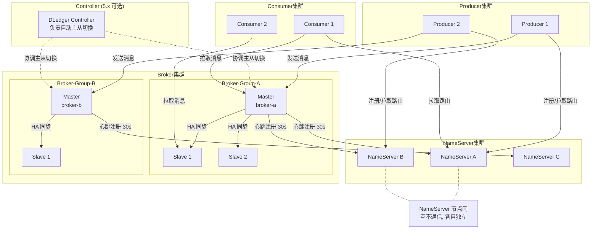

### 1.3 源码模块划分

RocketMQ 5.5.0 顶层采用 Maven 多模块结构，各模块职责如下：

| 模块 | 路径 | 职责 |
|------|------|------|
| `remoting` | remoting/ | 基于 Netty 的 RPC 通信层，定义 RemotingCommand 协议 |
| `namesrv` | namesrv/ | NameServer 路由注册中心 |
| `broker` | broker/ | Broker 服务端，请求处理器、事务、调度、消费管理 |
| `store` | store/ | 消息存储引擎（CommitLog、ConsumeQueue、IndexFile、HA） |
| `client` | client/ | Producer/Consumer 客户端实现 |
| `common` | common/ | 公共类、常量、消息体定义 |
| `proxy` | proxy/ | 5.x 新增 gRPC 代理层，对接新协议客户端 |
| `controller` | controller/ | 5.x 新增 Controller 模块，基于 DLedger 实现自动主从切换 |
| `tieredstore` | tieredstore/ | 5.x 分级存储（冷热分离） |
| `filter` | filter/ | 消息过滤（SQL92、TAG） |
| `auth` | auth/ | ACL 鉴权 |
| `container` | container/ | Broker 容器化，单进程多 Broker |
| `tools` | tools/ | 运维命令行工具 |

### 1.4 Broker 模块子包

`broker` 模块下进一步划分为 30+ 子包，体现职责分离：

```
broker/
├── processor/         # 请求处理器（SendMessage/PullMessage/Heartbeat...）
├── transaction/queue/ # 事务消息（半消息存储、回查）
├── schedule/          # 4.x 延迟消息 ScheduleMessageService
├── pop/               # 5.x Pop 消费模式
├── longpolling/       # 长轮询 PullRequestHoldService
├── topic/             # TopicConfigManager 配置管理
├── offset/            # ConsumerOffsetManager 消费位点
├── subscription/      # SubscriptionGroupManager 订阅组
├── filter/            # 消息过滤
├── controller/        # ReplicasManager 副本管理
├── client/            # 客户端连接管理（ConsumerManager/ProducerManager）
├── mqtrace/           # 消息轨迹
├── metrics/           # 指标埋点
└── latency/           # 故障延迟 LatencyFaultTolerance
```

### 1.5 工作流程总览

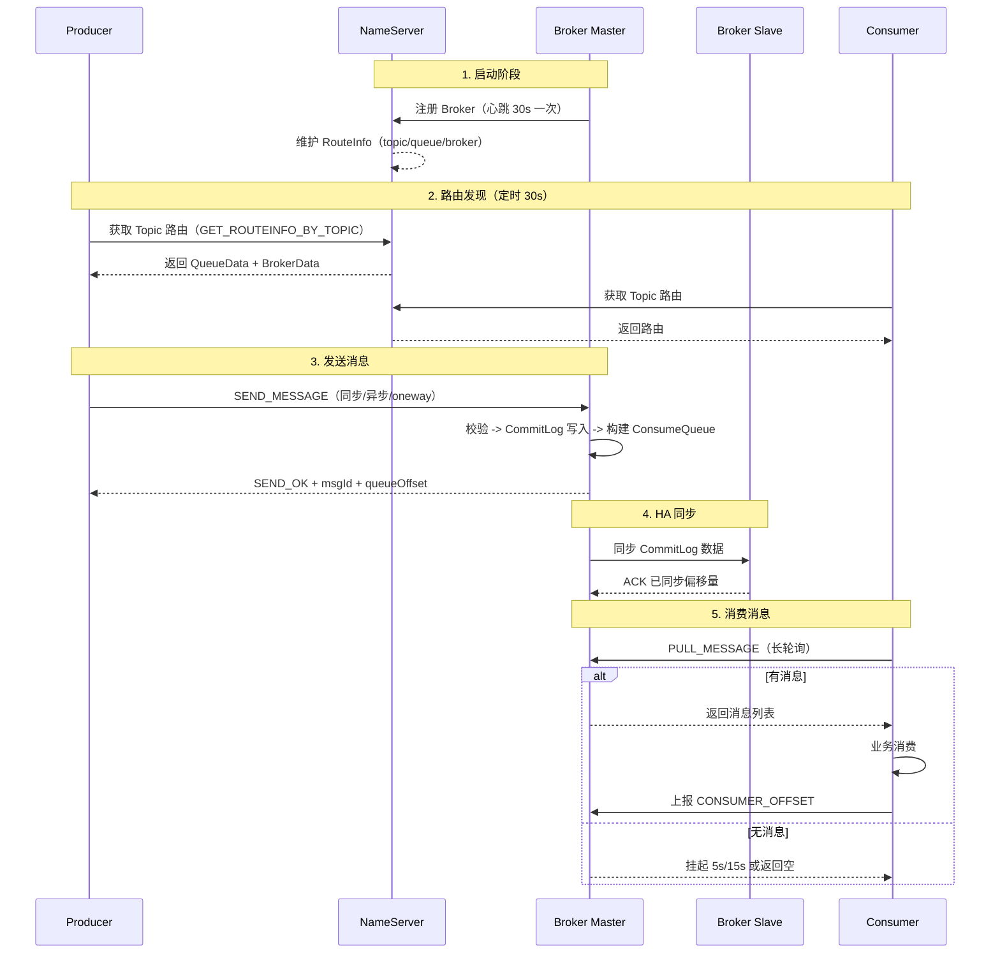

---

## 二、NameServer 路由中心原理

### 2.1 设计思想

NameServer 采用了"**去中心化、互不通信**"的设计：
- 多个 NameServer 节点之间**不互相通信**，每个节点独立维护完整路由数据
- Broker 向**每一个** NameServer 节点注册心跳
- 客户端随机选取一个 NameServer 拉取路由

这种设计避免了 ZooKeeper 的复杂一致性协议（Paxos/ZAB），牺牲了短暂的路由不一致，换取了**高可用与简单性**。

### 2.2 核心类

**`namesrv/src/main/java/org/apache/rocketmq/namesrv/routeinfo/RouteInfoManager.java`** —— 路由元数据中心。

其内部维护的核心数据结构：

```java
// RouteInfoManager 关键字段
private final Map<String /* topic */, Map<String /* brokerName */, QueueData>> topicQueueTable;
private final Map<String /* brokerName */, BrokerData> brokerAddrTable;
private final Map<String /* clusterName */, Set<String /* brokerName */>> clusterAddrTable;
private final Map<BrokerAddrInfo, BrokerLiveInfo> brokerLiveTable;
private final Map<String /* brokerAddr */ /* group */, List<QueueData>> brokerAddrTable;
```

| 数据结构 | 含义 |
|----------|------|
| `topicQueueTable` | Topic -> { brokerName -> QueueData（读写队列数）} |
| `brokerAddrTable` | brokerName -> BrokerData（主备地址表） |
| `clusterAddrTable` | 集群名 -> brokerName 集合 |
| `brokerLiveTable` | Broker 地址 -> 存活信息（心跳时间、channel） |

### 2.3 Broker 注册流程

Broker 每 **30s** 向所有 NameServer 发送 `REGISTER_BROKER` 心跳。

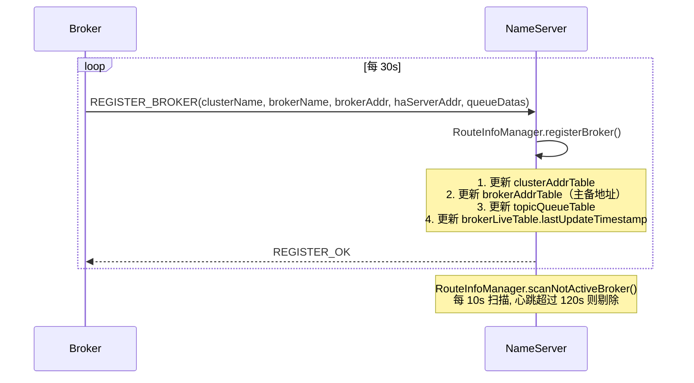

`RouteInfoManager.registerBroker` 流程要点：
1. 维护 cluster -> brokerName 关系
2. 维护 brokerName -> {brokerId -> brokerAddr}（brokerId=0 是 Master，非 0 是 Slave）
3. 根据 QueueData 更新 topicQueueTable（处理 Topic 在 broker 上的队列分布）
4. 更新 brokerLiveTable，记录心跳时间戳

### 2.4 心跳检测与故障剔除

`RouteInfoManager.scanNotActiveBroker()`（由 NamesrvController 定时调度，默认 10s 执行一次）：
- 遍历 `brokerLiveTable`
- 若 `lastUpdateTimestamp` 距当前超过 `CHANNEL_EXPIRED_TIMEOUT`（默认 120s），则：
  - 关闭 channel
  - 调用 `this.unregisterBroker()` 移除路由信息
  - 触发 `notifyMinBrokerIdChanged`（5.x Controller 模式下会通知选主）

### 2.5 路由发现（客户端拉取）

客户端不订阅推送，而是**定时主动拉取**路由：
- `MQClientInstance.updateTopicRouteInfoFromNameServer()`，默认 **30s** 一次
- 请求码 `GET_ROUTEINFO_BY_TOPIC`
- 返回 `TopicRouteData`，包含 QueueData 列表与 BrokerData 列表
- 客户端据此更新 `topicPublishInfoTable`（生产端）/ `topicSubscribeInfoTable`（消费端）

---

## 三、Broker 启动与服务端模块

### 3.1 启动入口

**`broker/src/main/java/org/apache/rocketmq/broker/BrokerStartup.java`** 是 main 入口。

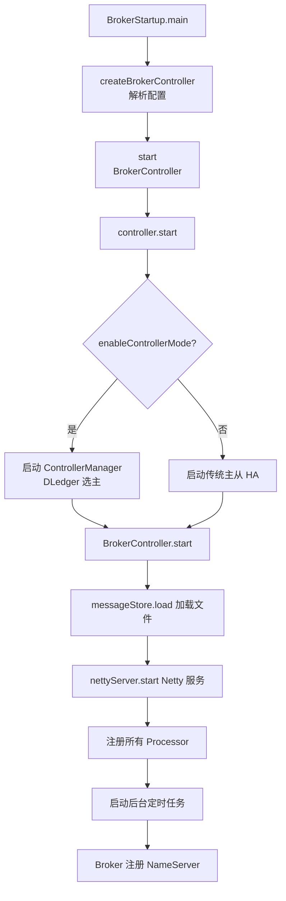

### 3.2 BrokerController 核心组件

**`broker/.../BrokerController.java`** 是 Broker 的"上帝类"，聚合了所有子模块。其 `initialize()` 与 `start()` 方法编排了数十个组件的初始化。

核心组件清单：

| 组件 | 类 | 作用 |
|------|----|------|
| 消息存储 | `DefaultMessageStore` | CommitLog/ConsumeQueue/IndexFile 统一管理 |
| 请求分发 | `NettyRemotingServer` | 接收客户端请求 |
| 发送处理器 | `SendMessageProcessor` | 处理 SEND_MESSAGE |
| 拉取处理器 | `PullMessageProcessor` | 处理 PULL_MESSAGE |
| 消费者管理 | `ConsumerManager` | 维护消费者组、订阅、clientId |
| 生产者管理 | `ProducerManager` | 维护生产者连接 |
| Topic 配置 | `TopicConfigManager` | Topic 元数据持久化 |
| 订阅组配置 | `SubscriptionGroupManager` | 消费组配置 |
| 消费位点 | `ConsumerOffsetManager` | 持久化消费进度 |
| 事务服务 | `TransactionalMessageService` | 事务消息半消息 + 回查 |
| 调度服务 | `ScheduleMessageService` | 4.x 延迟消息 |
| 定时存储 | `TimerMessageStore` | 5.x 定时消息 |
| 长轮询 | `PullRequestHoldService` | 消费拉取挂起 |
| 副本管理 | `ReplicasManager` | 5.x Controller 模式副本 |
| HA 服务 | `HAService` | 主从同步 |
| 客户端心跳 | `ClientHousekeepingService` | 检测客户端连接 |

### 3.3 Processor 注册机制

BrokerController 在 `registerProcessor()` 中将每个 `RequestCode` 映射到 `Pair<NettyRequestProcessor, ExecutorService>`：

```java
// 伪代码示意
SendMessageProcessor sendProcessor = new SendMessageProcessor(this);
this.remotingServer.registerProcessor(RequestCode.SEND_MESSAGE, sendProcessor, sendThreadPool);

PullMessageProcessor pullProcessor = new PullMessageProcessor(this);
this.remotingServer.registerProcessor(RequestCode.PULL_MESSAGE, pullProcessor, pullThreadPool);
```

请求到达 `NettyRemotingServer` 后，根据 RequestCode 查表得到对应的 Processor 与线程池，分派执行。

---

## 四、生产者发送消息流程

### 4.1 生产者启动

**`client/.../producer/DefaultMQProducerImpl.java`**

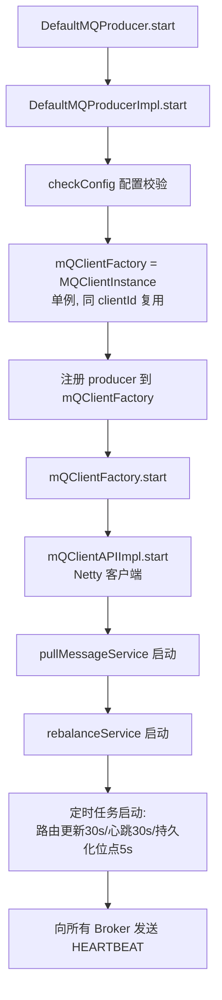

`MQClientInstance` 是客户端的"上帝类"，一个 JVM 内同 clientId（IP+PID+instanceName）只存在一个实例，被所有 Producer/Consumer 共享。

### 4.2 消息发送主流程

**核心方法：`DefaultMQProducerImpl.sendDefaultImpl()`（`DefaultMQProducerImpl.java:738`）**

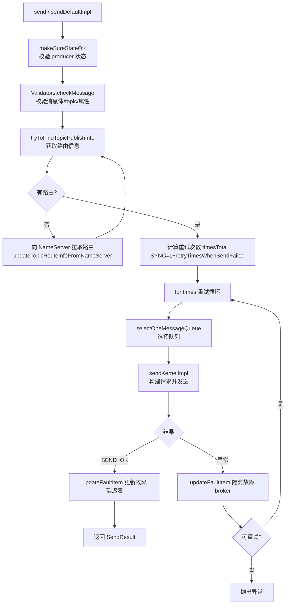

#### 4.2.1 路由查找 `tryToFindTopicPublishInfo`

```java
// DefaultMQProducerImpl.java:894
private TopicPublishInfo tryToFindTopicPublishInfo(final String topic) {
    TopicPublishInfo topicPublishInfo = this.topicPublishInfoTable.get(topic);
    if (null == topicPublishInfo || !topicPublishInfo.ok()) {
        // 本地无路由 -> 触发向 NameServer 拉取
        this.mQClientFactory.updateTopicRouteInfoFromNameServer(topic);
        topicPublishInfo = this.topicPublishInfoTable.get(topic);
    }
    if (topicPublishInfo.isHaveTopicRouterInfo() || topicPublishInfo.ok()) {
        return topicPublishInfo;
    }
    // 第二次拉取（允许自动创建 topic）
    this.mQClientFactory.updateTopicRouteInfoFromNameServer(topic, true, this.defaultMQProducer);
    return this.topicPublishInfoTable.get(topic);
}
```

#### 4.2.2 队列选择 `selectOneMessageQueue`（故障延迟机制）

**`DefaultMQProducerImpl.java:720`**

```java
public MessageQueue selectOneMessageQueue(final TopicPublishInfo tpInfo,
        final String lastBrokerName, final boolean resetIndex) {
    // 故障延迟机制开启
    if (this.sendLatencyFaultEnable) {
        // 1. 轮询取下一个 queue
        // 2. 若该 broker 在故障隔离期, 跳过
        // 3. 优先选择 lastBrokerName 之外的 broker, 实现故障转移
        ...
        // 通过 LatencyFaultTolerance.selectOneGateway() 选出可用 broker
    }
    // 默认: 简单轮询, 跳过上次的 lastBrokerName
    return tpInfo.selectOneMessageQueue(lastBrokerName);
}
```

**故障延迟（LatencyFaultTolerance）原理**：
- 每次发送后 `updateFaultItem(brokerName, latency, isolated)` 记录延迟
- `MQFaultStrategy` 按延迟分级（如 50ms/100ms/...）计算隔离时长
- 隔离期内该 broker 不被选择，超时后降级恢复
- 比普通重试更优雅：避免持续把请求打到慢 broker

#### 4.2.3 发送内核 `sendKernelImpl`

**`DefaultMQProducerImpl.java:911`**

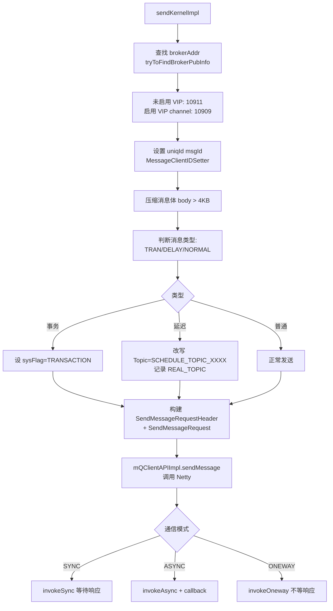

### 4.3 发送方式对比

| 方式 | API | 底层调用 | 适用场景 |
|------|-----|----------|----------|
| 同步 | `send(msg)` | `invokeSync` | 重要消息，需确认成功 |
| 异步 | `send(msg, callback)` | `invokeAsync` | 高吞吐，回调处理结果 |
| 单向 | `sendOneway(msg)` | `invokeOneway` | 日志收集，不计较结果 |
| 批量 | `send(batch)` | `asyncPutMessages` 批量编码 | 提升吞吐 |

### 4.4 服务端接收 — SendMessageProcessor

**`broker/.../processor/SendMessageProcessor.java`**

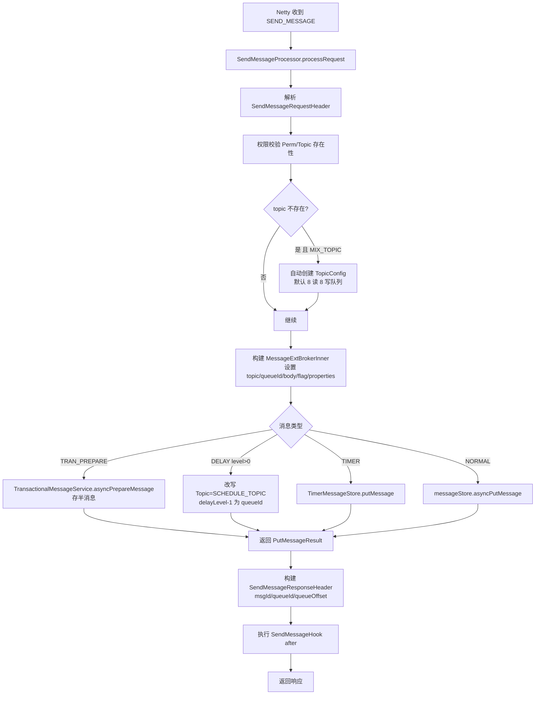

关键点：
- 自动创建 topic 走 `MixAll.AUTO_CREATE_TOPIC_KEY_TOPIC`（默认 TBW102），需要 Broker 开启 `autoCreateTopicEnable=true`
- 延迟消息改写 Topic 后写入正常 CommitLog，等延迟到期由 `ScheduleMessageService` 重新投递
- 事务半消息走 `TransactionalMessageService` 单独处理

---

## 五、Broker 存储消息完整流程

### 5.1 存储引擎总览

**`store/.../DefaultMessageStore.java`** 是存储引擎入口，实现 `MessageStore` 接口。

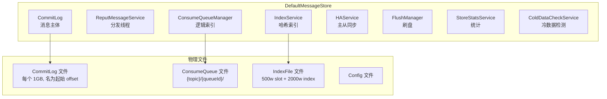

### 5.2 消息存储完整时序

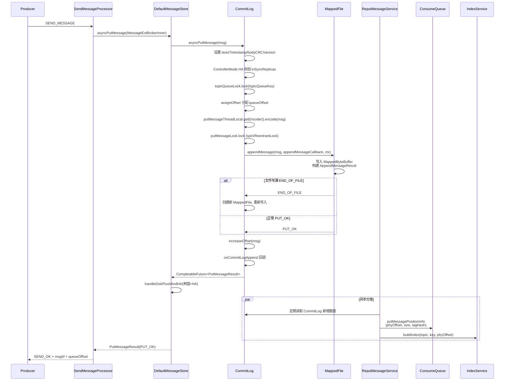

### 5.3 CommitLog.asyncPutMessage 源码剖析

**`store/.../CommitLog.java:969`**

```java
public CompletableFuture<PutMessageResult> asyncPutMessage(final MessageExtBrokerInner msg) {
    // 1. 设置存储时间、body CRC、消息版本
    msg.setStoreTimestamp(System.currentTimeMillis());
    msg.setBodyCRC(UtilAll.crc32(msg.getBody()));
    msg.setVersion(MessageVersion.MESSAGE_VERSION_V1);
    // topic 过长则升级为 V2（支持更长 topic 名）

    // 2. IPv6 host 标记
    // 3. 获取 PutMessageThreadLocal（线程局部 encoder/keyBuilder）
    String topicQueueKey = generateKey(putMessageThreadLocal.getKeyBuilder(), msg);

    // 4. HA 预校验
    if (needHandleHA && brokerConfig.isEnableControllerMode()) {
        if (haService.inSyncReplicasNums(currOffset) < minInSyncReplicas) {
            return PutMessageStatus.IN_SYNC_REPLICAS_NOT_ENOUGH;
        }
        if (allAckInSyncStateSet) needAckNums = ALL_ACK_IN_SYNC_STATE_SET;
    }

    // 5. topicQueueLock（保证同 topic 同 queue 分配 offset 有序）
    topicQueueLock.lock(topicQueueKey);
    try {
        // 6. 分配 queueOffset（ConsumeQueue 逻辑位点）
        defaultMessageStore.assignOffset(msg);
        // 7. 编码消息为字节流
        putMessageThreadLocal.getEncoder().encode(msg);

        // 8. putMessageLock（全局写锁，保证 CommitLog 写入串行化）
        putMessageLock.lock();
        try {
            beginTimeInLock = now;  // 锁内重设 storeTimestamp 保证全局有序
            // 9. 获取/创建 MappedFile
            mappedFile = mappedFileQueue.getLastMappedFile();
            // 10. 追加写入
            result = mappedFile.appendMessage(msg, appendMessageCallback, putMessageContext);
            switch (result.getStatus()) {
                case PUT_OK: onCommitLogAppend(msg, result, mappedFile); break;
                case END_OF_FILE: // 当前文件满, 新建文件重写
                    mappedFile = mappedFileQueue.getLastMappedFile(0);
                    result = mappedFile.appendMessage(...);
                    break;
                case MESSAGE_SIZE_EXCEEDED: return MESSAGE_ILLEGAL;
            }
        } finally { putMessageLock.unlock(); }

        // 11. 增加 queue offset 计数
        defaultMessageStore.increaseOffset(msg, getMessageNum(msg));
    } finally { topicQueueLock.unlock(topicQueueKey); }

    // 12. 处理刷盘 + HA
    return handleDiskFlushAndHA(putMessageResult, msg, needAckNums, needHandleHA);
}
```

#### 关键设计点

1. **两把锁**：
   - `topicQueueLock`：按 `topic@queue` 粒度加锁，保证 queueOffset 分配有序
   - `putMessageLock`：全局写锁，保证 CommitLog 串行追加。默认 `AdaptiveBackOffSpinLockImpl`（自旋+退避），也可配置 `ReentrantLock`

2. **锁内设置 storeTimestamp**：保证消息物理顺序与时间顺序一致

3. **CompletableFuture 异步化**：5.x 全面异步化，刷盘与 HA 通过 future 链式编排，避免阻塞

### 5.4 写入返回与刷盘/HA

`handleDiskFlushAndHA` 将刷盘与 HA 两个 future 合并：
- **同步刷盘**：`GroupCommitService` 等待刷盘完成
- **异步刷盘**：直接返回，由后台线程刷
- **同步双写**：等待至少 `needAckNums` 个 slave ACK
- **异步复制**：不等待 slave

最终 `PutMessageStatus` 可能值：`PUT_OK` / `FLUSH_DISK_TIMEOUT` / `FLUSH_SLAVE_TIMEOUT` / `SLAVE_NOT_AVAILABLE`。

---

## 六、文件存储机制（CommitLog/ConsumeQueue/IndexFile）

### 6.1 存储目录结构

```
${user.home}/store/
├── commitlog/                    # CommitLog 消息主体
│   ├── 00000000000000000000      # 文件名=起始偏移量, 20 位
│   ├── 00000000001073741824
│   └── ...
├── consumequeue/                 # ConsumeQueue 逻辑索引
│   └── {topic}/
│       └── {queueId}/
│           ├── 00000000000000000000
│           └── ...
├── index/                        # IndexFile 哈希索引
│   ├── 20240101090000000
│   └── ...
├── config/                       # 配置
│   ├── topics.json
│   ├── subscriptionGroup.json
│   ├── consumerOffset.json
│   └── delayOffset.json
└── checkpoint                    # 刷盘检查点
```

### 6.2 CommitLog 文件与消息格式

- **CommitLog 文件**：每个固定 **1GB**（`mappedFileSizeCommitLog=1073741824`），文件名是该文件起始偏移量，20 位补零
- 所有 Topic 的消息**混合存储**在同一个 CommitLog 中，顺序追加，最大化顺序写性能

**单条消息在 CommitLog 中的存储格式**（由 `MessageExtEncoder.encode` 生成）：

```
┌──────────────────────────────────────────────────────────────┐
│ TOTALSIZE       4B    消息总长度                              │
│ MAGICCODE       4B    MESSAGE_MAGIC_CODE = -626843481        │
│ BODYCRC         4B    body 的 CRC32                          │
│ QUEUEID         4B    队列 ID                                │
│ FLAG            4B    消息 flag                              │
│ QUEUEOFFSET     8B    队列逻辑偏移                           │
│ PHYSICALOFFSET  8B    在 CommitLog 中的物理偏移               │
│ SYSFLAG         4B    系统标记(压缩/事务/属性长度类型)        │
│ BORNTIMESTAMP   8B    生产时间                              │
│ BORNHOST        8/20B  生产者地址(IPv4/IPv6)                 │
│ STORETIMESTAMP  8B    存储时间                              │
│ STOREHOST       8/20B  Broker 地址                          │
│ RECONSUMETIMES  4B    重试次数                              │
│ PreparedTransaction Offset 8B  事务消息偏移                  │
│ BODYLENGTH      4B    消息体长度                             │
│ BODY            N     消息体                                 │
│ TOPICLENGTH     1B/2B  Topic 长度(V1=1B,V2=2B)             │
│ TOPIC           N     Topic                                  │
│ PROPERTIESLENGTH 2B   属性长度                               │
│ PROPERTIES       N     属性 (key=value\u0001 分隔)           │
└──────────────────────────────────────────────────────────────┘
```

### 6.3 ConsumeQueue 逻辑索引

**`store/.../ConsumeQueue.java:64`**

```java
public static final int CQ_STORE_UNIT_SIZE = 20;       // 每个条目 20 字节
public static final int MSG_TAG_OFFSET_INDEX = 12;      // tag hash 在条目内的偏移
```

**ConsumeQueue 条目结构（20 字节）**：

```
┌──────────────────────────────────────────┐
│ CommitLog Offset    8B  (phyOffset)      │  // 指向 CommitLog 中的物理位置
│ MsgSize             4B                   │  // 消息在 CommitLog 中的长度
│ Tag HashCode        8B                   │  // tag 的 hash, 用于服务端过滤
└──────────────────────────────────────────┘
```

- ConsumeQueue 是 CommitLog 的**逻辑索引**，按 `{topic}/{queueId}` 分目录组织
- 每个 ConsumeQueue 文件默认 30 万条 × 20B ≈ 5.72MB（`mappedFileSizeConsumeQueue=300000*20`）
- 消费者按 `queueOffset`（条目下标）顺序拉取，根据 phyOffset 去 CommitLog 取真实消息
- **为什么这么设计**：CommitLog 混合存储顺序写性能极高，但消费需要按 topic+queue 过滤，所以用 ConsumeQueue 建立"逻辑队列 -> 物理偏移"的映射

### 6.4 IndexFile 哈希索引

**`store/.../index/IndexFile.java`**

用于按 key（如 msgId、业务 key）查询消息。文件结构：

```
IndexHeader (40B)
├── beginTimestamp     8B
├── beginPhyOffset     8B    对应 CommitLog 起始物理偏移
├── endTimestamp       8B
└── endPhyOffset       8B
├── hashSlotCount      4B
└── indexCount         4B

Hash Slot Table (2000KB, 500 万个槽 × 4B)
└── 每个槽存该 slot 下最后一个 index 的相对位置(0 表示无)

Index Linked List (400MB, 2000 万 × 20B)
└── 每个 Index 条目 20B:
    ├── keyHash      4B    key 的 hash
    ├── phyOffset    8B    CommitLog 物理偏移
    ├── timeDiff     4B    相对 beginTimestamp 的时间差(秒)
    └── prevIndex    4B    前一个相同 slot 的 index 位置(链表)
```

写入流程：`IndexService` 由 `ReputMessageService` 调用，从消息 properties 提取 `KEYS`/`UNIQ_KEY`，对 key hash 取 slot，写入 Index 条目并更新链表。冲突时通过 `prevIndex` 形成链表。

查询流程：`QueryMessageProcessor` 按 key hash 找到 slot，遍历链表对比真实 key，命中后从 CommitLog 取出消息。

### 6.5 ReputMessageService — 分发构建索引

**`store/.../DefaultMessageStore.ReputMessageService`** 是一个后台线程：
- 每毫秒从 CommitLog 读出新增的字节流
- 解析每条消息，调用 `ConsumeQueue.putMessagePositionInfo` 写 ConsumeQueue
- 调用 `IndexService.buildIndex` 写 IndexFile
- 这是 CommitLog 与 ConsumeQueue/IndexFile 之间"最终一致"的关键

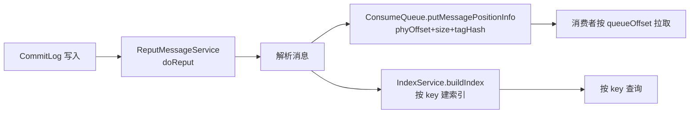

### 6.6 MappedFile 与 MappedFileQueue

**`store/.../logfile/MappedFile.java`** 封装了对单个文件的内存映射与读写：
- `MappedByteBuffer mappedByteBuffer = fileChannel.map(READ_WRITE, 0, fileSize)` —— mmap 内存映射
- `writeBuffer`（DirectByteBuffer）—— 当启用 `TransientStorePool` 时，先写堆外内存，再 commit 到 FileChannel
- `appendMessage(...)` —— 追加写
- `commit()` —— 堆外内存提交到 FileChannel
- `flush()` —— FileChannel.force 刷盘

**`MappedFileQueue`** 管理一组连续的 MappedFile：
- `mappedFiles` 列表
- `getLastMappedFile()` —— 取最后一个文件，满了则创建新文件
- `findMappedFileByOffset(offset)` —— 二分查找定位文件

---

## 七、消费者消费流程

### 7.1 消费者类型

| 类型 | 类 | 特点 |
|------|----|------|
| Push 消费者 | `DefaultMQPushConsumer` | 看似推、实为拉，最常用 |
| Lite Pull 消费者 | `DefaultLitePullConsumer` | 5.x 推荐的主动拉取 |
| 旧 Pull 消费者 | `DefaultMQPullConsumer` | 已废弃 |
| Simple Consumer | 5.x gRPC | 同步拉取，轻量 |
| Pop 消费 | `PopMessageProcessor` | 5.x Broker 端 Pop，无 Rebalance |

### 7.2 Push 消费者启动

**`client/.../consumer/DefaultMQPushConsumerImpl.java`**

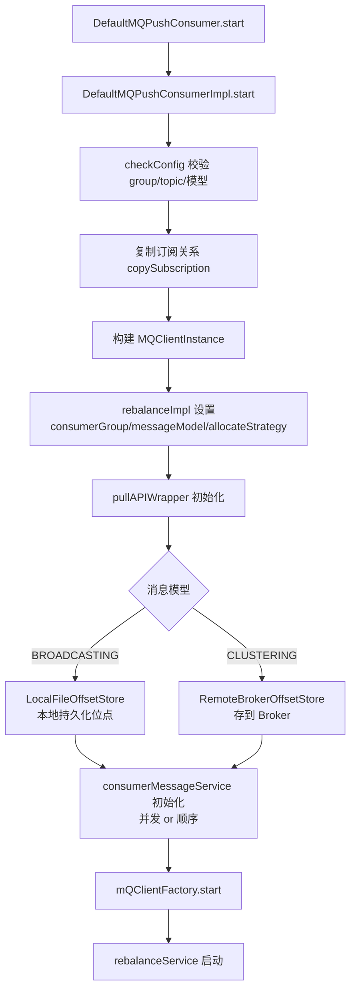

### 7.3 Push 消费主流程（核心）

Push 模式的本质：**Rebalance 触发 -> 创建 PullRequest -> PullMessageService 异步拉取 -> 回调后提交消费线程池**

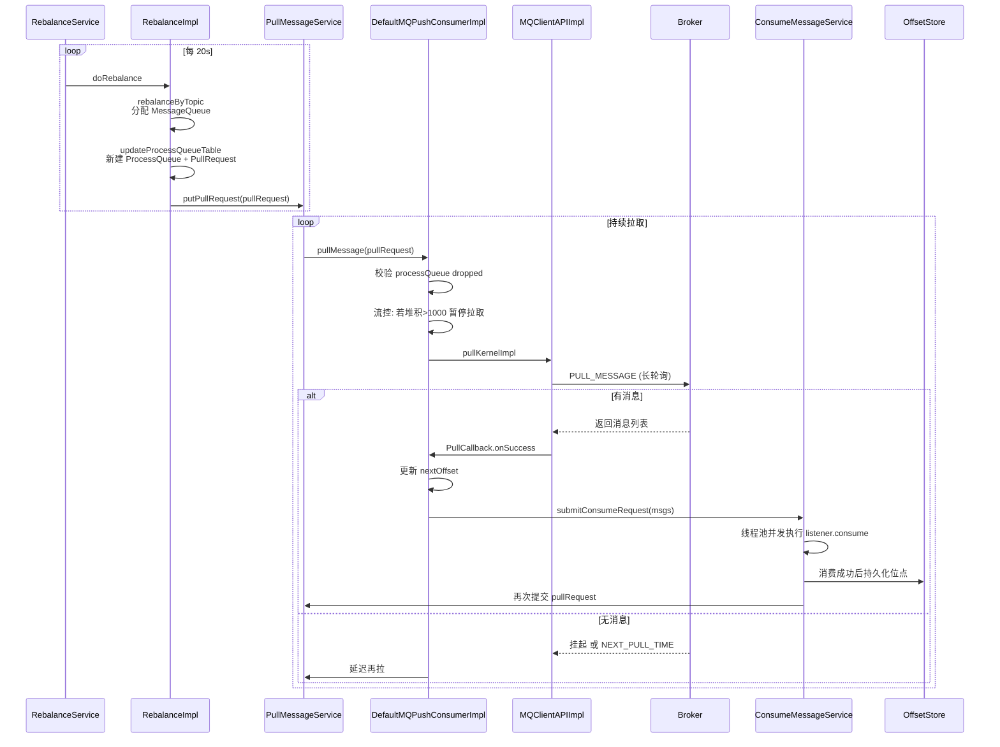

### 7.4 Rebalance 触发拉取

**`client/.../consumer/RebalanceImpl.java`**

`doRebalance()` 每 20s 执行（`RebalanceService` 线程）：
1. 遍历所有订阅 topic
2. `rebalanceByTopic(topic)`：
   - 获取该 topic 所有 MessageQueue（从 NameServer 路由）
   - 获取该消费组所有 consumer clientId（从 Broker `getConsumerList`）
   - 对 `cidAll` 和 `mqAll` 排序（保证各消费者计算一致）
   - 调用 `AllocateMessageQueueStrategy` 分配
3. `updateProcessQueueTable`：
   - 新分配的 queue -> 创建 ProcessQueue，生成 PullRequest 放入 `pullRequestQueue`
   - 不再归属自己的 queue -> ProcessQueue.setDropped(true)，持久化后移除

### 7.5 服务端 PullMessageProcessor

**`broker/.../processor/PullMessageProcessor.java`**

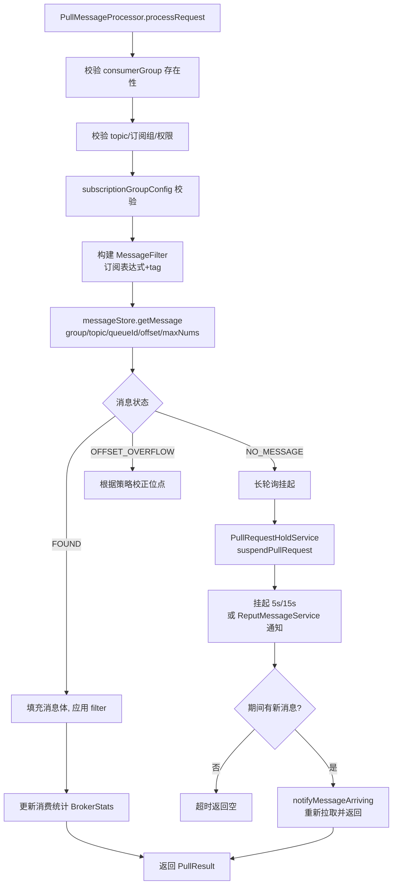

#### 长轮询机制

**`broker/.../longpolling/PullRequestHoldService`**：
- 当拉取无消息时，把 `PullRequest` 挂起到 `ManyPullRequest` 链表
- 默认挂起时间 `suspendTimeoutMillisLong=15s`（PullMessageRequestHeader 可带 `5s` 短挂起）
- `ReputMessageService` 每次分发新消息后调用 `PullRequestHoldService#notifyMessageArriving`
- 若新消息的 queueOffset 大于等于挂起请求的 nextOffset，立即唤醒请求返回
- 实现"准实时"投递，避免消费者空轮询

### 7.6 消费位点管理

**`client/.../consumer/store/OffsetStore`**
- `LocalFileOffsetStore`：广播模式，位点存本地 `offsets.json`
- `RemoteBrokerOffsetStore`：集群模式，位点存 Broker
  - 每 5s 通过 `CONSUMER_OFFSET` 请求持久化
  - 服务端 `ConsumerOffsetManager` 维护 `offsetTable`，持久化到 `consumerOffset.json`

### 7.7 顺序消费（Orderly）

**`client/.../impl/consumer/ConsumeMessageOrderlyService`**
- 同一 MessageQueue 串行消费：通过 `messageQueueLock.lock(queue)` 加锁
- 服务端 `LockBatchMQProcessor` 处理 `LOCK_BATCH_MQ`，broker 端记录队列锁占用
- 消费失败 -> 本地重试（默认无限重试，可配），不跳过消息
- 与并发消费对比：吞吐低但保证分区内有序

---

## 八、队列负载均衡 Rebalance

### 8.1 负载均衡触发时机

1. `RebalanceService` 定时（默认 20s）触发
2. 客户端启动时触发
3. Topic 路由变化时触发
4. 消费者上下线时通过心跳感知（Broker 通知或下次拉路由发现）

### 8.2 分配算法

**接口：`client/.../consumer/rebalance/AllocateMessageQueueStrategy`**

| 实现 | 说明 |
|------|------|
| `AllocateMessageQueueAveragely` | **默认**。按 cid 排序后均分，前 `n%` 个消费者多一个队列 |
| `AllocateMessageQueueAveragelyByCircle` | 环形分配，轮流一个一个分给消费者 |
| `AllocateMessageQueueConsistentHash` | 一致性哈希，消费者变化时迁移最少 |
| `AllocateMessageQueueByMachineRoom` | 按机房就近分配（同 brokerName 前缀） |
| `AllocateMessageQueueByConfig` | 自定义配置分配 |

**平均分配核心逻辑**（`AllocateMessageQueueAveragely`）：
```
index = cidAll.indexOf(本机 clientId)
mod = mqAll.size % cidAll.size
if index < mod: 该消费者分配 (mqAll.size / cidAll.size + 1) 个
       范围: [index * avg + index, (index+1)*avg + index + 1)
else: 该消费者分配 (mqAll.size / cidAll.size) 个
       范围: [index * avg + mod, (index+1) * avg + mod)
```

### 8.3 Rebalance 全流程

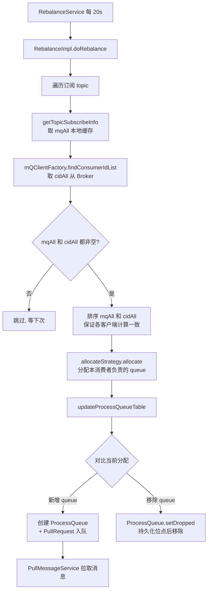

### 8.4 重复消费与消息丢失风险

| 场景 | 风险 | 应对 |
|------|------|------|
| Rebalance 期间位点未持久化 | 重复消费 | 业务幂等 |
| ProcessQueue dropped 后仍在消费 | 重复消费 | 消费前检查 `isDropped` |
| PullRequest 拉到消息但 consumer 宕机 | 重复消费 | 集群模式位点已提交才更新 |
| 广播模式位点丢失 | 重复消费 | 本地文件，重启可能丢失 |

> **核心结论**：RocketMQ 保证 **At-Least-Once**，业务必须幂等。

---

## 九、事务消息实现原理

### 9.1 半消息机制概述

RocketMQ 事务消息采用**半消息 + 本地事务 + 回查**的两阶段提交：

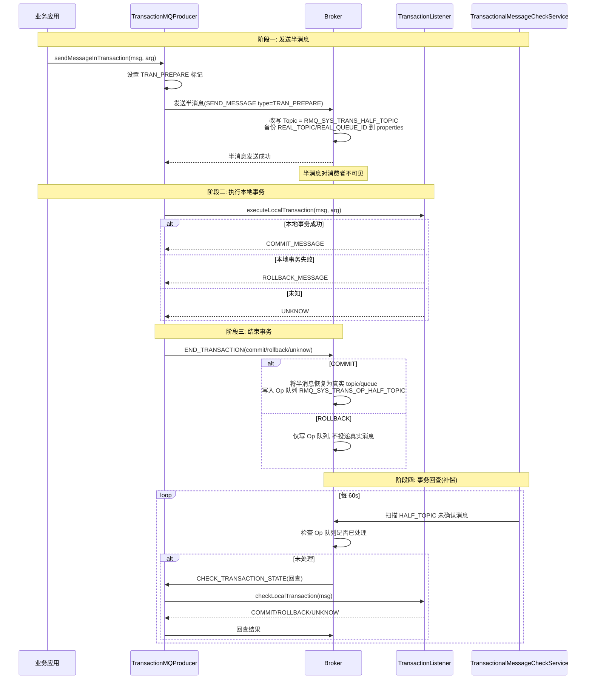

### 9.2 客户端实现

**`client/.../transaction/TransactionMQProducer`** + **`TransactionListener`**

核心方法 `DefaultMQProducerImpl.sendMessageInTransaction`：
1. 设置 `sysFlag` 为 `TRANSACTION_PREPARED_TYPE`
2. 发送半消息（走普通 `sendKernelImpl`，服务端识别 TRAN_PREPARE）
3. 半消息发送成功后，调用 `transactionListener.executeLocalTransaction(msg, arg)` 执行本地事务
4. 根据本地事务状态调用 `endTransaction`：
   - `COMMIT_MESSAGE` -> 服务端投递真实消息
   - `ROLLBACK_MESSAGE` -> 服务端删除半消息
   - `UNKNOW` -> 不处理，等待回查

### 9.3 服务端实现

**`broker/.../transaction/queue/TransactionalMessageServiceImpl.java`**

#### 半消息存储 `asyncPrepareMessage`
- 改写消息 `Topic = RMQ_SYS_TRANS_HALF_TOPIC`
- 在 properties 备份 `REAL_TOPIC`、`REAL_QUEUE_ID`
- 写入 CommitLog（混合存储，但 Topic 是特殊的 half topic，消费者不可见）

#### 结束事务 `endMessageTransaction`（`EndTransactionProcessor`）
- **COMMIT**：把半消息恢复真实 Topic/QueueId，重新 `putMessage` 投递；写一条 op 消息到 `RMQ_SYS_TRANS_OP_HALF_TOPIC`（标记该半消息已处理）
- **ROLLBACK**：不投递真实消息，只写 op 消息标记已处理
- **UNKNOW**：什么都不做，等待回查

#### 事务回查 `TransactionalMessageCheckService`
- 默认每 60s 执行 `TransactionalMessageServiceImpl.check`
- 流程：
  1. 扫描 `RMQ_SYS_TRANS_HALF_TOPIC` 的 ConsumeQueue
  2. 对每条半消息，检查 `RMQ_SYS_TRANS_OP_HALF_TOPIC` 是否已有对应 op（已处理）
  3. 未处理 -> 发送 `CHECK_TRANSACTION_STATE` 给 Producer
  4. Producer 回调 `checkLocalTransaction` 返回状态
  5. 根据 Producer 回查结果，再次执行 commit/rollback
- 回查次数限制 `transactionCheckMax`（默认 15 次），超过则打印日志/打回滚标记

### 9.4 关键设计点

1. **半消息对消费者不可见**：通过改写 Topic 实现，CommitLog 中存在但 ConsumeQueue 是 half topic 的
2. **Op 队列**：`RMQ_SYS_TRANS_OP_HALF_TOPIC` 记录已处理半消息，避免重复回查
3. **回查补偿**：解决本地事务执行后、`END_TRANSACTION` 请求丢失的情况（如 Producer 宕机、网络故障）
4. **最终一致**：不保证强一致，保证最终一致（commit 后消息一定投递，rollback 后一定不投递）

---

## 十、延迟消息与定时消息（4.x vs 5.x）

### 10.0 延迟/定时消息的路由入口：PutMessageHook

5.x 中延迟消息与定时消息的**Topic 改写并非在 SendMessageProcessor 中直接完成**，而是通过注册的 `PutMessageHook` 在 `DefaultMessageStore.asyncPutMessage` 写入 CommitLog **之前**执行：

**注册位置**：`broker/.../BrokerController.java:1060`
```java
putMessageHookList.add(new PutMessageHook() {
    public String hookName() { return "handleScheduleMessage"; }
    public PutMessageResult executeBeforePutMessage(MessageExt msg) {
        if (msg instanceof MessageExtBrokerInner) {
            return HookUtils.handleScheduleMessage(BrokerController.this, (MessageExtBrokerInner) msg);
        }
        return null;
    }
});
```

**执行位置**：`store/.../DefaultMessageStore.java:645`（asyncPutMessage 方法内，CommitLog 写入前）
```java
for (PutMessageHook putMessageHook : putMessageHookList) {
    PutMessageResult handleResult = putMessageHook.executeBeforePutMessage(msg);
    if (handleResult != null) return CompletableFuture.completedFuture(handleResult);
}
// ... 继续 CommitLog 写入
```

**路由逻辑**（`broker/.../util/HookUtils.java` `handleScheduleMessage`）：
1. `checkIfTimerMessage(msg)`：若有 `TIMER_DELIVER_MS`/`TIMER_DELAY_MS`/`TIMER_DELAY_SEC` 属性 → 走 5.x `transformTimerMessage`（改写为 `rmq_sys_wheel_timer`）
2. 若 `delayTimeLevel > 0` → 走 4.x `transformDelayLevelMessage`（改写为 `SCHEDULE_TOPIC_XXXX`，queueId=delayLevel-1）
3. 优先级：`delayTimeLevel > 0` 最高（会清除所有 timer 属性，强制走 4.x）

---

### 10.1 4.x 延迟消息实现

**`broker/.../schedule/ScheduleMessageService.java`**

#### 固定延迟级别
默认 18 个级别：`1s 5s 10s 30s 1m 2m 3m 4m 5m 6m 7m 8m 9m 10m 20m 30m 1h 2h`

通过 `messageDelayLevel` 配置，`parseDelayLevel()`（`:300`）解析为 `delayLevelTable: level -> delayMillis`。

#### 工作流程

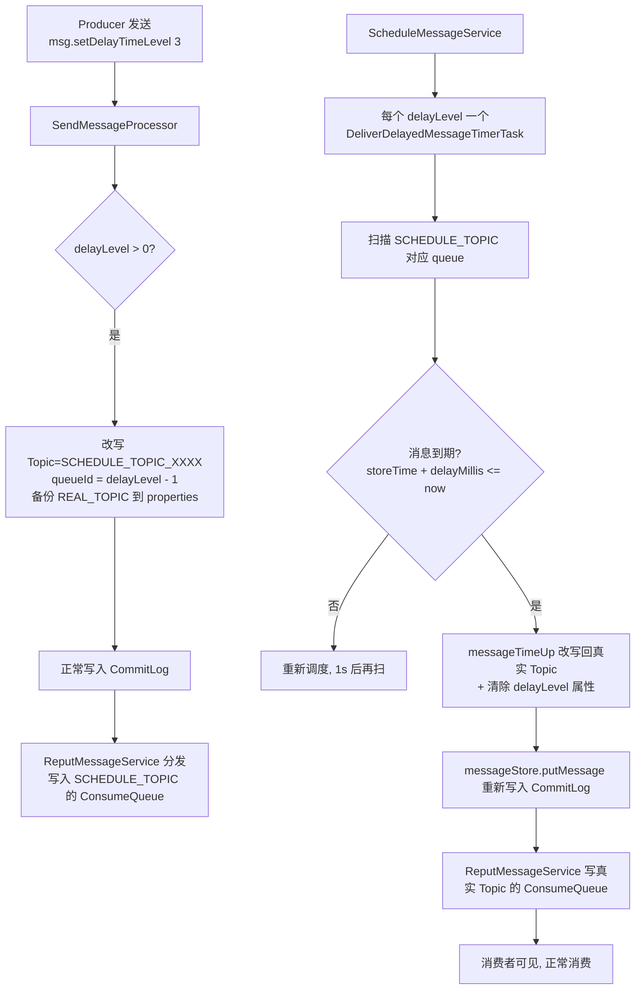

#### 客户端 API（4.x 风格）

```java
Message msg = new Message(TOPIC, body);
msg.setDelayTimeLevel(3);  // 第 3 级 = 10s
producer.send(msg);
```

### 10.2 5.x 定时消息实现（TimerMessageStore）

5.x 引入 **`store/.../timer/TimerMessageStore.java`**，支持**任意时刻**定时投递，彻底摆脱 18 级限制。

#### 核心常量

```java
// TimerMessageStore.java:86
public static final String TIMER_TOPIC = TopicValidator.SYSTEM_TOPIC_PREFIX + "wheel_timer";  // rmq_sys_wheel_timer
public static final String TIMER_OUT_MS = MessageConst.PROPERTY_TIMER_OUT_MS;       // 投递时间
public static final String TIMER_ENQUEUE_MS = MessageConst.PROPERTY_TIMER_ENQUEUE_MS; // 入队时间
public static final String TIMER_DEQUEUE_MS = MessageConst.PROPERTY_TIMER_DEQUEUE_MS; // 出队时间
public static final int DAY_SECS = 24 * 3600;
public static final int TIMER_WHEEL_TTL_DAY = 7;    // 时间轮保留 7 天
public static final int TIMER_BLANK_SLOTS = 60;
protected final int precisionMs;   // 精度, 默认 1000ms (1s)
```

#### 工作流程

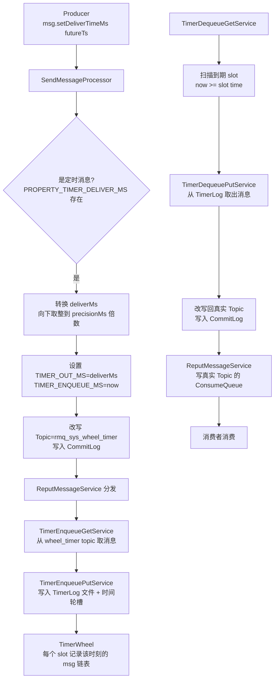

#### TimerLog 文件结构

**`store/.../timer/TimerLog.java:33`** 定义每条记录固定 **52 字节**：

```java
public final static int UNIT_SIZE = 4  //size
        + 8 //prev pos（同一 slot 链表前驱位置）
        + 4 //magic value（DEFAULT/ROLL/DELETE）
        + 8 //curr write time，用于 trace
        + 4 //delayed time，用于校验
        + 8 //offsetPy，CommitLog 物理偏移
        + 4 //sizePy，消息大小
        + 4 //hash code of real topic
        + 8; //reserved value，预留
// 合计 = 52 字节
```

```
┌──────────────────────────────────────────┐
│ size          4B   本条记录长度            │
│ prevPos       8B   同一 slot 链表前驱位置   │
│ magicValue    4B   DEFAULT/ROLL/DELETE    │
│ currWriteTime 8B   写入时间(trace)        │
│ delayedTime   4B   投递时间(秒)           │
│ offsetPy      8B   CommitLog 物理偏移      │
│ sizePy        4B   消息大小               │
│ topicHash     4B   真实 topic 的 hash     │
│ reserved      8B   预留                   │
└──────────────────────────────────────────┘
```

#### TimerWheel 时间轮结构

**`store/.../timer/TimerWheel.java`** + **`Slot.java`**

时间轮是环形结构，每个 Slot 固定 **32 字节**：

```
┌──────────────┬───────────┬───────────┬───────┬───────┐
│ timeMs  8B   │ firstPos 8B│ lastPos 8B│ num 4B│ magic4│
└──────────────┴───────────┴───────────┴───────┴───────┘
```
- `timeMs`：该 slot 对应的时间（按 precisionMs 对齐）
- `firstPos` / `lastPos`：该时间槽中首/末条 TimerLog 记录位置
- `num`：该槽消息数量
- 链表通过 TimerLog 记录中的 `prevPos` 字段反向串联

**规模参数**：
- `slotsTotal = TIMER_WHEEL_TTL_DAY(7) × DAY_SECS(86400) = 604800` 个 slot
- 环形使用 `slotsTotal × 2` 避免索引冲突，总大小 ≈ 604800 × 2 × 32 ≈ **38.7MB**
- `precisionMs` 默认 1000ms（可配 100/200/500ms）
- `timerMaxDelaySec` 默认 3 天（最大可延迟时间，区别于 7 天的时间轮保留期）
- slot 索引：`getSlotIndex(timeMs) = (timeMs / precisionMs) % (slotsTotal * 2)`

### 10.3 4.x vs 5.x 关键差异

| 维度 | 4.x 延迟消息 | 5.x 定时消息（TimerMessageStore） |
|------|--------------|-----------------------------------|
| **延迟时间** | 固定 18 级别 | 任意时刻（秒级精度） |
| **存储方式** | 复用 `SCHEDULE_TOPIC_XXXX`（每个 level 一个 queue） | 独立 `rmq_sys_wheel_timer` + TimerLog 文件 + 时间轮 |
| **调度机制** | 每个 level 一个 `Timer` 定时任务，扫描 ConsumeQueue | 时间轮 + Dequeue 服务，按 slot 触发 |
| **精度** | 受 level 限制，最细 1s | 默认 1s，可配 `timerPrecisionMs` |
| **回滚机制** | 无 | 支持 `TIMER_ROLL_TIMES`，超时未投递则滚动到下一轮 |
| **容量** | 级别有限，大量同级别消息拥塞 | 7 天 TTL，按时间分布，吞吐更高 |
| **兼容性** | 5.x 仍支持（`messageDelayLevel`） | 5.x 默认开启 `timerMessageStoreEnable`（取决于配置） |
| **客户端 API** | `setDelayTimeLevel(int)` | `setDeliverTimeMs(long)` / `setDelayTimeMs` / `setDelayTimeSec` |

#### 5.x 的兼容与切换
- 5.x 同时支持两种：若消息带 `delayLevel` 且 `messageDelayLevel` 配置生效，走 4.x 逻辑（`ScheduleMessageService`）
- 若消息带 `TIMER_DELIVER_MS`，走 `TimerMessageStore`
- Broker 配置 `messageDelayLevel` 与 `timerMessageStoreEnable` 控制开关

---

## 十一、客户端与服务端通信机制

### 11.1 通信协议设计

RocketMQ 自定义了基于 Netty 的二进制协议，核心是 **`remoting/.../protocol/RemotingCommand.java`**：

```
┌─────────────────────────────────────────────┐
│ 4B  | Total Length                          │  // 整个包长度
│ 4B  | Header Length (高 1 位是序列化类型标志)│  // 低 31 位为 header 长度
│ Header (JSON 或 RPC)                         │  // 含 code/language/version/flag/extFields
│ Body (bytes)                                 │  // 业务数据
└─────────────────────────────────────────────┘
```

- `code`：请求码（`RequestCode.SEND_MESSAGE = 10`）
- `language`：客户端语言
- `version`：版本
- `flag`：标记位（0=请求,1=响应,2=oneway）
- `extFields`：请求参数 map
- `body`：消息体字节数组

### 11.2 Remoting 核心类结构

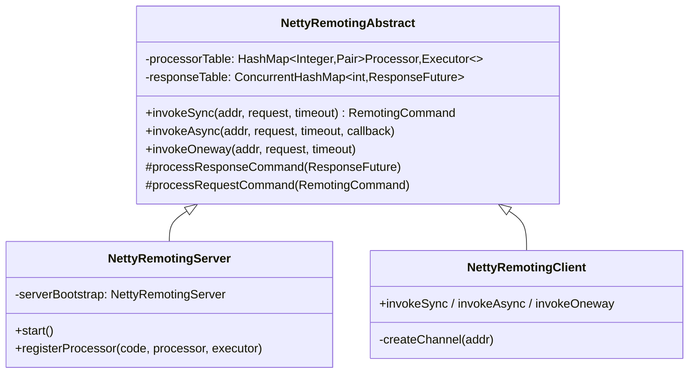

**`remoting/.../netty/NettyRemotingAbstract.java`** 是 Server/Client 共同父类，定义了三种调用语义。

### 11.3 三种调用语义

#### 同步 invokeSync
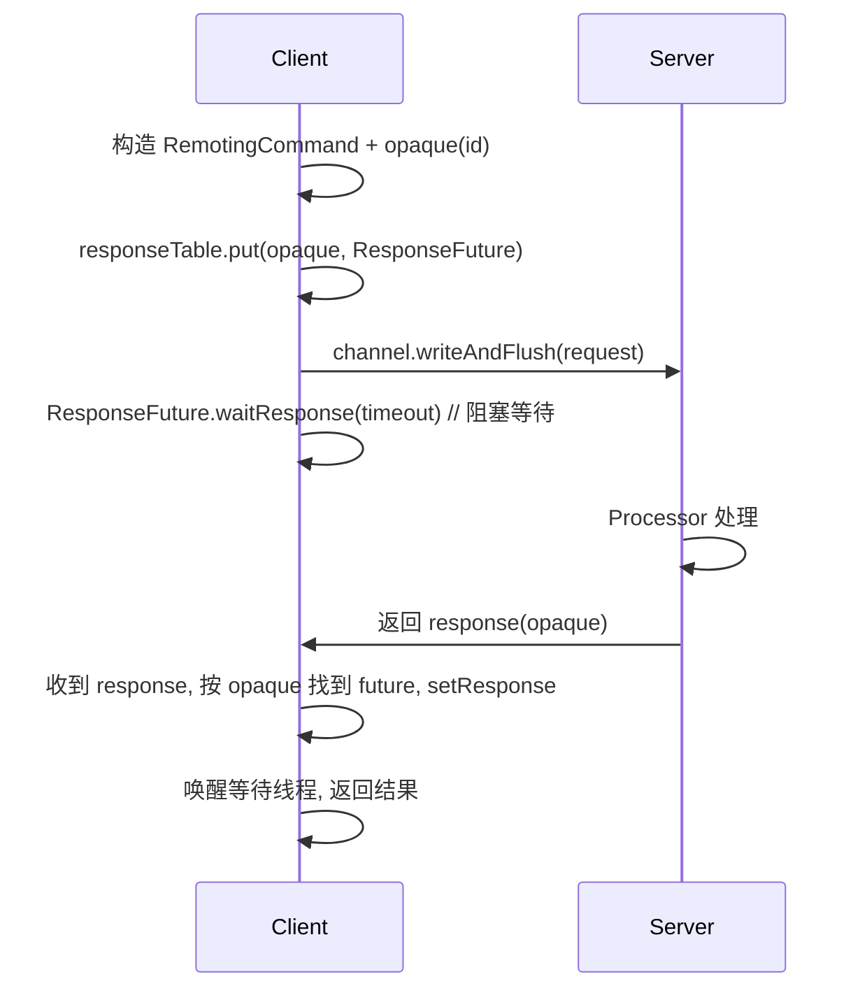

#### 异步 invokeAsync
- 提交请求后立即返回，`ResponseFuture` 持有 `InvokeCallback`
- 服务端响应到达时，从 `responseTable` 取出 future，执行 `callback.operationComplete`
- 配合超时检测 `TimerTask`

#### 单向 invokeOneway
- 设置 `flag |= RPC_TYPE_ONEWAY`
- 不等响应，无 `ResponseFuture`
- 用于心跳、位点上报等不需确认的场景

### 11.4 服务端 Processor 路由

`NettyRemotingServer` 收到请求后：
```java
// NettyRemotingAbstract.processRequestCommand
Pair<NettyRequestProcessor, ExecutorService> pair = processorTable.get(request.getCode());
if (pair == null) {
    // 默认 defaultRequestProcessor
    pair = defaultRequestProcessorPair;
}
pair.getObject2().submit(() -> {
    RemotingCommand response = pair.getObject1().processRequest(ctx, request);
    ctx.writeAndFlush(response);
});
```

**优势**：不同 RequestCode 用不同线程池隔离，避免慢请求（如拉取大消息）阻塞快请求（如心跳）。

Broker 启动时注册的关键 Processor 与线程池：

| RequestCode | Processor | 线程池 |
|-------------|-----------|--------|
| SEND_MESSAGE | SendMessageProcessor | sendThreadPool |
| PULL_MESSAGE | PullMessageProcessor | pullThreadPool |
| HEARTBEAT | HeartbeatProcessor | heartbeatThreadPool |
| QUERY_MESSAGE | QueryMessageProcessor | queryThreadPool |
| CONSUMER_OFFSET | ConsumerManageProcessor | consumerManagerThreadPool |
| END_TRANSACTION | EndTransactionProcessor | endTransactionThreadPool |

### 11.5 客户端 Channel 管理

**`client/.../impl/MQClientAPIImpl.java`** + **`NettyRemotingClient`**
- `channelTables`：缓存 `addr -> Channel`，连接复用
- 心跳检测：`RequestFuture` 扫描，超时连接关闭
- NameServer 选址：随机一个地址，失败则轮询下一个

---

## 十二、零拷贝与性能优化

### 12.1 为什么 RocketMQ 性能好

RocketMQ 单机可支撑**十万级 TPS**，核心优化点：

1. **顺序写盘**：CommitLog 顺序追加，机械盘也能达百 MB/s
2. **零拷贝**：mmap 内存映射，消费时直接读页缓存
3. **异步刷盘**：写内存即返回，后台批量刷
4. **Group Commit**：同步刷盘下批量合并刷盘请求
5. **文件预分配 + 预热**：避免运行时分配文件抖动
6. **堆外内存**：`TransientStorePool` 用 DirectByteBuffer 写入，避免 GC
7. **ConcurrentHashMap + CAS**：路由表无锁读
8. **批量发送**：`asyncPutMessages` 单次写多条
9. **异步化**：5.x 全面 CompletableFuture，避免线程阻塞

### 12.2 零拷贝实现

#### 12.2.1 mmap 内存映射（写入与读取）

**`store/.../logfile/MappedFile.java`**

```java
// 关键代码
this.fileChannel = new RandomAccessFile(file, "rw").getChannel();
this.mappedByteBuffer = this.fileChannel.map(MapMode.READ_WRITE, 0, fileSize);
```

- `mmap` 将文件映射到进程**虚拟地址空间**，用户空间直接读写文件，**减少一次内核态到用户态的拷贝**
- 写入：`mappedByteBuffer.put(bytes)` —— 用户空间写入即等同写文件（页缓存）
- 读取（消费）：消费者拉取时，Broker 直接把 `mappedByteBuffer` 的切片作为 response body 返回，**避免从内核态拷贝到用户态再拷贝到 Socket**

```
传统读写:  磁盘 -> 内核缓冲 -> 用户缓冲 -> Socket缓冲 -> 网卡   (4次拷贝)
mmap读取:  磁盘 -> 内核缓冲(=用户映射) -> Socket缓冲 -> 网卡   (3次拷贝)
sendfile: 磁盘 -> 内核缓冲 -> Socket缓冲 -> 网卡               (3次拷贝, 无用户态切换)
```

#### 12.2.2 TransientStorePool（堆外内存写）

当 `transientStorePoolEnable=true`（同步刷盘推荐开启）：
- 预分配一批 `DirectByteBuffer`（堆外内存）
- 写入路径：`writeBuffer` (DirectByteBuffer) <- `commit()` -> `fileChannel` <- `flush()` -> 磁盘
- **读取路径仍走 mmap**：读用 mappedByteBuffer，写用堆外
- 优势：写不污染页缓存（mmap 映射区），消费读命中页缓存率高；堆外内存不受 GC 影响

```mermaid
flowchart LR
    subgraph 写路径
        A[Producer 请求] --> B[DirectByteBuffer<br/>writeBuffer]
        B -->|commit| C[FileChannel]
        C -->|flush force| D[(磁盘)]
    end
    subgraph 读路径
        E[Consumer 请求] --> F[MappedByteBuffer<br/>mmap 映射]
        F --> G[页缓存 PageCache]
        G --> D
        D --> G
    end
```

#### 12.2.3 sendfile 在消息传输的应用

消费拉取时，`PullMessageProcessor` 通过 `getMessage` 获取 `SelectMappedBufferResult`（mappedByteBuffer 的切片），再走 Netty 的 `FileRegion`（底层 `sendfile`）或 `wrappedBuffer` 直接发送，**避免数据进入用户态**。

### 12.3 刷盘机制

| 模式 | 配置 | 机制 | 性能 | 可靠性 |
|------|------|------|------|--------|
| 异步刷盘 | `ASYNC_FLUSH`（默认） | 写 mmap 即返回，后台 `FlushConsumeQueueService` 定时 flush | 高 | 宕机可能丢少量 |
| 同步刷盘 | `SYNC_FLUSH` | `GroupCommitService` 等待 flush 完成才返回 | 中 | 宕机不丢 |

#### GroupCommitService 同步刷盘
- 维护 `requestsWrite` / `requestsRead` 两个队列（双缓冲交换）
- 每 10ms 检测一次 `requestsRead`，批量执行 `mappedFile.flush()`
- 刷完后唤醒所有等待的 `GroupCommitRequest`
- 把多个写请求合并为一次刷盘，提升吞吐

### 12.4 文件预热 warmMappedFile

`MappedFile.warmMappedFile`：
- 每页写 1 字节，触发缺页中断，预分配物理内存
- 调用 `mlock`（JNA）锁定内存，防止被 swap
- 避免运行时第一次写触发缺页带来的延迟抖动

### 12.5 文件删除

`DefaultMessageStore.cleanFilesPeriodically`：
- `CleanCommitLogService`：删除超过 `fileReservedTime`（默认 72h）的 CommitLog 文件
- `CleanConsumeQueueService`：删除对应 ConsumeQueue
- 删除条件：文件最后修改时间 > 保留时间，且 `MappedFile` 引用计数为 0
- 默认凌晨 4 点执行 `deleteWhen`

---

## 十三、高可用机制

### 13.1 高可用全景

```mermaid
graph TB
    subgraph 高可用层次
        A[客户端容错<br/>故障延迟 LatencyFaultTolerance]
        B[Broker 主从复制<br/>异步复制/同步双写]
        C[自动故障转移<br/>5.x Controller 模式]
        D[NameServer 心跳检测<br/>120s 剔除]
        E[消息重试与死信队列]
    end
```

### 13.2 主从复制（HA）

**`store/.../ha/HAService.java`** 接口，实现有：
- `DefaultHAService`：传统主从
- `AutoSwitchHAService`：5.x Controller 模式

#### 传统主从同步流程

```mermaid
sequenceDiagram
    participant M as Master
    participant MS as HAService.Master<br/>AcceptSocketService
    participant SS as Slave HAClient
    participant MF as Master CommitLog

    Note over M,SS: 建立连接
    SS->>MS: TCP 连接 Master 10912 端口
    SS->>MS: 上报 slaveAckOffset (已同步位点)
    MS->>MS: HAConnection 处理

    loop 持续同步
        MF->>MF: 新消息写入 CommitLog
        MS->>SS: 推送 CommitLog 数据(从 slaveAckOffset 开始)
        SS->>SS: 写入本地 CommitLog
        SS->>MS: 更新 ackOffset
        MS->>MS: 更新 master offset
    end
```

- Master 开启 10912 端口（`haListenPort`），`AcceptSocketService` 接收 Slave 连接
- `WriteSocketService` 向 Slave 推送 CommitLog 字节流
- `ReadSocketService` 接收 Slave 上报的 ackOffset
- Slave 的 `HAClient` 主动连接 Master，定时上报位点

#### 同步复制 vs 异步复制

| 模式 | BrokerRole | 行为 |
|------|------------|------|
| 异步复制 | `ASYNC_MASTER` | Master 写完本地即返回，不等 Slave |
| 同步双写 | `SYNC_MASTER` | Master 等 Slave ACK 才返回 |

**同步双写实现**（`store/.../ha/GroupTransferService`）：
- `CommitLog.handleDiskFlushAndHA` 创建 `GroupCommitRequest`（含 `nextOffset = master 写入位点`）
- 提交到 `GroupTransferService`
- `GroupTransferService` 线程检查 `HAService.inSyncSlaveOffsets` 是否覆盖 `nextOffset`
- 超时未同步 -> `PutMessageStatus.FLUSH_SLAVE_TIMEOUT`

### 13.3 5.x Controller 模式（自动主从切换）

传统模式下，Master 宕机需要人工切换或依赖第三方（如 ZooKeeper/DLedger）。5.x 引入 **`controller` 模块**，基于 DLedger Raft 实现自动选主。

```mermaid
graph TB
    subgraph Controller集群["Controller 集群 (Raft)"]
        C1[Controller 1 Leader]
        C2[Controller 2 Follower]
        C3[Controller 3 Follower]
        C1 <-.-> C2
        C1 <-.-> C3
    end

    subgraph Broker组A
        BA_M[Broker-A Master]
        BA_S1[Broker-A Slave1]
        BA_S2[Broker-A Slave2]
    end

    BA_M -->|注册 Broker / 上报 syncStateSet| C1
    BA_S1 -->|注册 Broker| C1
    BA_S2 -->|注册 Broker| C1

    C1 -.->|AlterSyncStateSet<br/>选主通知| BA_M
    C1 -.->|broker 不可用<br/>触发切换| BA_S1
```

#### 核心类
- **`controller/.../ControllerManager.java`**：Controller 启动入口
- **`DLedgerController`**：基于 DLedger Raft 实现，保证 Controller 集群自身高可用
- **`broker/.../controller/ReplicasManager.java`**：Broker 端副本管理，与 Controller 交互

#### 关键请求码
- `REGISTER_BROKER_TO_CONTROLLER`：Broker 注册
- `ALTER_SYNC_STATE_SET`：修改同步副本集合
- `BROKER_HOUSEKEEPING`：Broker 上下线感知
- `GET_METADATA`：获取集群元数据

#### 自动切换流程

```mermaid
sequenceDiagram
    participant B as Broker组(Master+Slaves)
    participant R as ReplicasManager
    participant C as Controller Leader

    Note over B: Master 宕机
    B->>R: 心跳超时感知 Master 失联
    R->>C: 上报新 syncStateSet(剩余存活副本)
    C->>C: 校验是否满足 minInSyncReplicas
    C->>R: ALTER_SYNC_STATE_SET 选出新 Master
    R->>R: 切换 BrokerRole 为 Master
    R->>C: 注册新 Master
    C->>C: 更新路由, 通知 NameServer
    Note over B: Slave 提升为 Master, 持续服务
```

#### 与传统模式对比

| 维度 | 传统模式 | Controller 模式 |
|------|----------|----------------|
| Master 故障 | 需人工切换 / Slave 只读 | 自动选举新 Master |
| 一致性 | 异步复制有数据丢失风险 | `minInSyncReplicas` + `allAckInSyncStateSet` 保证 |
| 依赖 | 无 | Controller 集群（DLedger Raft） |
| 配置 | `brokerRole=ASYNC/SYNC_MASTER` | `enableControllerMode=true` |

### 13.4 客户端容错

**故障延迟机制（`LatencyFaultTolerance`）**（见 §4.2.2）：
- 每次发送记录延迟，按延迟分级隔离 broker
- NameServer 剔除失联 broker（120s）
- 客户端定时（30s）拉取路由更新

### 13.5 消息重试与死信

- 消费失败 -> 重试到 `RETRY` 队列（`%RETRY%group`），延迟级别递增（10s/30s/1m...2h）
- 超过 `maxReconsumeTimes`（默认 16）-> 进入死信队列 `%DLQ%group`
- 死信队列需要人工处理

---

## 十四、RocketMQ 5.x 新特性

### 14.1 新特性总览

| 特性 | 模块 | 说明 |
|------|------|------|
| **gRPC Proxy** | `proxy` | 新协议接入层，支持多语言 gRPC 客户端 |
| **Controller 自动 HA** | `controller` | 基于 DLedger 的自动主从切换 |
| **定时消息（TimerMessageStore）** | `store/timer` | 任意时刻定时投递 |
| **分级存储 TieredStore** | `tieredstore` | 冷热分离，热数据本地、冷数据上 S3/OSS |
| **Pop 消费模式** | `broker/pop` | Broker 端 Pop，无 Rebalance 风险，无队列占用 |
| **Lite Pull Consumer** | `client` | 轻量主动拉取 |
| **RocksDB 存储** | `store/queue` | ConsumeQueue/Config 可选 RocksDB，降低内存 |
| **消息轨迹增强** | `broker/mqtrace` | 内置轨迹 |
| **ACL 鉴权** | `auth` | 认证与授权 |
| **Cold Data Check** | `store` | 冷数据检测与下沉 |
| **Container 多 Broker** | `container` | 单进程多 Broker |
| **RIP-27 消息回溯** | - | 按时间/offset 回溯消费 |

### 14.2 Proxy 模块详解

**`proxy/`** 是 5.x 新增的接入层，定位是"Remoting 与 gRPC 的桥接"：

```mermaid
graph LR
    subgraph 客户端
        NC[新客户端 gRPC<br/>rocketmq-clients]
        OC[旧客户端 Remoting<br/>Java SDK]
    end
    subgraph Proxy
        P[ProxyController<br/>MessagingProcessor]
    end
    subgraph Broker
        B1[Broker 1]
        B2[Broker 2]
    end
    NC -->|gRPC + protobuf| P
    OC -->|Remoting| B1
    P -->|Remoting 转发| B1
    P -->|Remoting 转发| B2
```

#### ProxyMode
- `LOCAL`：Proxy 与 Broker 同进程（默认，简化部署）
- `CLUSTER`：Proxy 独立部署，多 Proxy 负载均衡，后接多个 Broker

### 14.3 Pop 消费模式

**`broker/.../pop/PopMessageProcessor.java`**

传统 Push 模式下，Rebalance 会导致重复消费、队列占用。Pop 模式让多个 Consumer **共享队列**：

```mermaid
sequenceDiagram
    participant C1 as Consumer 1
    participant C2 as Consumer 2
    participant B as Broker

    C1->>B: POP_MESSAGE(topic, queueId)
    B->>B: 从 ConsumeQueue 取 N 条<br/>写入 POP_REVIVE_TOPIC(待 ack)
    B-->>C1: 返回消息列表 + popCheckPoint
    C2->>B: POP_MESSAGE(topic, queueId)
    B-->>C2: 返回下一批消息
    C1->>B: ACK(checkPoint)
    B->>B: 从 POP_REVIVE 移除
    Note over B: 若超时未 ack, 触发 revive<br/>消息重新可见
```

**优势**：
- 无需 Rebalance，Consumer 增减不影响
- 单队列可被多 Consumer 并发消费
- 超时未 ACK 自动重投，避免消息丢失
- 适合流式消费、Serverless 场景

### 14.4 分级存储 TieredStore

**`tieredstore/`** 模块：
- 热数据存本地 CommitLog（高性能）
- 冷数据（超过阈值）下沉到对象存储（S3/OSS/HDFS）
- 透明消费：消费者无感知，Broker 自动从冷存储拉取
- 大幅降低本地存储成本，适合海量历史消息场景

### 14.5 RocksDB 元数据存储

5.x 可选将 ConsumeQueue、Config、消费位点等元数据存入 RocksDB：
- 减少 JVM 堆内存占用（大量 ConsumeQueue 文件映射占用大）
- 支持更大队列数
- 通过 `messageStoreConfig` 的 `storeType` 配置

---

## 十五、关键问题总结

### 15.1 为什么 RocketMQ 性能好

1. **CommitLog 顺序写 + mmap 零拷贝** —— 顺序写性能远超随机写，mmap 减少一次拷贝
2. **ConsumeQueue 索引分离** —— CommitLog 顺序写吞吐最大化，ConsumeQueue 提供按队列消费的快速定位
3. **异步刷盘 + Group Commit** —— 写内存即返回，同步场景批量合并刷盘
4. **堆外内存 TransientStorePool** —— 写不污染页缓存，读高命中
5. **文件预热 + mlock** —— 避免运行时缺页抖动
6. **Reactor Netty + 线程池隔离** —— 不同请求独立线程池
7. **5.x 全面异步化** —— CompletableFuture 编排刷盘+HA，无阻塞

### 15.2 零拷贝是怎么做的

| 场景 | 技术 | 实现 |
|------|------|------|
| 写入 | mmap | `FileChannel.map(READ_WRITE)` -> `mappedByteBuffer.put` |
| 消费读取 | mmap | 直接返回 mappedByteBuffer 切片 |
| 网络传输 | sendfile | Netty `FileRegion` 底层 `transferTo` |
| 堆外写 | DirectByteBuffer | `TransientStorePool` + `commit` 到 FileChannel |

### 15.3 高可用是怎么做的

- **NameServer 无状态集群**：去中心化，任一节点可用即可服务路由
- **Broker 主从复制**：异步复制（高吞吐）/ 同步双写（强一致）
- **Controller 自动选主**（5.x）：DLedger Raft 保证 Controller 高可用，Broker 自动故障转移
- **客户端故障延迟**：LatencyFaultTolerance 隔离慢 broker
- **消息重试 + 死信**：消费失败兜底

### 15.4 事务消息如何保证最终一致

- **半消息机制**：本地事务执行前先持久化半消息（不可见）
- **本地事务 + 二次确认**：本地事务成功才 commit 投递，失败 rollback
- **事务回查**：未确认的半消息定时回查 Producer，解决二次确认丢失
- **最终一致**：commit 后消息必投递，rollback 后必不投递，可能短暂不可见但最终一致

### 15.5 5.x 延迟消息相比 4.x 的改进

- 4.x 受 18 个固定级别限制，大量消息堆积在同一级别队列造成拥塞
- 5.x 时间轮支持任意秒级精度，消息按时间分散存储，吞吐更高
- 5.x 通过 `setDeliverTimeMs` 直接指定投递时刻，API 更直观
- 5.x 向后兼容 4.x 的 `setDelayTimeLevel`

### 15.6 关键源码索引

| 主题 | 源码路径 | 关键方法/行号 |
|------|----------|---------------|
| CommitLog 写入 | `store/.../CommitLog.java` | `asyncPutMessage` :969 |
| 批量写入 | `store/.../CommitLog.java` | `asyncPutMessages` :1142 |
| ConsumeQueue 条目 | `store/.../ConsumeQueue.java` | `CQ_STORE_UNIT_SIZE=20` :64 |
| 消息分发 | `store/.../DefaultMessageStore.java` | `ReputMessageService.doReput` |
| 生产者发送 | `client/.../producer/DefaultMQProducerImpl.java` | `sendDefaultImpl` :738, `sendKernelImpl` :911 |
| 队列选择 | `client/.../producer/DefaultMQProducerImpl.java` | `selectOneMessageQueue` :720 |
| 消费者启动 | `client/.../consumer/DefaultMQPushConsumerImpl.java` | `start` |
| Rebalance | `client/.../consumer/RebalanceImpl.java` | `doRebalance`, `rebalanceByTopic` |
| 路由管理 | `namesrv/.../routeinfo/RouteInfoManager.java` | `registerBroker`, `scanNotActiveBroker` |
| Broker 启动 | `broker/.../BrokerStartup.java` + `BrokerController.java` | `main`, `start` |
| 发送处理器 | `broker/.../processor/SendMessageProcessor.java` | `processRequest`, `asyncPutMessage` |
| 拉取处理器 | `broker/.../processor/PullMessageProcessor.java` | `processRequest` |
| 长轮询 | `broker/.../longpolling/PullRequestHoldService.java` | `suspendPullRequest`, `notifyMessageArriving` |
| 事务消息 | `broker/.../transaction/queue/TransactionalMessageServiceImpl.java` | `asyncPrepareMessage`, `check` |
| 4.x 延迟 | `broker/.../schedule/ScheduleMessageService.java` | `parseDelayLevel` :300, `messageTimeUp` :334 |
| 5.x 定时 | `store/.../timer/TimerMessageStore.java` | `:79` 常量, Enqueue/Dequeue 服务 |
| 通信基类 | `remoting/.../netty/NettyRemotingAbstract.java` | `invokeSync/Async/Oneway` |
| 副本管理 | `broker/.../controller/ReplicasManager.java` | `start`, `alterSyncStateSet` |
| HA 服务 | `store/.../ha/HAService.java` + `DefaultHAService` | `Master/Slave` |
| 同步双写 | `store/.../ha/GroupTransferService.java` | `transfer` |
| Pop 消费 | `broker/.../pop/PopMessageProcessor.java` | `processRequest` |

---

## 附录：消息存储格式速查

### CommitLog 单条消息
```
TOTALSIZE(4) MAGICCODE(4) BODYCRC(4) QUEUEID(4) FLAG(4)
QUEUEOFFSET(8) PHYSICALOFFSET(8) SYSFLAG(4)
BORNTIMESTAMP(8) BORNHOST(8/20) STORETIMESTAMP(8) STOREHOST(8/20)
RECONSUMETIMES(4) PreparedTxOffset(8)
BODYLENGTH(4) BODY(N)
TOPICLENGTH(1/2) TOPIC(N)
PROPERTIESLENGTH(2) PROPERTIES(N)
```

### ConsumeQueue 条目（20B）
```
CommitLogOffset(8) MsgSize(4) TagHashCode(8)
```

### IndexFile 条目（20B）
```
keyHash(4) phyOffset(8) timeDiff(4) prevIndex(4)
```

---

> 本文档基于 Apache RocketMQ 5.5.0 源码（develop 分支，commit `686c263d9`）深入分析。
> 所有图示采用 Mermaid 语法，支持 Mermaid 渲染器直接查看。
